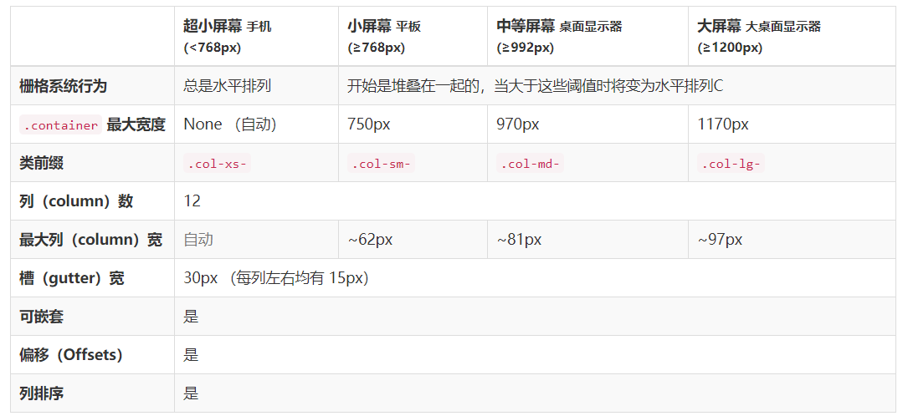

## 一．移动设备优先

在 HTML5 的项目中，我们做了移动端的项目。它有一份非常重要的 meta，用于设置屏幕和设备等宽以及是否运行用户缩放，及缩放比例的问题。

```html
//分别为：屏幕宽度和设备一致、初始缩放比例、最大缩放比例和禁止用户缩放
<meta
  name="viewport"
  content="width=device-width, initial-scale=1, maximum-scale=1, user-scalable=no"
/>
```

## 二．布局容器

Bootstrap 需要为页面内容和栅格系统包裹一个.container 容器。由于 padding 等属性的原因，这两种容器类不能相互嵌套。

```html
//固定宽度
<div class="container">...</div>

//100%宽度
<div class="container-fluid">...</div>
```

栅格系统中，浏览器会随着屏幕的大小的增减自动分配最多 12 列。通过一系列的行(row) 与列(column)的组合来创建页面布局。工作原理如下：
1.“行（row）”必须包含在 .container （固定宽度）或 .container-fluid （100%
宽度）中，以便为其赋予合适的排列（aligment）和内补（padding）。

2.通过“行（row）”在水平方向创建一组“列（column）”。

3.你的内容应当放置于“列（column）”内，并且，只有“列（column）”可以作为 行（row）”的直接子元素。

4.类似 .row 和 .col-xs-4 这种预定义的类，可以用来快速创建栅格布局。
Bootstrap 源码中定义的 mixin 也可以用来创建语义化的布局。

5.通过为“列（column）”设置 padding 属性，从而创建列与列之间的间隔（gutter）。

通过为 .row 元素设置负值 margin 从而抵消掉为 .container 元素设置的 padding， 也就间接为“行（row）”所包含的“列（column）”抵消掉了 padding。

6.负值的 margin 就是下面的示例为什么是向外突出的原因。在栅格列中的内容排成一行。

7.栅格系统中的列是通过指定 1 到 12 的值来表示其跨越的范围。例如，三个等宽的列可以使用三个 .col-xs-4 来创建。

8.如果一“行（row）”中包含了的“列（column）”大于 12，多余的“列（column）”所在的元素将被作为一个整体另起一行排列。

9.栅格类适用于与屏幕宽度大于或等于分界点大小的设备 ， 并且针对小屏幕设备覆盖栅格类。 因此，在元素上应用任何 .col-md-_ 栅格类适用于与屏幕宽度大于或等于分界点大小的设备 ，并且针对小屏幕设备覆盖栅格类。因此，在元素上应用任何 .col-lg-_ 不存在， 也影响大屏幕设备。

```html
//创建一个响应式行
<div class="container">
  <div class="row">...</div>
</div>

//创建最多 12 列的响应式行
<div class="container">
  <div class="row">
    <div class="col-md-1 a">1</div>
    <div class="col-md-1 a">2</div>
    <div class="col-md-1 a">3</div>
    <div class="col-md-1 a">4</div>
    <div class="col-md-1 a">5</div>
    <div class="col-md-1 a">6</div>
    <div class="col-md-1 a">7</div>
    <div class="col-md-1 a">8</div>
    <div class="col-md-1 a">9</div>
    <div class="col-md-1 a">10</div>
    <div class="col-md-1 a">11</div>
    <div class="col-md-1 a">12</div>
  </div>
</div>

//为了显示明显的 CSS .a { height: 100px; background-color: #eee; border:1px
solid #ccc; } //总列数都是 12，每列分配多列
<div class="container">
  <div class="row">
    <div class="col-md-4 a">1-4</div>
    <div class="col-md-4 a">5-8</div>
    <div class="col-md-4 a">9-12</div>
  </div>
  <div class="row">
    <div class="col-md-8 a">1-8</div>
    <div class="col-md-4 a">9-12</div>
  </div>
</div>
```

栅格参数表

如上图所示，栅格系统最外层区分了四种宽度的浏览器：超小屏(<768px)、小屏(>=768px)、中屏(>=992px)和大屏(>=1200px)。而内层.container 容器的自适应宽度为：自动、750px、970px 和 1170px。自动的意思为，如果你是手机屏幕，则全面独占一行显示。



```html
//四种屏幕分类全部激活
<div class="container">
  <div class="row">
    <div class="col-lg-3 col-md-4 col-sm-6 col-xs-12 a">4</div>
    <div class="col-lg-3 col-md-4 col-sm-6 col-xs-12 a">4</div>
    <div class="col-lg-3 col-md-4 col-sm-6 col-xs-12 a">4</div>
    <div class="col-lg-3 col-md-4 col-sm-6 col-xs-12 a">4</div>
    <div class="col-lg-3 col-md-4 col-sm-6 col-xs-12 a">4</div>
    <div class="col-lg-3 col-md-4 col-sm-6 col-xs-12 a">4</div>
    <div class="col-lg-3 col-md-4 col-sm-6 col-xs-12 a">4</div>
    <div class="col-lg-3 col-md-4 col-sm-6 col-xs-12 a">4</div>
    <div class="col-lg-3 col-md-4 col-sm-6 col-xs-12 a">4</div>
    <div class="col-lg-3 col-md-4 col-sm-6 col-xs-12 a">4</div>

    <div class="col-lg-3 col-md-4 col-sm-6 col-xs-12 a">4</div>
    <div class="col-lg-3 col-md-4 col-sm-6 col-xs-12 a">4</div>
  </div>
</div>

//有时我们可以设置列偏移，让中间保持空隙
<div class="container">
  <div class="row">
    <div class="col-md-8 a">8</div>
    <div class="col-md-3 col-md-offset-1 a">3</div>
  </div>
</div>

//也可以嵌套，嵌满也是 12 列
<div class="container">
  <div class="row">
    <div class="col-md-9 a">
      <div class="col-md-8 a">1-8</div>
      <div class="col-md-4 a">9-12</div>
    </div>
    <div class="col-md-3 a">11-12</div>
  </div>
</div>

//可以把两个列交换位置，push 向左移动，pull 向右移动
<div class="container">
  <div class="row">
    <div class="col-md-9 col-md-push-3 a">9</div>
    <div class="col-md-3 col-md-pull-9 a">3</div>
  </div>
</div>
```
