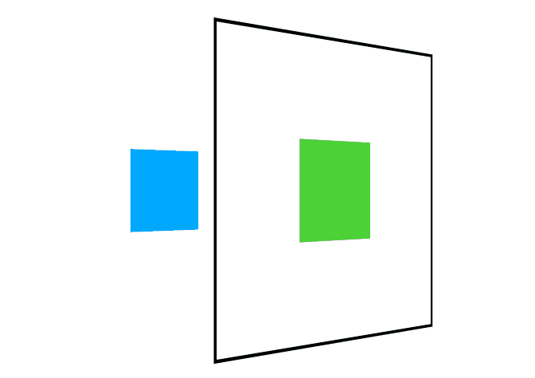
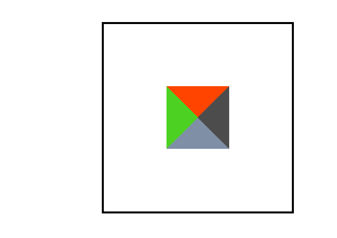

## 轴

xy 同之前的方向是一致的,z 由屏幕内指外

## 变形操作

使用 `transform` 规则控制元素的变形操作，包括控制移动、旋转、倾斜、3D 转换等，下面会详细介绍每一个知识点。

下面是 CSS 提供的变形动作。

| 选项                  | 说明                                                        |
| --------------------- | ----------------------------------------------------------- |
| none                  | 定义不进行转换。                                            |
| translate(x,y)        | 定义 2D 转换。                                              |
| translate3d(x,y,z)    | 定义 3D 转换。                                              |
| translateX(x)         | 定义转换，只是用 X 轴的值。                                 |
| translateY(y)         | 定义转换，只是用 Y 轴的值。                                 |
| translateZ(z)         | 定义 3D 转换，只是用 Z 轴的值。                             |
| scale(x,y)            | 定义 2D 缩放转换。                                          |
| scale3d(x,y,z)        | 定义 3D 缩放转换。                                          |
| scaleX(x)             | 通过设置 X 轴的值来定义缩放转换。                           |
| scaleY(y)             | 通过设置 Y 轴的值来定义缩放转换。                           |
| scaleZ(z)             | 通过设置 Z 轴的值来定义 3D 缩放转换。                       |
| rotate(angle)         | 定义 2D 旋转，在参数中规定角度。                            |
| rotate3d(x,y,z,angle) | 定义 3D 旋转。                                              |
| rotateX(angle)        | 定义沿着 X 轴的 3D 旋转。                                   |
| rotateY(angle)        | 定义沿着 Y 轴的 3D 旋转。                                   |
| rotateZ(angle)        | 定义沿着 Z 轴的 3D 旋转。                                   |
| skew(x-angle,y-angle) | 定义沿着 X 和 Y 轴的 2D 倾斜转换。                          |
| skewX(angle)          | 定义沿着 X 轴的 2D 倾斜转换。                               |
| skewY(angle)          | 定义沿着 Y 轴的 2D 倾斜转换。                               |
| perspective(n)        | 为 3D 转换元素定义透视视图。定义了 z=0 平面与用户之间的距离 |

PS:CSS 数据类型 `<angle>` 用于表示角的大小，单位为度（degrees）、 百分度（gradians）、弧度（radians）或圈数（turns）。

**重点 matrix()|matrix3d() 暂时先不介绍**

[https://www.zhangxinxu.com/wordpress/2012/06/css3-transform-matrix-%E7%9F%A9%E9%98%B5/](https://www.zhangxinxu.com/wordpress/2012/06/css3-transform-matrix-矩阵/)

## 行级元素

行级元素不产生变形效果，将其转为 `inline-block` 或 `block` 以及弹性元素时都可以产生变化效果。

## 移动 translate

### 2D 水平移动

```css
main:hover div:nth-child(2) {
  transform: translateX(50%) translateY(100px);
  /* translate(x,y) 可以直接同时设置xy*/
}
```

用于向右下方移动
`50%`是相对于自身而言的.

### 3D 移动

先透视并旋转一下(暂时不讨论这一些属性)

```css
transform: perspective(900px) rotateY(45deg);
```

这样就可以做到 Z 轴上的移动,简写值可以直接看上表(Z 轴方向不能设置`%`)

```css
transform: perspective(900px) rotateY(45deg) translateZ(200px);
```

## 缩放 scale

### 2D 缩放

这个和前面的是一样的,`0.5`代表缩放成 0.5 倍

```css
transform: scale(0.5, 2);
```

### 3D 缩放

```css
main {
  position: absolute;
  top: 50%;
  left: 50%;
  width: 300px;
  height: 300px;
  margin-top: -150px;
  margin-left: -150px;
  border: 3px solid #000;
  transform: perspective(900px) rotateY(45deg);
  transform-style: preserve-3d;
}

div {
  position: absolute;
  top: 100px;
  left: 100px;
}

div:nth-child(1) {
  background-color: #4cd137;
  width: 100px;
  height: 100px;
  transition: 1s;
}

div:nth-child(2) {
  background-color: #00a8ff;
  width: 100px;
  height: 100px;
  transform: translateZ(-300px);
  transition: 1s;
}

body {
  width: 100vw;
  width: 100vh;
}

body:hover main {
  transform: perspective(900px) rotateY(45deg) scaleZ(2);
}
```

属性
`scaleZ(2)`



**Z 轴方向相当于拉伸盒子 z 轴**

简写值看上面表吧

## 旋转 rotate

### 水平旋转

`rotateX`
按水平轴发生旋转，如果旋转 90deg 将不可见



### 垂直旋转

`rotateY`
按垂直轴旋转，如果旋转 90deg 将不可见。

下面这是旋转了 290 度


### 普通的旋转

`rotateZ`
让一个元素围绕横 Z 轴旋转这才是常见的旋转吧,这是一个顺时针的时钟效果

### rotate

`rotate`控制 xy 轴上的旋转效果和`rotateZ`是一样的,不能理解成`rotateX(45deg) rotateY(45deg);`这样的效果

### rotate3d

```css
rotate3d(x,y,z,a);
```

x/y/z: &lt;number&gt; 类型，可以是 0 到 1 之间的数值，表示旋转轴 x/y/z 坐标方向的矢量。(成比例变化结果是一样的,如果这些矢量被赋予非标准值，即 3 个坐标值的平方和不等于 1 时，它将会被内部隐式标准化。)
a: &lt;angle&gt; 类型，表示旋转角度。正的角度值表示顺时针旋转，负值表示逆时针旋转。

## 倾斜操作 skew

`skewX(angle)` 沿 x 轴倾斜
`skewY` 沿 y 轴倾斜
`skew` 沿 x/y 轴倾斜,只设置一个值时,y 轴倾斜为 0
