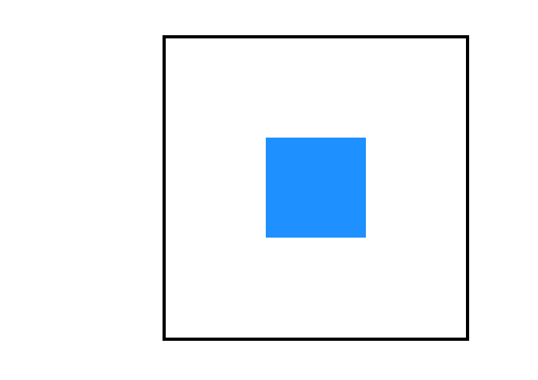
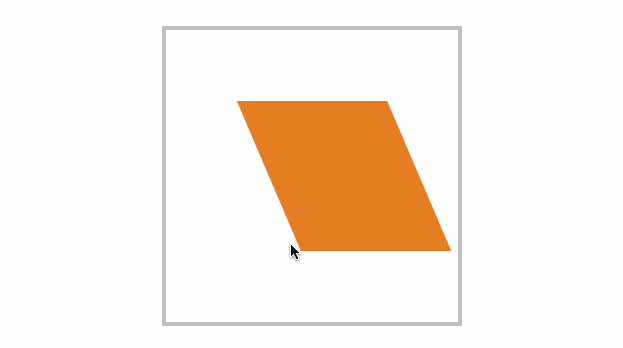

## 变形基点

使用`tansform-origin`设置元素的 X/Y/Z 的操作基点,用于控制旋转和倾斜等操作

- 旋转默认以元素中心进行旋转，改变基点后可控制旋转点位置
- 元素移动不受变形基点所影响

[MDN 上介绍的不能再详细了,还可以直接看到旋转中心](https://developer.mozilla.org/zh-CN/docs/Web/CSS/transform-origin)

### 平面旋转



```html
<main>
  <div></div>
  <div></div>
</main>
```

```css
div {
  position: absolute;
  top: 100px;
  left: 100px;
  width: 100px;
  height: 100px;
  transform-origin: right bottom;
}

div:nth-child(1) {
  background-color: #4cd137;
  transition: 1s;
}

div:nth-child(2) {
  background-color: #1e90ff;
  transition: 1s;
}

main:hover div:nth-child(2) {
  transform: rotateZ(45deg);
}
```

### 倾斜控制

默认中线倾斜



### 3 维旋转

`tansform-origin`第三个值用来表现 z 轴上的偏移量(注意,这个值没有预设单词,也不能使用百分比,只能是数值)

## 透视景深

### perspective

- 使用 `perspective` 来控制元素的透视景深
- `perspective` 规则为舞台元素控制景深， `perspective` 属性值为控制单个元素
- 当舞台中只有一个变换元素时,效果是一样的,
- 不止一个时,使用`perspective` 规则透视的是舞台,其中每个元素样式不一样.
- `perspective`属性值却将舞台中每个元素表现成一样

```css
perspective: 200px;
```

> 当该属性值不为 0 和 none 时，会创建新的 层叠上下文。在这种情况下，容器内元素的层叠关系像是使用了 `position: fixed` 一样。

perspective 函数用于为元素设置单独透视，下面是为元素单独设置透视参数，每个元素的透视效果是一样的。

```css
transform: perspective(100px) rotateY(60deg);
```

## 3D 透视

这是一个实验中的属性
CSS 属性 `transform-style` 设置元素的子元素是位于 3D 空间中还是平面中。

```css
transform-style: flat;
transform-style: preserve-3d;
```

## 观看视角

CSS 属性 `perspective-origin` 指定了观察者的位置，用作 `perspective` 属性的消失点。

[MDN 中的介绍](https://developer.mozilla.org/zh-CN/docs/Web/CSS/perspective-origin)

## 隐藏背面

`backface-visibility`指定当元素背面朝向观察者时是否可见。

```css
backface-visibility: visible; /*背面朝向用户时可见*/
backface-visibility: hidden; /*背面朝向用户时不可见*/
```
