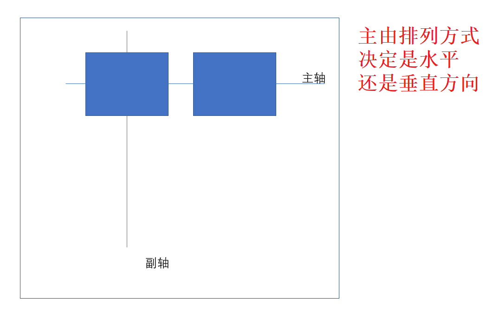

## 定义

article 是盒子
div 是盒子中的元素

```html
<article>
  <div>1</div>
  <div>2</div>
  <div>3</div>
</article>
```

## 定义盒子的方法

给盒子加上

```css
display: flex; /*类似于块级*/
display: inline-flex; /*类似于行级*/
```


## 弹性元素的排列

也是给盒子加

```css
flex-direction: row; /*默认,水平左到右*/
flex-direction: row-reverse; /*水平右到左排列*/
flex-direction: column; /*垂直*/
flex-direction: column-reverse;
```

## 换行

当行或者列放不下时

给盒子加上

```css
flex-wrap: wrap; /* 直接将溢出换行 */
flex-wrap: wrap-reverse; /* 换行,并反向处理 */
```

排列和换行可以用一个组合设置

```css
flex-flow: row wrap-reverse;
```

## 弹性轴



## 主轴的设置

`justify-content`用来设置弹性盒子中各项周围的空白

```css
div {
  display: flex;
  justify-content: space-around; //两边是中间的一半
}
```

```css
    flex-start 开始
    flex-end 结束
    center 中间
    space- 空间分布的方式
    space-evenly 空白完全平均分布
```

## 交叉轴的设置

`align-items` 侧轴（副轴）方向上的对齐方式。

`align-center` 用来设置弹性盒子中各项交叉轴方向的周围的空白(`justify-content`)

## 设置单个弹性元素

对单个元素进行设置

`align-self` 对单个元素进行设置

```css
align-self: flex-start;
```

`flex-grow` 设置可用空间占几等分(设置为 0 保持自己)

`flex-shrink` 设置溢出却没换行时的缩小比例(设置为 0 为不缩小)

`flex-basis` 基准尺寸

上面三条简写成`flex`

`order` 控制排序(数值越大越靠后)

http://www.ruanyifeng.com/blog/2015/07/flex-grammar.html
