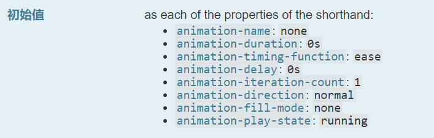

## 属性

| 属性                                                                                                    | 描述                                                | 值                                                             |
| :------------------------------------------------------------------------------------------------------ | :-------------------------------------------------- | -------------------------------------------------------------- |
| [@keyframes](https://developer.mozilla.org/zh-CN/docs/Web/CSS/@keyframes)                               | 规定动画。                                          | 略                                                             |
| [animation](https://developer.mozilla.org/zh-CN/docs/Web/CSS/animation)                                 | 下面所有动画属性的简写属性                          | 略                                                             |
| [animation-name](https://developer.mozilla.org/zh-CN/docs/Web/CSS/animation-name)                       | 规定 @keyframes 动画的名称。                        | 能同时设置多个,逗号分隔                                        |
| [animation-duration](https://developer.mozilla.org/zh-CN/docs/Web/CSS/animation-duration)               | 规定动画完成一个周期所花费的秒或毫秒。默认是 0。    |                                                         |
| [animation-timing-function](https://developer.mozilla.org/zh-CN/docs/Web/CSS/animation-timing-function) | 规定动画的速度曲线。默认是 "ease"。                 | 太多不列                                                       |
| [animation-delay](https://developer.mozilla.org/zh-CN/docs/Web/CSS/animation-delay)                     | 规定动画何时开始。默认是 0。                        |                                                         |
| [animation-iteration-count](https://developer.mozilla.org/zh-CN/docs/Web/CSS/animation-iteration-count) | 规定动画被播放的次数。默认是 1。                    | infinite,非负 number                                           |
| [animation-direction](https://developer.mozilla.org/zh-CN/docs/Web/CSS/animation-direction)             | 规定动画是否在下一周期逆向地播放。默认是 "normal"。 | normal \| reverse \| alternate \| alternate-reverse 一个或多个 |
| [animation-play-state](https://developer.mozilla.org/zh-CN/docs/Web/CSS/animation-play-state)           | 规定动画是否正在运行或暂停。默认是 "running"。      | running \| paused                                              |
| [animation-fill-mode](https://developer.mozilla.org/zh-CN/docs/Web/CSS/animation-fill-mode)             | 规定对象动画时间前后的状态。                        | none \| forward \| backwards \| both                           |

## animation 属性

`animation`也可以有多组,每组之间使用逗号分隔



时间值可以出现 0,1,2 次,第一个给`duration`,第二个给`delay`

## @keyframes

```css
@keyframes slidein {
  from {
    margin-left: 100%;
    width: 300%;
  }

  to {
    margin-left: 0%;
    width: 100%;
  }
}
```

### JavaScript 访问

CSSKeyframesRule 接口

### 重复问题

同一个名字的`@keyframes`被定义只选择最后一个

一个`@keyframes`中定义多次同一个关键帧也是最后一个

### !important 关键词

会被忽略

### 取值

`from` 相当于 0%

`to`相当于 100%

百分比
