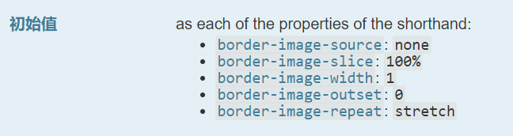

## border-radius 圆角

该属性是一个简写属性，是为了将这四个属性 [`border-top-left-radius`](https://developer.mozilla.org/zh-CN/docs/Web/CSS/border-top-left-radius)、[`border-top-right-radius`](https://developer.mozilla.org/zh-CN/docs/Web/CSS/border-top-right-radius)、[`border-bottom-right-radius`](https://developer.mozilla.org/zh-CN/docs/Web/CSS/border-bottom-right-radius)，和 [`border-bottom-left-radius`](https://developer.mozilla.org/zh-CN/docs/Web/CSS/border-bottom-left-radius) 简写为一个属性。

`border-top-left-radius`可以使用俩个值,一个值时表示圆,两个值是椭圆

`border-radius`中某个方向是两个值时,这两个值用`/`分隔

## border-image 边框图片

### border-image-source

图片或者函数

### border-image-slice

将盒子分成 9 个区域,4 角,4 边,1 个中心

### border-image-width

设置 4 个边的图片宽度,不会影响边的宽度

### border-image-outset

属性定义边框图像可超出边框盒的大小。

## box-shadow 阴影
