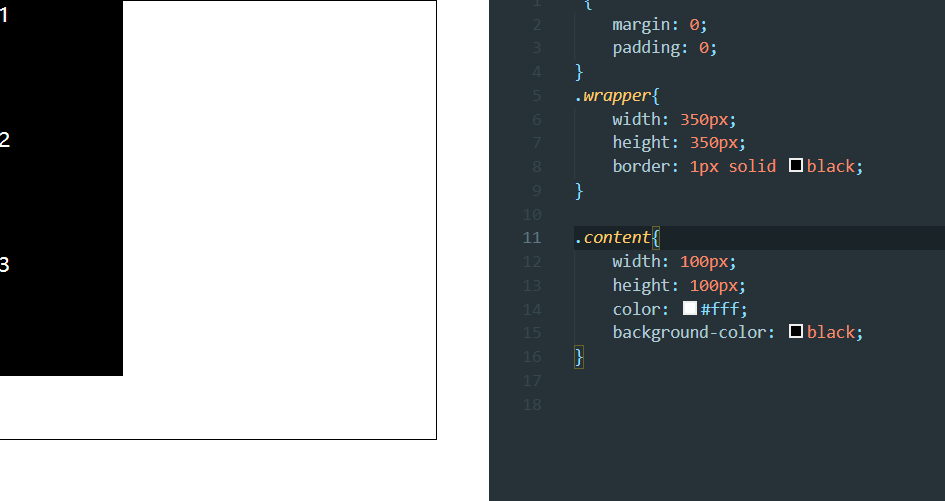
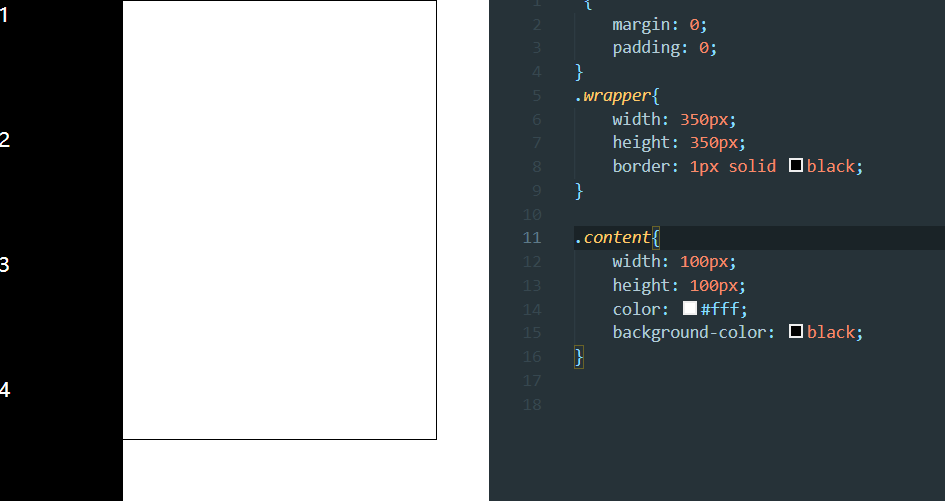
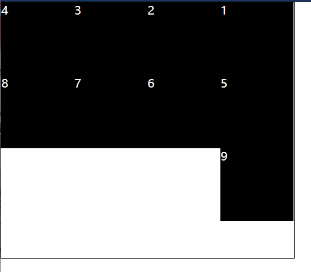
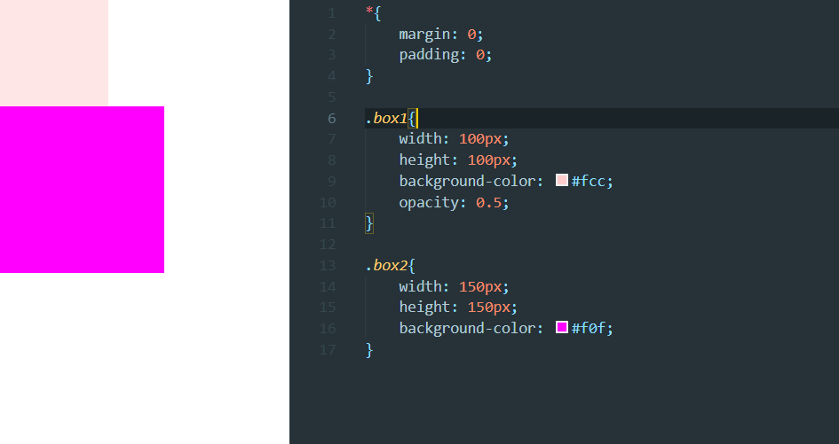
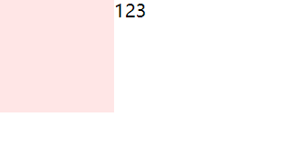
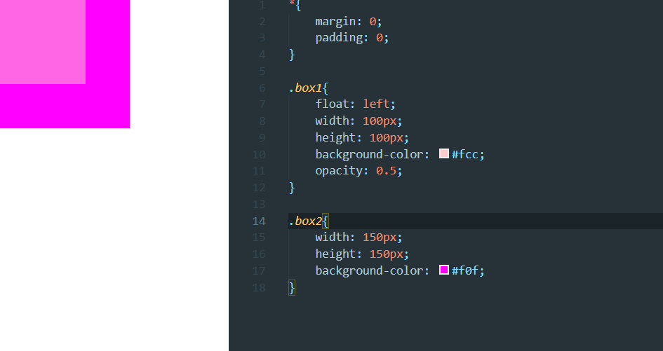
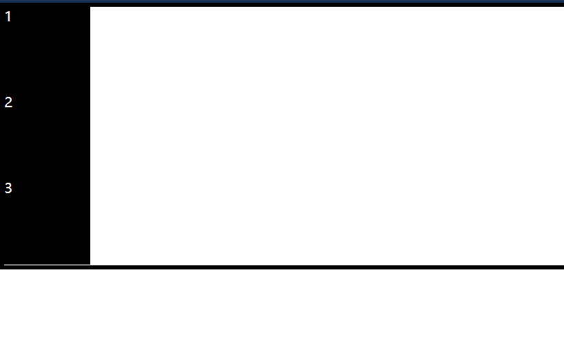
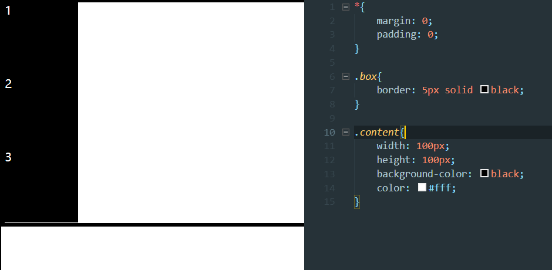
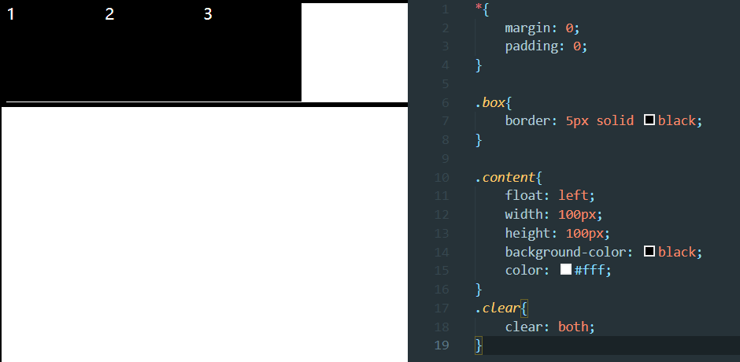
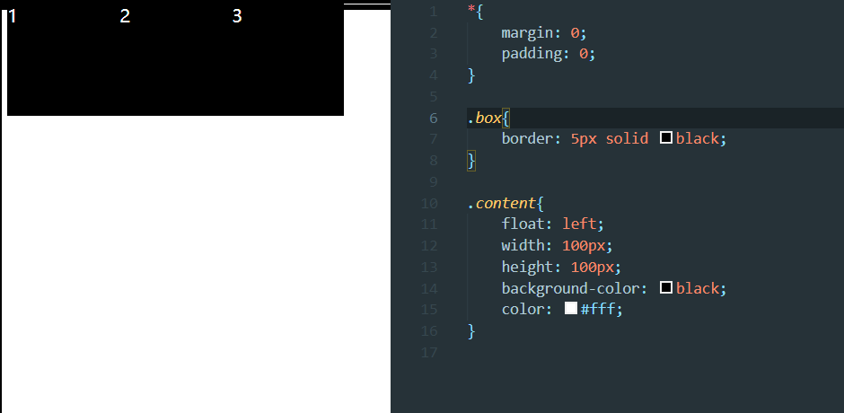

## 浮动模型

### float 浮动用法：让元素排队

`float: left;`  

向左浮动,并排队  

```html
  <div class="wrapper">
    <div class="content">1</div>
    <div class="content">2</div>
    <div class="content">3</div>
  </div>
```

```css
*{
    margin: 0;
    padding: 0;
}
.wrapper{
    width: 350px;
    height: 350px;
    border: 1px solid black;
}

.content{
    width: 100px;
    height: 100px;
    color: #fff;
    background-color: black;
}
```

  

不管是left还是right,`1`都会首先去站队  

当多个方块时  

  

浮动的顺序只是变动一行中的,不影响其他行.  

每行3个方块是盒子大小的影响,下面我增加盒子宽度   

  

浮动元素上可以加 margin或padding 等等   

导航栏也可以用浮动解决...  

   

### 单个浮动元素演示

```html
  <div class="box1"></div>
  <div class="box2"></div>
```

```css
*{
    margin: 0;
    padding: 0;
}

.box1{
    float: left;
    width: 100px;
    height: 100px;
    background-color: #fcc;
    opacity: 0.5;
}

.box2{
    width: 150px;
    height: 150px;
    background-color: #f0f;
}
```

  

float 元素也分层了。跟 absolute 效果是类似的(看下面)  

## 浮动元素

1）浮动元素产生了浮动流  
（浮动流产生的效果）所有产生了浮动流的元素，块级元素(block)看不到他们。  
产生了 bfc 的元素和文本类属性（带有 inline 属性就是文本类属性）的元素以及文本(就是字)都能看到浮动元素。  
文本能看到浮动元素。浮动元素不意味着分层，只能说明他产生了浮动流。  

我们只改下html  

```html
    <div class="box1"></div>123
  <!-- <div class="box2"></div> -->
```

   

图片也会和文字一样.  

所以把前面的div变成inline-block  

  

### 包住浮动元素的办法

```html
  <div class="box">
    <div class="content">1</div>
    <div class="content">2</div>
    <div class="content">3</div>
  </div>
```

```css
*{
    margin: 0;
    padding: 0;
}

.box{
    border: 5px solid black;
}

.content{
    width: 100px;
    height: 100px;
    background-color: black;
    color: #fff;
}
```

   

让元素浮动  
   

box不能把content包裹起来了  
给box一个大小可以解决(之前的例子证明没影响),但如果content数量不固定,就不知道加多大了.  

```html
  <div class="box">
    <div class="content">1</div>
    <!-- 由上面产生的浮动流 -->
    <div class="content">2</div>
    <!-- 由上面产生的浮动流 -->
    <div class="content">3</div>
    <!-- 由上面产生的浮动流 -->
  </div>
```

只要将最下面的浮动流去掉即可  
在此处加一个p元素  

```html
    <p class="clear"></p>
```

```css
.clear{
    clear: both;    /*还有left,right,通常用both*/
}
```

   

这个p不需要设置padding,margin,border以及内容也可生效(只需要其存在于那个位置)  

其实这个方法不能用,和margin合并一样原因,解决办法看下面  

## 伪元素

伪元素存在与普通元素中, 可以用css选择器选中  
前面选择器章节有所提及  

```css
  content:"添加内容";
```

伪元素也可以和普通元素一样添加css  
其自带`display:inline;`  

```html
  <div class="box">
    <div class="content">1</div>
    <div class="content">2</div>
    <div class="content">3</div>
  </div>
```

原来的基础上修改伪元素  

```css
*{
    margin: 0;
    padding: 0;
}

.box{
    border: 5px solid black;
}

.content{
    float: left;
    width: 100px;
    height: 100px;
    background-color: black;
    color: #fff;
}

.box::after{
    content: "";    /*空内容*/
    clear: both;
    display: block;
  }
```

<font color=#00BFFF >`clear`需要块级元素(或者非块级元素修改成`display: block;`)才能生效</font>  

实际还可以变成让其BFC  

注意:`positoin:absolute;`&nbsp;&nbsp;`float:left/right`会从内部把元素变成`inline-block`,上面例子就会有所变化  

  

宽原本是占满一行,正是变化成`inline-block`所以完全包住了content;  

## 浮动最早的应用--报纸布局

文字无法环绕一个图片,但使图片浮动后就可以环绕.类似于下列红框中的字体的样式.   

  

很多图片和文字不就是报纸的样式吗  