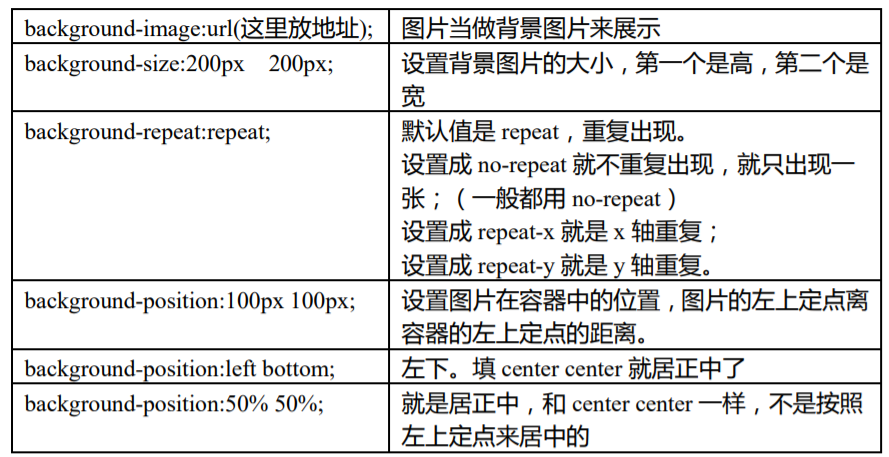
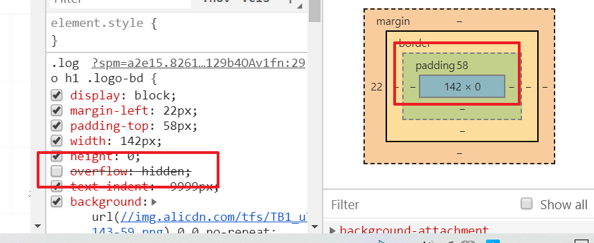
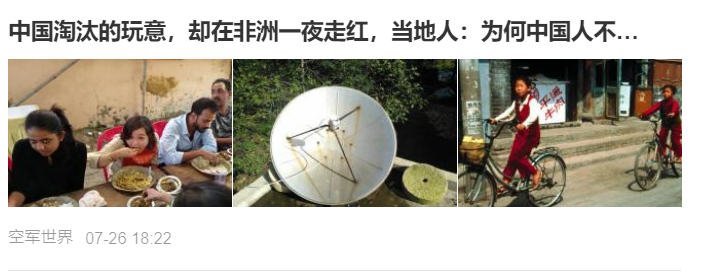
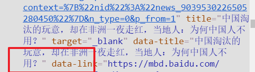
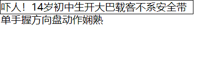
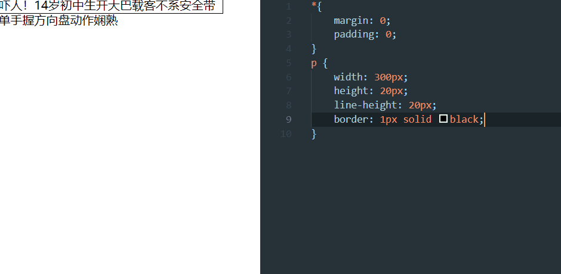
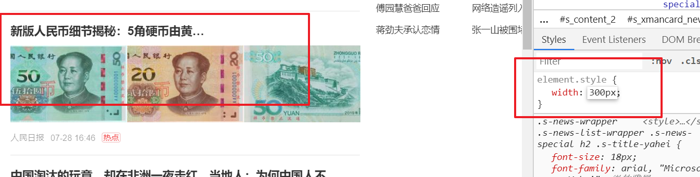
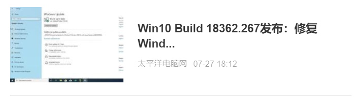
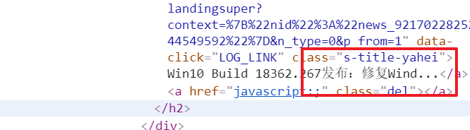
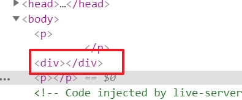

## 背景图片

 

> background-size:可以只设置一个高  
background-position:只有left代表左中  

一个普通的网站，一旦采取默认加载策略(css加载失败)，就是一片空白(因为大部分都是css操作,导致无法使用网站功能),下面的方法就是为了应对这种极端情况  

方法一：  
用 text-indent:190px;首行缩进,缩进距离大于内容区的宽度   
用 white-space:nowrap;强制文本不换行  
用 overflow:hidden;溢出部分隐藏   

方法二：  
背景颜色，图片会作用在 padding 上，但是内容（文字）不能作用在 padding 上  
让 height=0；  
容器就会变成一条线，并且文字在图片外面  
然后再加 padding-top:90px；  
那么 padding 里面就会显示图片   
最后用 overflow:hidden;溢出部分隐藏  

淘宝使用第二种方法  

  
  

## 导航栏完整开发代码

```html
    <ul class="nav">
        <li class="list-item"><a href="#">天猫</a></li>
        <li class="list-item"><a href="#">聚划算</a></li>
        <li class="list-item"><a href="#">天猫超市</a></li>
    </ul>
```

```css
*{
    margin: 0;
    padding: 0;
    color: #424242;
}

a {
    text-decoration: none;
}

.nav {
    list-style: none;
    margin-top: 5px;
}

.nav::after {
    content: "";
    display: block;
    clear: both;
}

.nav .list-item {
    float: left;
    margin: 0 10px;
    height: 30px;
    line-height: 30px;
}

.nav .list-item a {
    padding: 0 5px;
    font-weight: bold;
    display: inline-block;
    border-radius: 15px;
    color: #f40;
}

.nav .list-item a:hover {
    background-color: #f40;
    color: #fff;
}
```


## 单行文本溢出处理

  

  

多余的文字变成了`...`  

```html
    <p>吓人！14岁初中生开大巴载客不系安全带 单手握方向盘动作娴熟</p>
```

```css
*{
    margin: 0;
    padding: 0;
}
p {
    width: 300px;
    height: 20px;
    line-height: 20px;
    border: 1px solid black;
}
```

  

想让单行文本溢出文字，打点，步骤：  
首先先让文本失去换行功能，`white-space:nowrap;`;  
再溢出部分不展示隐藏，`overflow:hidden;`;  
最后把溢出部分打点，`text-overflow:ellipsis;`;  

  

  

## 多行文本溢出 

采用的方法是多行文字做截断  
`...`是用手写上去的，多少字截断是估算出来的，新的CSS3方法可以不用这么麻烦,但老版本的浏览器支持不太好，所以不用这种方法,其移动端上可以实现  
height 是 line-height 的两倍，就展示两行，内容区域高是单行文本的高度整数倍。算好了高度就可以做截断了(后端传固定字数,之后打点)  

  
  

## 元素嵌套

1. 行级元素只能嵌套行级元素  
2. 块级元素能嵌套所有元素

PS:`p`不能套块级元素,a也不能套a 

 

div将其分割成两个p元素  

