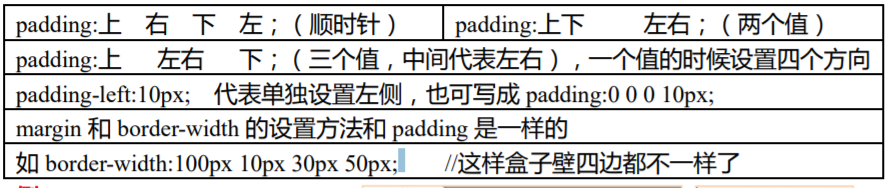
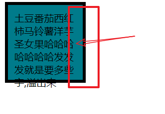
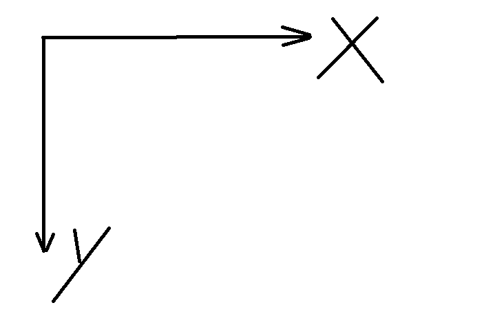
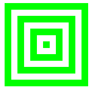
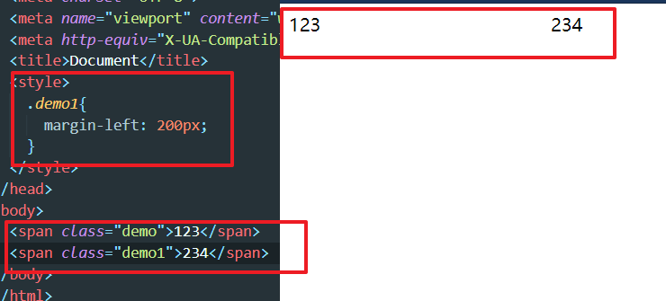
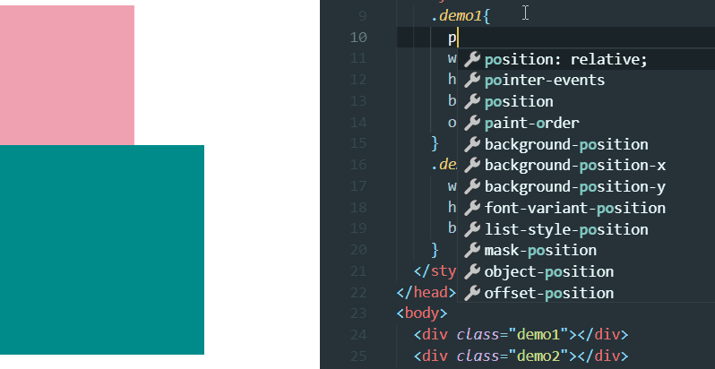
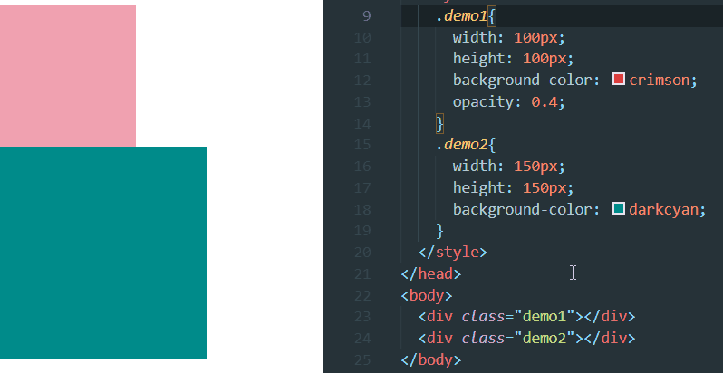
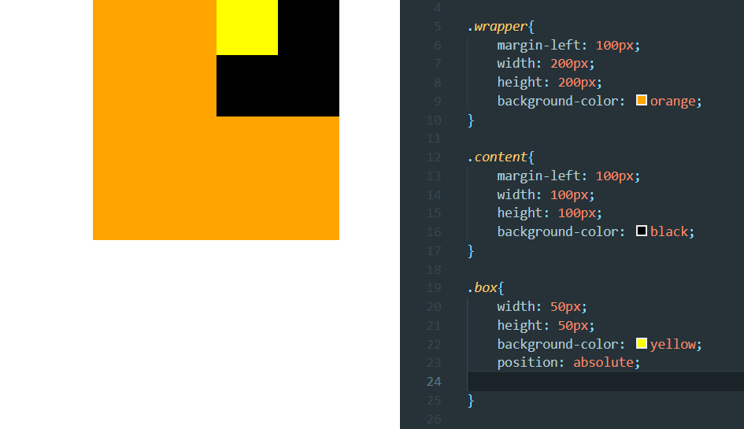
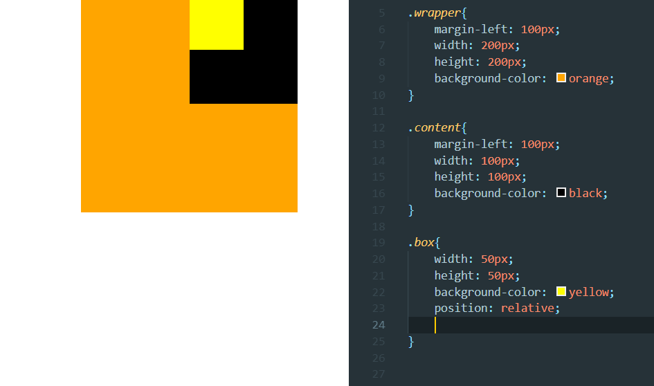

## 盒子模型

1）盒子的组成三大部分：  
A 盒子壁 border  
B 盒子内边距 padding   
C 盒子内容 width+height   

2）盒子模型（四部分组成）  
A 盒子壁 border  
B 盒子内边距 padding  
C 盒子内容 content=width+height   
D 盒子外边距 margin   

盒子的大小会成为笔试的一部分,计算盒子大小是第一种(不包含margin)  
body自带的margin值是多少也出现过.   

  

下面这种，文字和盒子之间隔出了距离，就是 padding，padding 内边距是不能放内
容的。内容是放到内容区 content 的。  

```css
div{
    width: 100px;
    height: 100px;
    background-color: rgb(0, 123, 139);
    padding: 10px;
    border: 5px solid #000;
}
```

  

文档的坐标轴是这样的  

  

设置了 margin 就会推动盒子移动  

### 盒子大小计算

<font color=#00BFFF >计算可视区域,真实的大小不包括margin</font>  

例  

```css
div{
    width: 100px;
    height: 100px;
    background-color: rgb(0, 123, 139);
    padding: 10px 20px 30px;
    border: 10px solid #000;
    margin: 10px 20px;
  }
```

realWidth：100+10+10+20+20px=160px  
realHeight：100+10+10+10+30px=160px  

### 远视图

画个简单的盒子

```html
    <div class="content">
        <div class="content1"></div>
    </div>
```

```css
    .content1{
      width: 10px;
      height: 10px;
      background-color: #0f0;
 
    }
    .content{
      width: 10px;
      height: 10px;
      background-color: #000;
      border: 10px solid #0f0;
      padding: 10px;
    }
```

按照那个来增加  

```html
<div class="wrapper">
    <div class="box">
      <div class="content">
        <div class="content1"></div>
      </div>
    </div>
</div>
```

```css
    .content1{
      width: 10px;
      height: 10px;
      background-color: #0f0;
 
    }
    .content{
      width: 10px;
      height: 10px;
      background-color: #fff;
      border: 10px solid #0f0;
      padding: 10px;
    }
    .box{
      width: 50px;
      height: 50px;
      background-color: #fff;
      border: 10px solid #0f0;
      padding: 10px;
    }
    .wrapper{
      width: 90px;
      height: 90px;
      background-color: #fff;
      border: 10px solid #0f0;
      padding: 10px;
    }
```

  

### margin 

通过调整 margin，调整距离  

  

## 层模型

<font color=#00BFFF >position 属性规定元素的定位类型。</font>  
当position的值为非static时，其层叠级别通过z-index属性定义。 

1. static: 默认属性,对象遵循常规流。此时4个定位偏移属性不会被应用。   
2. relative： 对象遵循常规流，并且参照自身在常规流中的位置通过top，right，bottom，left这4个定位偏移属性进行偏移时不会影响常规流中的任何元素。   
3. absolute： 对象脱离常规流，此时偏移属性参照的是离自身最近的定位祖先元素，如果没有定位的祖先元素，则一直回溯到body元素。盒子的偏移位置不影响常规流中的任何元素，其margin不与其他任何margin折叠。   
4. fixed： 与absolute一致，但偏移定位是以窗口为参考。当出现滚动条时，对象不会随着滚动。   
5. sticky： 对象在常态时遵循常规流。它就像是relative和fixed的合体，当在屏幕中时按常规流排版，当卷动到屏幕外时则表现如fixed。该属性的表现是现实中你见到的吸附效果。（CSS3）   

定位时left就是盒子的左边框相对,right是右边框,left和top是相对于左上角,以此类推...  
   
### absolute

<font color=#8470FF >脱离原来位置定位(人移动位置)</font>  

```css
    .demo1{
      position: absolute;
      left: 100px;
      width: 100px;
      height: 100px;
      background-color: crimson;
      opacity: 0.4;     /*透明度*/
    }
    .demo2{
      width: 150px;
      height: 150px;
      background-color: darkcyan;
    }
```

  

### relative

<font color=#008000 >保留原来位置定位(灵魂移动位置,身体还在)</font>  

  

### 居中广告demo

```css
div{
    position: fixed;
    left: 50%;
    top: 50%;
    width: 150px;
    height: 150px;
    margin-left: -75px;
    margin-top: -75px;
    background-color: #f0f;
}
```

fixed相对于窗口定位  
50%让左上角居中  
margin值为负让其中心居中  

### 总结

<font color=#8470FF >absolute相对于有定位的父级(祖父级...)进行定位,如果没有,那么相对于文档定位</font>   

  

<font color=#008000 >relative相对于原来的位置进行对位</font>   

   

<font color=#00BFFF size=4>综上所述:relative可以给元素增加定位属性,然后用absolute进行定位</font>   

## 小练习题目-居中五环

z-index 设置整数值,值越大越上层显示  
border-radius : 50%; 圆;  

要求,对颜色镶嵌没要求(5环不用套着)  
