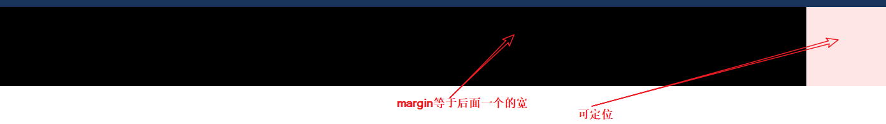

## 五环题目答案

### 解题思路

1. 五个环=5个div 并且由一个盒子包围  
2. 先让五个环可以定位,将其定位到合适位置  
3. 让外围div包围五环并带他到居中位置(根据盒子大小移动margin)  
4. 去掉外围div的辅助材料  

```html
    <div class="plat">
      <div class="circle1"></div>
      <div class="circle2"></div>
      <div class="circle3"></div>
      <div class="circle4"></div>
      <div class="circle5"></div>
    </div>
```

```css
*{
    margin: 0;
    padding: 0;
}
.circle1,
.circle2,
.circle3,
.circle4,
.circle5 {
    width: 100px;
    height: 100px;
    border-radius: 50%;
    border: 10PX solid black;
    position: absolute;
}

.circle1 {
    border-color: blue;
    z-index: 4;
}

.circle2{
    border-color: black;
    left: 130px;
    z-index: 1;
}

.circle3{
    border-color: red;
    left: 260px;
}

.circle4{
    border-color: yellow;
    top: 65px;
    left: 65px;
    z-index: 2;
}

.circle5 {
    border-color: green;
    top: 65px;
    left: 195px;
}

.plat {
    position: absolute;
    /*
    border: 5px solid black;
    height: 184px;
    width: 380px;
    */
    left: 50%;
    top: 50%;
    margin-top: -92px;
    margin-left: -190px;
}
```

css中注释部分为辅助材料  

## 两栏布局

```css
*{
    margin: 0;
    padding: 0;
}
.demo1 {
    position: absolute;
    right: 0;
    width: 100px;
    height: 100px;
    background-color: #fcc;
    opacity: 0.5;
}

.demo2 {
    height: 100px;
    background-color: black;
    margin-right: 100px;
}
```

1. 让两个div变成一栏,需要让其中一个变成`position:absolute;`    

2. 内容不允许覆盖,所以要用一个div的margin把另一个推开.  

  

浮动也能做两栏布局   
多栏布局可以同样方法实现  

下面给个demo  

```html
  <div class="box1"></div>
  <div class="box2"></div>
  <div class="box3"></div>
```

`position:`解法  

```css
.box1{
    position: absolute;
    width: 100px;
    height: 100px;
    background-color: #fcc;
    opacity: 0.5;
}

.box2{
    position: absolute;
    right: 0;
    width: 100px;
    height: 100px;
    background-color: #ffc;  
    opacity: 0.5;
}

.box3{
    margin-right: 100px;
    margin-left: 100px;
    height: 100px;
    background-color: #123;
}
```

`float`解法  

```css
.box1{
    float: left;
    width: 100px;
    height: 100px;
    background-color: #fcc;
    opacity: 0.5;
}

.box2{
    float: right;
    width: 100px;
    height: 100px;
    background-color: #ffc;  
    opacity: 0.5;
}

.box3{
    margin-right: 100px;
    margin-left: 100px;
    height: 100px;
    background-color: #123;
}
```