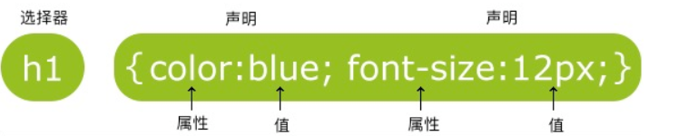
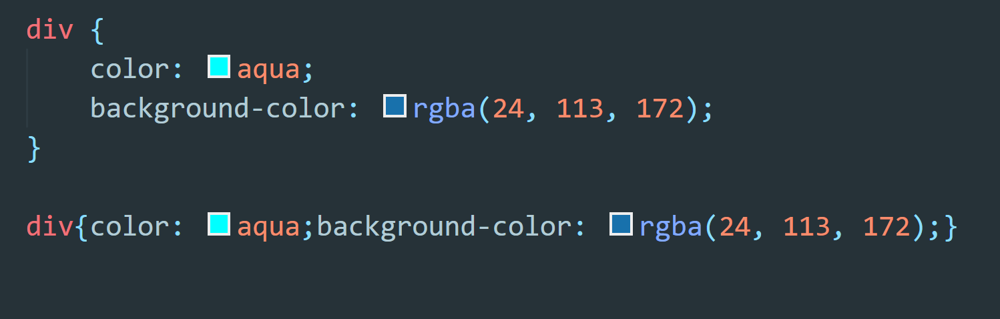

## CSS 实例

  

像`color:blue;`这样叫一条声明,声明由`属性`&nbsp;&nbsp;+&nbsp;&nbsp;`:`&nbsp;&nbsp;+&nbsp;&nbsp;`值`&nbsp;&nbsp;+&nbsp;&nbsp;`;`  

每一个css块由选择器开头,`{}`包裹一条或者多条声明.  

为了代码的可读性,一行写一条声明,对比下图的两种写法,哪个更直观  

  

## CSS 注释

注释是用来解释你的代码，并且可以随意编辑它，浏览器会忽略它。

CSS注释以 `/*` 开始, 以 `*/` 结束, 实例如下:  

```css
    /*这是个注释*/
    p {
        text-align:center;
    /*这是另一个注释*/
        color:black;
        font-family:arial;
}
```
