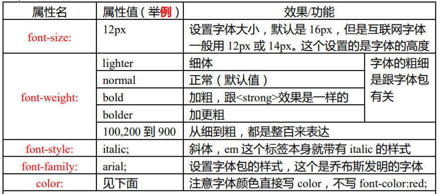
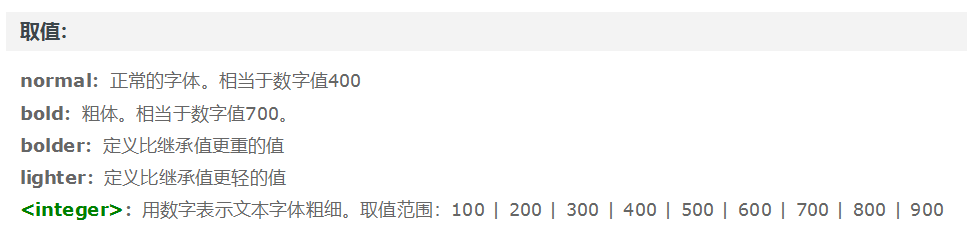
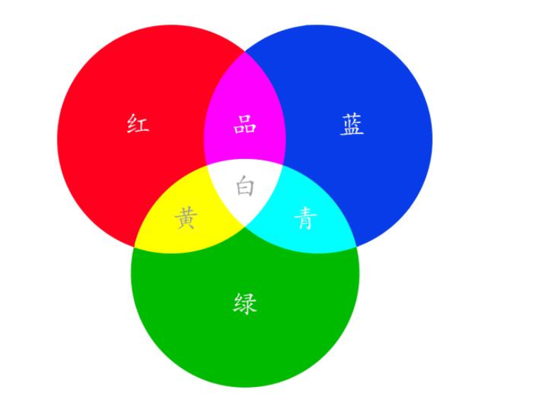
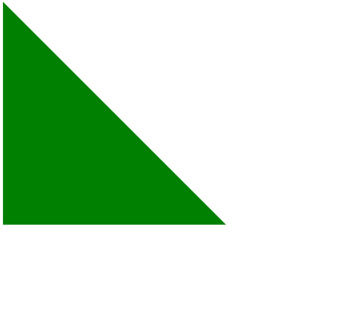
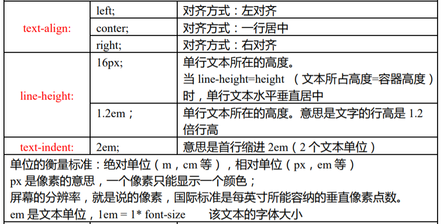
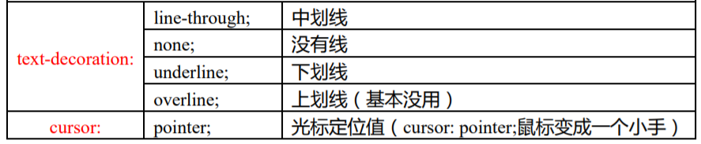

## 字体属性

  



## 颜色

### 颜色名称

```css
    .foreground { color: highlight; }
    .background { background-color: gray; }
```

### HEX(十六进制代码)

写法是`#RRGGBB`

> RR： 红色值。  
GG： 绿色值。  
BB： 蓝色值。  

以上三个参数，取值范围为：00 - FF。  
参数必须是两位数。对于只有一位的，应在前面补零。   
如果每个参数各自在两位上的数字都相同，那么本单位也可缩写为 `#RGB` 的方式。例如：#FF8800 可以缩写为 #F80。   

<font color=#00BFFF >编程中的颜色都是RGB光学三原色</font>  

`#000000`  是黑色
`#FFFFFF`  是白色(太阳光能分解成三原色)

  

### RGB RGBA

`rgb(255,255,255)`  

`rgba(255,255,255,1)`  

前面三个参数分别是r,g,b  
有两种取值方法，正整数值的取值范围为：0 - 255。百分数值的取值范围为：0.0% - 100.0%。   
如果数值大于255就会取255  

A： Alpha透明度。取值0 - 1之间。

### transparent

透明

## 边框border

border是复合属性   
border : border-width border-style border-color;  

```css
    border:1px solid red;
```

属性可以单独设置

例如`border-width = 1px`  

border-top,  
border-right,  
border-bottom,  
border-left  
分别设置四个方向(也是复合属性)  

### 画三角形

```css
div{
    width: 0px;
    height: 0px;
    border: 300px solid green;
    border-top-color: transparent;
    border-right-color: transparent;
}
```

  

## 文本属性

  

  