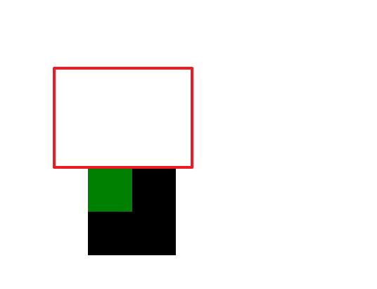
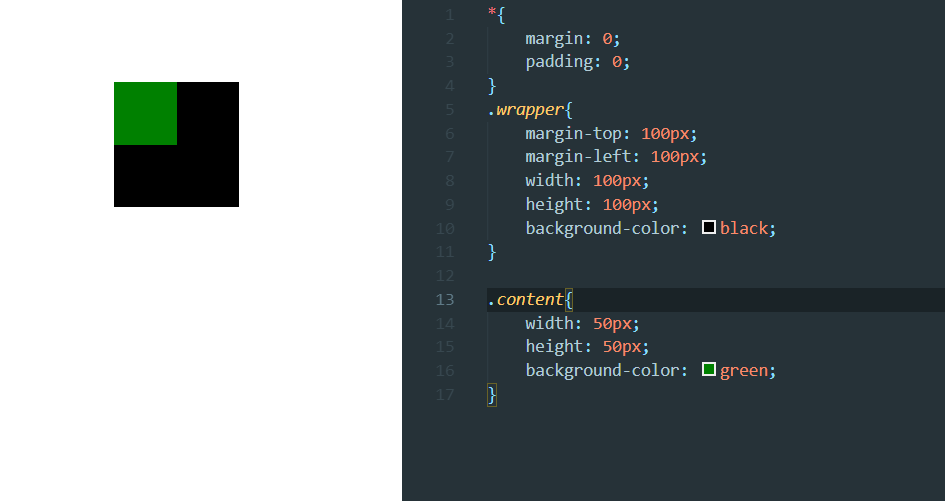
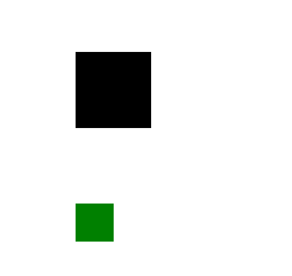
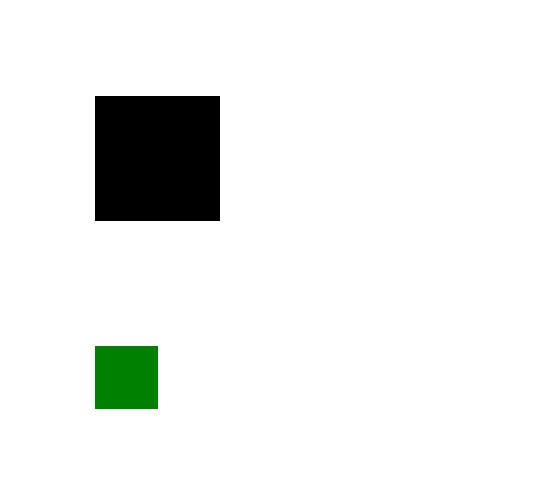
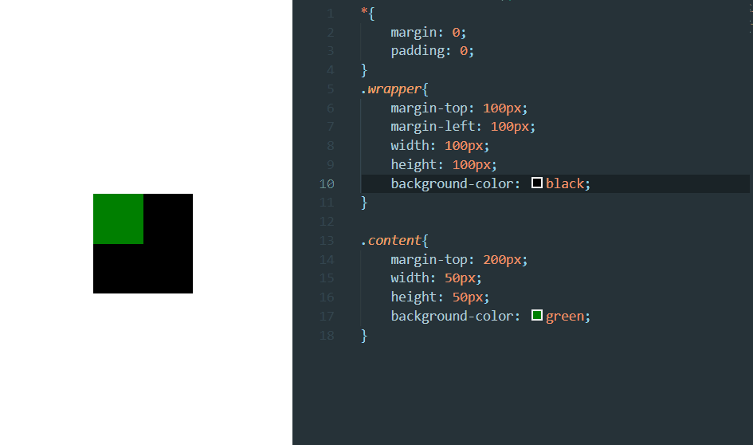
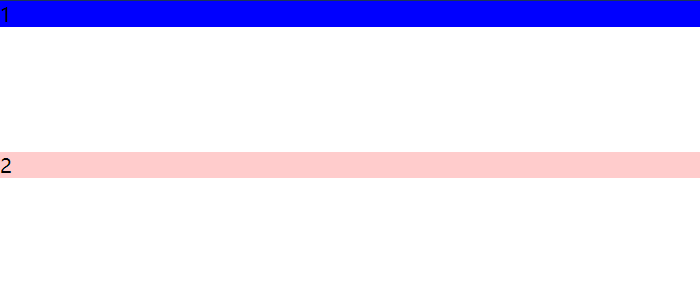
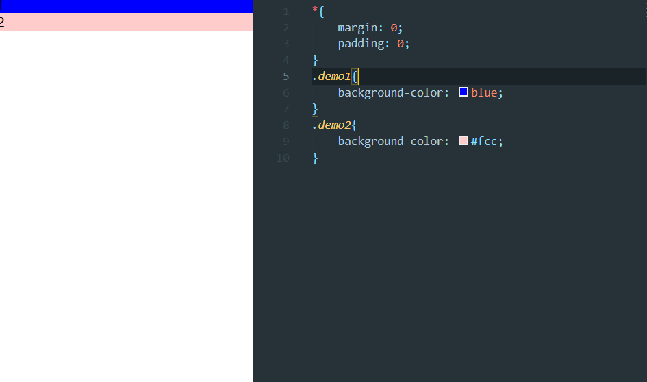

## BFC

<strong>块格式化上下文（Block Formatting Context，BFC）</strong> 是Web页面的可视化CSS渲染的一部分，是块盒子的布局过程发生的区域，也是浮动元素与其他元素交互的区域。

下列方式会创建块格式化上下文：  

>- 根元素(`<html>`)  
>- 浮动元素（元素的 `float` 不是 `none`）  
>- 绝对定位元素（元素的 `position` 为 `absolute` 或 `fixed`）  
>- 行内块元素（元素的 `display` 为 `inline-block`）  
>- 表格单元格（元素的 `display`为 `table-cell`，HTML表格单元格默认为该值）  
>- 表格标题（元素的 `display` 为 `table-caption`，HTML表格标题默认为该值）  
>- 匿名表格单元格元素（元素的 `display`为 `table`、`table-row`、 `table-row-group`、`table-header-group`、`table-footer-group`（分别是HTML table、row、tbody、thead、tfoot的默认属性）或 `inline-table`）  
>- `overflow` 值不为 `visible` 的块元素  
>- `display` 值为 `flow-root` 的元素  
>- `contain` 值为 `layout`、`content`或 `strict` 的元素  
>- 弹性元素（`display`为 `flex` 或 `inline-flex`元素的直接子元素）  
>- 网格元素（`display`为 `grid` 或 `inline-grid` 元素的直接子元素）  
>- 多列容器（元素的 `column-count` 或 `column-width` 不为 `auto`，包括 `column-count` 为 `1`）  
>- `column-span` 为 `all` 的元素始终会创建一个新的BFC，即使该元素没有包裹在一个多列容器中（ [标准变更]([https://link](https://github.com/w3c/csswg-drafts/commit/a8634b96900279916bd6c505fda88dda71d8ec51)) ，[Chrome bug](https://bugs.chromium.org/p/chromium/issues/detail?id=709362)）。  
>- 块格式化上下文包含创建它的元素内部的所有内容.  
>
>> 块格式化上下文对浮动定位（参见 float）与清除浮动（参见 clear）都很重要。浮动定位和清除浮动时只会应用于同一个BFC内的元素。浮动不会影响其它BFC中元素的布局，而清除浮动只能清除同一BFC中在它前面的元素的浮动。外边距折叠（Margin collapsing）也只会发生在属于同一BFC的块级元素之间。  

[引用于MDN](https://developer.mozilla.org/zh-CN/docs/Web/Guide/CSS/Block_formatting_context)  

触发BFC常用方式如下(部分情况也会使用上面内容):  

1）position:absolute;  
2）display:inline-block;  
3）float:left/right;     //浮动  
4）overflow:hidden;      //溢出盒子的部分要隐藏展示   

具体使用见下方两个bug实例以及浮动模型   

## margin塌陷

### 形成塌陷

先来两个盒子  

```html
    <div class="wrapper">
      <div class="content"></div>
    </div>
```

```css
*{
    margin: 0;
    padding: 0;
}
.wrapper{
    margin-top: 100px;
    margin-left: 100px;
    width: 100px;
    height: 100px;
    background-color: black;
}

.content{
    width: 50px;
    height: 50px;
    background-color: green;
}
```

这样的两个父子级盒子  

  

给绿色的加个margin-left  

```css
    margin-left: 50px;
```

  

移动没毛病  

问题来了,把margin-left改成加margin-top  

```css
    margin-top: 50px;
```

  

与最初的两个盒子时的状态没有任何差别,margin-top不管用  

<font color=#8470FF >问题就是父子嵌套的盒子,子元素纵向使用margin不起作用</font>  

如果子元素的margin-top比父级margin的100px大   

```css
    margin-top: 200px;
```

  
红框为后期添加(表示原来所在位置)  

<font color=#8470FF >两个盒子同时移动了100px(200-100),</font>带他父亲走,这么拽的么   
<font color=#fcc >这个效果就是margin塌陷</font>,正常情况应该是父级相对于浏览器进行定位，子级应该相对于父级定位的,但是 margin 塌陷是在父级相对于浏览器进行定位时，子级没有相对于父级定位，就像父级顶上的棚子没有了一样,相当于棚塌陷了.  

  

### 解决办法

既然棚塌陷了,那加一个呗  

```css
    border-top: 1px solid black;  /*父级加上*/
```

  

仿佛解决了,但事实没那么简单  

<font color=#008000 >这个方法不能用,border-top多出来一像素,产品经理不同意</font>  

正确解法就是用BFC  

上面介绍了BFC的形成,现在试一下(让父级拥有BFC)  

```css
.wrapper{
    margin-top: 100px;
    margin-left: 100px;
    width: 100px;
    height: 100px;
    background-color: black;
    overflow:hidden;
}
```

  

出现这个其实是成功了...只是`overflow:hidden;`让溢出部分隐藏了  
那换一个  

```css
    float:left;
```

  

说明完全没问题,但我为什么要举`overflow:hidden;`这个例子?  

答案是 <font color=#00BFFF >这些方法都能触发 BFC，但是使用的时候都带来了新的麻烦,
在具体情况中，针对需求，哪个触发方式没有影响，就用哪个解决塌陷问题</font>  



## margin合并

第七节盒子模型中有个margin隔开两个span的例子  

```html
    <span class="demo1">123</span>
    <span class="demo2">123</span>
```

```css
*{
    margin: 0;
    padding: 0;
}
.demo1{
    background-color: blue;
}
.demo2{
    background-color: #fcc;
    margin-left: 200px;
}
```

  

我给第一个span右边也加一个

```css
margin-right: 200px;
```

  

margin造成的距离累加了  

<font color=#00BFFF >但和塌陷一样,问题也在纵轴方向</font>   

```html
    <div class="demo1">1</div>
    <div class="demo2">2</div>
```

```css
*{
    margin: 0;
    padding: 0;
}
.demo1{
    background-color: blue;
}
.demo2{
    background-color: #fcc;
}
```

都知道上面是什么样的,变化一下  

```css
.demo1{
    background-color: blue;
    margin-bottom: 100px;
}
```

  

再给demo2变一下 

```css
.demo1{
    margin-bottom: 100px;
    background-color: blue;
}
.demo2{
    background-color: #fcc;
    margin-top: 100px;
}
```

bug出现了,完全没变化  

  

我们试着用BFC解决  

```html
    <div class="demo1">1</div>
  <div class="wrapper">
    <div class="demo2">2</div>
  </div>
```

或者

```css
  <div class="wrapper">
    <div class="demo1">1</div>
  </div>
  <div class="wrapper">
      <div class="demo2">2</div>
    </div>
```

```css
.wrapper{
    overflow:hidden;
}
```

仿佛也是解决了,但并不然  

<font color=#00BFFF >上面这方法，改变了 HTML 的结构，这在开发中是不允许的,实际开发中，在 margin 合并这个 bug 上，不用 BFC（这里使用BFC会修改HTML）,假如我们需要两个 div 之间的距离有 300px，那就设置上面的 `margin-bottom:300px;`来解决距离的问题</font>  

  