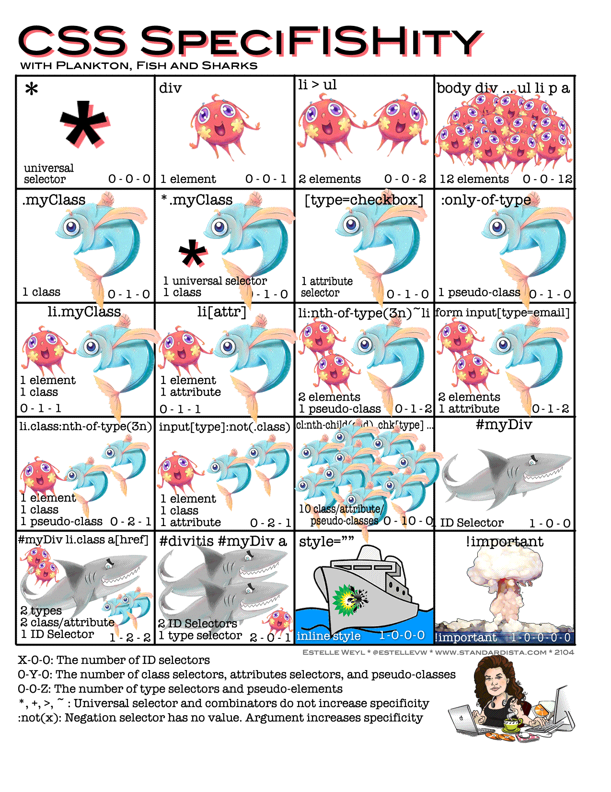
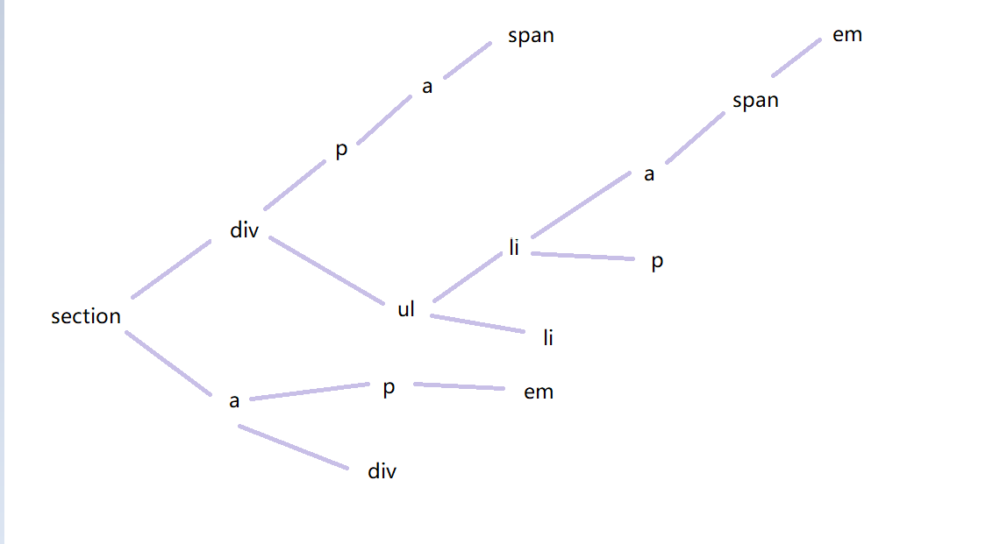

## 权重值

| 选择器                         | 权重值   |
| ------------------------------ | -------- |
| !important                     | infinity |
| 行间样式                       | 1000     |
| id选择器                       | 0100     |
| class 选择器、属性选择器、伪类 | 0010     |
| 标签选择器、伪元素             | 0001     |
| 通配符选择器                   | 0000     |

权重并不是真的1,10,100  
他们不是10进制而是<font color=#f40>至少256进制</font>  
[可以看看这里,有个小demo](https://www.zhangxinxu.com/wordpress/2012/08/256-class-selector-beat-id-selector/)  

我们甚至可以将三种引入方式进行比较最后结果是:  
`行间样式 > 内部CSS > 外部CSS`

那么权重相同会怎么样呢?
谁在后面就是显示谁(相同效果的后面的覆盖前面的),下面效果都是控制颜色,显示蓝色  

```css
    li {color：red;}
    li {color：blue;}
```

## 权重计算



<font color=#00BFFF >计算方式是组合选择器中所有单个选择器(上表有的)权重之和.</font>  

像〜，>和+之类的组合符号对权重没有任何影响.    
例子中的权重都是2,谁在后面就是显示谁(后面的覆盖前面的)  

```css
    ul> li {color：red;} 0-0-2
    ul li {color：blue;} 0-0-2
```

分组选择器中不能把不同组的加在一起,只能组内相加.  

```css
    div,                0-0-1
    .demo,              0-1-0
    div ul li,          0-0-3
    p {                 0-0-1
        color: red;
    }
```

计算机中无穷加一会比无穷大,所以`!important`也能参与计算  

下面看几个例子:  

```html
    <div class="classDiv" id="idDiv">
    <p class="classP" id="idP">123</p>
    </div>
```

```css
    .classDiv #idP{
        background-color: green;
}
    #idDiv .classP{
        background-color: red;
}
```

都是110,所以红色  

```css
#idDiv > .classP{
    background-color: red;
}
.classDiv #idP{
    background-color: green;
}
```

`>`符号没影响,还是绿色  

```css
    #idDiv > p.classP{
        background-color: red;
    }
    .classDiv #idP{
        background-color: green;
    }
```

上面增加了一个p,变成了111,所以红色  

```css
    #idDiv p.classP{
        background-color:red;
    }
    div .classP#idP{
        background-color: green;
    }
```

权重都是111  

```css
        div p.classP{
            background-color: green!important;
        }
        p.classP{
            background-color:red!important;
        }
```

正无穷+12 比 正无穷+11 大,所以绿色  

CSS3中有一个特殊选择器  
`：not（x）`：否定选择器没有值,其中的x(选择器)有值  

[图片的来源](http://www.standardista.com/css3/css-specificity/)  

## CSS从右解析

  

先找到li再找ul,从右开始找(这是最快的)

```css
    ul> li {color：red;}
    ul li {color：blue;}
```