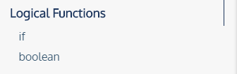
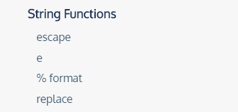
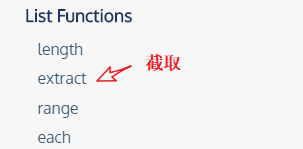
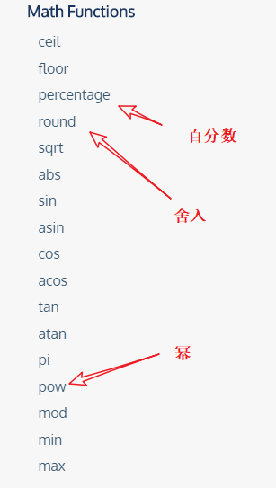
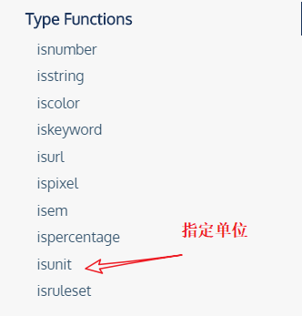
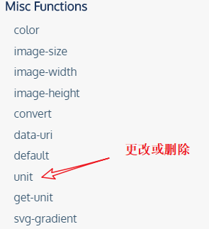
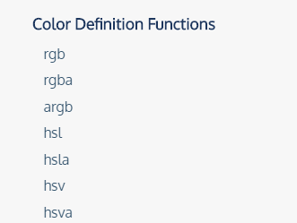
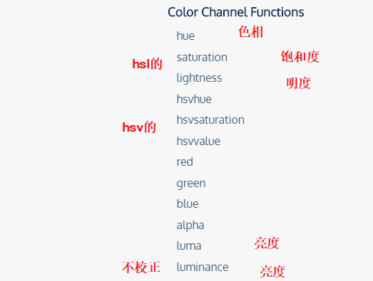
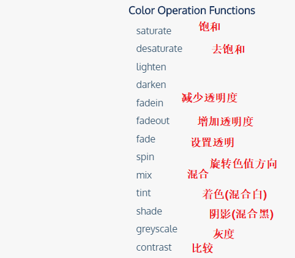
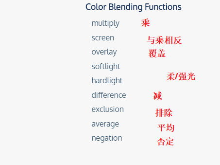

## 逻辑




## 字符串




## 列表




## 数学




## 类型




### iskeyword

```less
iskeyword(keyword);  // true
iskeyword(margin); // true
iskeyword(blue); // false
```


### isunit

```less
isunit(1em,em)   //true
```


## 其他




## 颜色定义





## 颜色通道





## 色值操作



## 色彩融合

