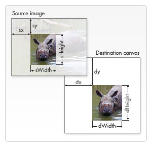

## 获取需要绘制的图片

- **[`HTMLImageElement`](https://developer.mozilla.org/zh-CN/docs/Web/API/HTMLImageElement)**

  这些图片是由`Image()`函数构造出来的，或者任何的``元素

* **[`HTMLVideoElement`](https://developer.mozilla.org/zh-CN/docs/Web/API/HTMLVideoElement)**

  用一个 HTML 的 [`<video>`](https://developer.mozilla.org/zh-CN/docs/Web/HTML/Element/video)元素作为你的图片源，可以从视频中抓取当前帧作为一个图像

- **[`HTMLCanvasElement`](https://developer.mozilla.org/zh-CN/docs/Web/API/HTMLCanvasElement)**

  可以使用另一个 [`canvas`](https://developer.mozilla.org/zh-CN/docs/Web/HTML/Element/canvas) 元素作为你的图片源。

* **[`ImageBitmap`](https://developer.mozilla.org/zh-CN/docs/Web/API/ImageBitmap)**

  这是一个高性能的位图，可以低延迟地绘制，它可以从上述的所有源以及其它几种源中生成。

这些源统一由 [`CanvasImageSource`](https://developer.mozilla.org/zh-CN/docs/Web/API/CanvasImageSource)类型来引用。

### 创建一个图像

```JavaScript
var img = new Image();   // 创建img元素
img.onload = function(){
  // 执行drawImage语句
}
img.src = 'myImage.png'; // 设置图片源地址
```

## 绘制图片

**`drawImage(image, x, y)`**

其中 `image` 是 image 或者 canvas 对象，`x` 和 `y 是其在目标 canvas 里的起始坐标。`

```javascript
var ctx = document.getElementById('canvas').getContext('2d');
var img = new Image();
img.onload = function() {
  ctx.drawImage(img, 0, 0);
  ctx.beginPath();
  ctx.moveTo(30, 96);
  ctx.lineTo(70, 66);
  ctx.lineTo(103, 76);
  ctx.lineTo(170, 15);
  ctx.stroke();
};
img.src = 'images/backdrop.png';
```

## 图片缩放

[`drawImage(image, x, y, width, height)`](https://developer.mozilla.org/zh-CN/docs/Web/API/CanvasRenderingContext2D/drawImage)

这个方法多了 2 个参数：`width` 和 `height，`这两个参数用来控制 当向 canvas 画入时应该缩放的大小

## 图片切片

[`drawImage(image, sx, sy, sWidth, sHeight, dx, dy, dWidth, dHeight)`](https://developer.mozilla.org/zh-CN/docs/Web/API/CanvasRenderingContext2D/drawImage)

第一个参数和其它的是相同的，都是一个图像或者另一个 canvas 的引用。其它 8 个参数最好是参照下边的图解，前 4 个是定义图像源的切片位置和大小，后 4 个则是定义切片的目标显示位置和大小。


