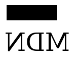

## 状态的保存和恢复

- [`save()`](https://developer.mozilla.org/zh-CN/docs/Web/API/CanvasRenderingContext2D/save)

  保存画布(canvas)的所有状态

- [`restore()`](https://developer.mozilla.org/zh-CN/docs/Web/API/CanvasRenderingContext2D/restore)

  save 和 restore 方法是用来保存和恢复 canvas 状态的，都没有参数。Canvas 的状态就是当前画面应用的所有样式和变形的一个快照。

Canvas 状态存储在栈中，每当`save()`方法被调用后，当前的状态就被推送到栈中保存。一个绘画状态包括：

- 当前应用的变形（即移动，旋转和缩放，见下）
- `strokeStyle`, `fillStyle`, `globalAlpha`, `lineWidth`, `lineCap`, `lineJoin`, `miterLimit`, `shadowOffsetX`, `shadowOffsetY`, `shadowBlur`, `shadowColor`, `globalCompositeOperation 的值`
- 当前的裁切路径（clipping path），会在下一节介绍

你可以调用任意多次 `save`方法。

每一次调用 `restore` 方法，上一个保存的状态就从栈中弹出，所有设定都恢复。

## 移动

```
translate(x, y)
```

`translate`方法接受两个参数。x 是左右偏移量，y 是上下偏移量，如下图所示。


## 旋转

- `rotate(angle)`

  这个方法只接受一个参数：旋转的角度(angle)，它是顺时针方向的，以弧度为单位的值。

旋转的中心点始终是 canvas 的原点，如果要改变它，我们需要用到 `translate`方法。


## 缩放

- **`scale(x, y)`**

  `scale` 方法可以缩放画布的水平和垂直的单位。两个参数都是实数，可以为负数，x 为水平缩放因子，y 为垂直缩放因子，如果比 1 小，会比缩放图形， 如果比 1 大会放大图形。默认值为 1， 为实际大小。

画布初始情况下， 是以左上角坐标为原点的第一象限。如果参数为负实数， 相当于以 x 或 y 轴作为对称轴镜像反转（例如， 使用`translate(0,canvas.height); scale(1,-1);` 以 y 轴作为对称轴镜像反转， 就可得到著名的笛卡尔坐标系，左下角为原点）。



## 变形

最后一个方法允许对变形矩阵直接修改。

- `transform(m11, m12, m21, m22, dx, dy)`

这个方法是将当前的变形矩阵乘上一个基于自身参数的矩阵，在这里我们用下面的矩阵：

```
m11 m21 dx
m12 m22 dy
0 	0 	1
```

详见:

有点和 css3 像

https://developer.mozilla.org/zh-CN/docs/Web/API/Canvas_API/Tutorial/Transformations
