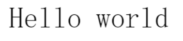
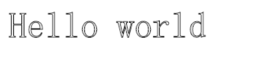
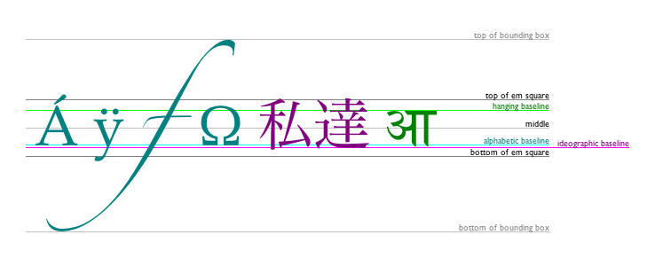

## 绘制文本

[`fillText(text, x, y [, maxWidth])`](https://developer.mozilla.org/zh-CN/docs/Web/API/CanvasRenderingContext2D/fillText)

在指定的(x,y)位置填充指定的文本，绘制的最大宽度是可选的.

[`strokeText(text, x, y [, maxWidth])`](https://developer.mozilla.org/zh-CN/docs/Web/API/CanvasRenderingContext2D/strokeText)

在指定的(x,y)位置绘制文本边框，绘制的最大宽度是可选的.

## 有样式的文本

[`font = value`](https://developer.mozilla.org/zh-CN/docs/Web/API/CanvasRenderingContext2D/font)

当前我们用来绘制文本的样式. 这个字符串使用和 [CSS](https://developer.mozilla.org/en-US/docs/Web/CSS) [`font`](https://developer.mozilla.org/zh-CN/docs/Web/CSS/font) 属性相同的语法. 默认的字体是 `10px sans-serif`。

[`textAlign = value`](https://developer.mozilla.org/zh-CN/docs/Web/API/CanvasRenderingContext2D/textAlign)

文本对齐选项. 可选的值包括：`start`, `end`, `left`, `right` or `center`. 默认值是 `start`。

[`textBaseline = value`](https://developer.mozilla.org/zh-CN/docs/Web/API/CanvasRenderingContext2D/textBaseline)

基线对齐选项. 可选的值包括：`top`, `hanging`, `middle`, `alphabetic`, `ideographic`, `bottom`。默认值是 `alphabetic。`

[`direction = value`](https://developer.mozilla.org/zh-CN/docs/Web/API/CanvasRenderingContext2D/direction)

文本方向。可能的值包括：`ltr`, `rtl`, `inherit`。默认值是 `inherit。`

## 预测文本宽度

[`measureText()`](https://developer.mozilla.org/zh-CN/docs/Web/API/CanvasRenderingContext2D/measureText)

将返回一个 [`TextMetrics`](https://developer.mozilla.org/zh-CN/docs/Web/API/TextMetrics)对象的宽度、所在像素，这些体现文本特性的属性。
