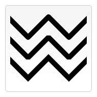
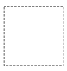

## 色彩

```JavaScript
fillStyle  = color
//设置图形填充色
strokeStyle = color
//设置图形轮廓颜色

//颜色支持任何符合css3颜色值标准的有效字符串
```

## 透明度

```JavaScript
globalAlpha = transparencyValue
```

0 到 1 的值,设置全局透明色

但是用这个干嘛不直接在颜色值中添加 alpha

## 线型

- [`lineWidth = value`](https://developer.mozilla.org/zh-CN/docs/Web/API/CanvasRenderingContext2D/lineWidth)

  设置线条宽度。

  

- [`lineCap = type`](https://developer.mozilla.org/zh-CN/docs/Web/API/CanvasRenderingContext2D/lineCap)

  设置线条末端样式。

  

- [`lineJoin = type`](https://developer.mozilla.org/zh-CN/docs/Web/API/CanvasRenderingContext2D/lineJoin)

  设定线条与线条间接合处的样式。

  

- [`miterLimit = value`](https://developer.mozilla.org/zh-CN/docs/Web/API/CanvasRenderingContext2D/miterLimit)

  限制当两条线相交时交接处最大长度；所谓交接处长度（斜接长度）是指线条交接处内角顶点到外角顶点的长度。

  

- [`getLineDash()`](https://developer.mozilla.org/zh-CN/docs/Web/API/CanvasRenderingContext2D/getLineDash)

  返回一个包含当前虚线样式，长度为非负偶数的数组。

  

- [`setLineDash(segments)`](https://developer.mozilla.org/zh-CN/docs/Web/API/CanvasRenderingContext2D/setLineDash)

  设置当前虚线样式。

* [`lineDashOffset = value`](https://developer.mozilla.org/zh-CN/docs/Web/API/CanvasRenderingContext2D/lineDashOffset)

  设置虚线样式的起始偏移量。

## 渐变

[`createLinearGradient(x1, y1, x2, y2)`](https://developer.mozilla.org/zh-CN/docs/Web/API/CanvasRenderingContext2D/createLinearGradient)

createLinearGradient 方法接受 4 个参数，表示渐变的起点 (x1,y1) 与终点 (x2,y2)。


[`createRadialGradient(x1, y1, r1, x2, y2, r2)`](https://developer.mozilla.org/zh-CN/docs/Web/API/CanvasRenderingContext2D/createRadialGradient)

createRadialGradient 方法接受 6 个参数，前三个定义一个以 (x1,y1) 为原点，半径为 r1 的圆，后三个参数则定义另一个以 (x2,y2) 为原点，半径为 r2 的圆。

[`gradient.addColorStop(position, color)`](https://developer.mozilla.org/zh-CN/docs/Web/API/CanvasGradient/addColorStop)

addColorStop 方法接受 2 个参数，`position` 参数必须是一个 0.0 与 1.0 之间的数值，表示渐变中颜色所在的相对位置。例如，0.5 表示颜色会出现在正中间。`color` 参数必须是一个有效的 CSS 颜色值（如 #FFF， rgba(0,0,0,1)，等等）。

```JavaScript
var lineargradient = ctx.createLinearGradient(0,0,150,150);
lineargradient.addColorStop(0,'white');
lineargradient.addColorStop(1,'black');
```

## 图案样式

[`createPattern(image, type)`](https://developer.mozilla.org/zh-CN/docs/Web/API/CanvasRenderingContext2D/createPattern)

该方法接受两个参数。Image 可以是一个 `Image` 对象的引用，或者另一个 canvas 对象。`Type` 必须是下面的字符串值之一：`repeat`，`repeat-x`，`repeat-y` 和 `no-repeat`。

```JavaScript
  var ctx = document.getElementById('canvas').getContext('2d');

  // 创建新 image 对象，用作图案
  var img = new Image();
  img.src = 'https://mdn.mozillademos.org/files/222/Canvas_createpattern.png';
  img.onload = function() {

    // 创建图案
    var ptrn = ctx.createPattern(img, 'repeat');
    ctx.fillStyle = ptrn;
    ctx.fillRect(0, 0, 150, 150);
```

## 阴影

[`shadowOffsetX = float`](https://developer.mozilla.org/zh-CN/docs/Web/API/CanvasRenderingContext2D/shadowOffsetX)

`shadowOffsetX` 和 `shadowOffsetY`用来设定阴影在 X 和 Y 轴的延伸距离，它们是不受变换矩阵所影响的。负值表示阴影会往上或左延伸，正值则表示会往下或右延伸，它们默认都为 `0`。

[`shadowOffsetY = float`](https://developer.mozilla.org/zh-CN/docs/Web/API/CanvasRenderingContext2D/shadowOffsetY)

shadowOffsetX 和 `shadowOffsetY`用来设定阴影在 X 和 Y 轴的延伸距离，它们是不受变换矩阵所影响的。负值表示阴影会往上或左延伸，正值则表示会往下或右延伸，它们默认都为 `0`。

[`shadowBlur = float`](https://developer.mozilla.org/zh-CN/docs/Web/API/CanvasRenderingContext2D/shadowBlur)

shadowBlur 用于设定阴影的模糊程度，其数值并不跟像素数量挂钩，也不受变换矩阵的影响，默认为 `0`。

[`shadowColor = color`](https://developer.mozilla.org/zh-CN/docs/Web/API/CanvasRenderingContext2D/shadowColor)

shadowColor 是标准的 CSS 颜色值，用于设定阴影颜色效果，默认是全透明的黑色。

## 填充规则 ???

两个值

- **nonzero**
- **evenodd**

```JavaScript
ctx.fill("evenodd");
```
