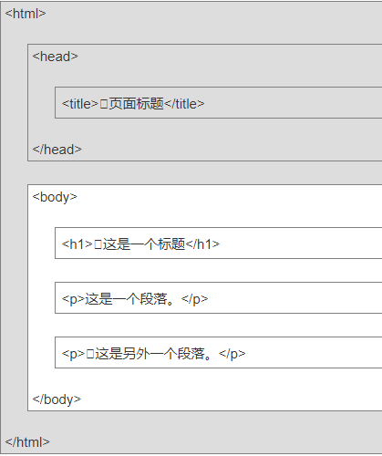
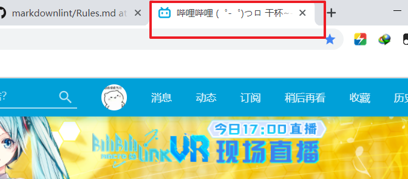
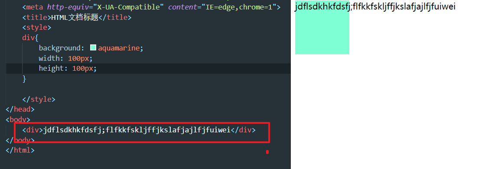
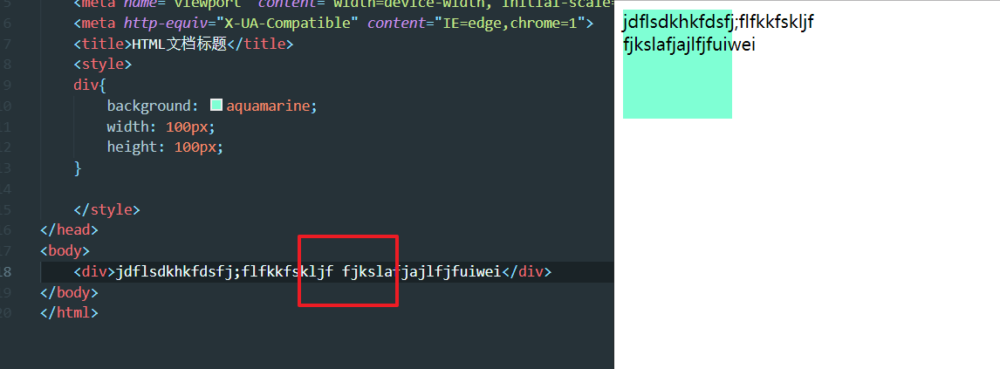

## 基础标签（必须）

```html
<!DOCTYPE html>
<html lang="en">
<head>
    <title>Document</title>
</head>
<body>
    <h2>二级标题</h2>
    <p>这是一段话</p>
</body>
</html>
```



版本声明

声明使用html5版本(不是标签)

```html
    <!DOCTYPE html>
```

1. 根标签

```html
    <html> </html>
```

所有的html内容都包含在里面
属性`lang="en"` 让搜索引擎和浏览器知道这是英文网页（即使里面全是中文）
> 中文zh-CN
> 日本ja
> 德国de

2. 头标签

```html
    <head> </head>
```

<font size=4 color=#8470FF>这是给浏览器看的，告诉浏览器一些信息 </font>

`<meta charset="UTF-8">` 定义网页编码格式为 UTF-8（编码字符集）。
> meta拥有众多属性（主要用于网页适配，搜索优化），初步只用记住charset

3. 身体标签

```html
    <body> </body>
```

<font size=4 color=#8470FF>这是给人看的，看得到的内容都写在里面</font>

4. 文档标题标签

```html
    <title>这是网页的标题</title>
```



## 标题和段落

### 标题标签

标题拥有一组标签

```html
  <h1>一级标题</h1>
  <h2>二级标题</h2>
  <h3>三级标题</h3>
  <h4>四级标题</h4>
  <h5>五级标题</h5>
  <h6>六级标题</h6>
```

> 一级标题最大，然后依次递减


### 段落标签

段落标签，让内容成段展示

```html
    <p>这是一段话</p>
```

## 文本格式化

HTML 使用标签  `<b>`("bold粗体") 与 `<i>`("italic斜体") 对输出字体进行控制
> 通常标签 `<strong>` 替换加粗标签 `<b>` 来使用, `<em>` 替换 `<i>`标签使用。
> 但他们所表达的意义并不同
> strong和em意味着体现文本的重要性，所以要突出显示(通常用这,而不是b和i)

标签能够套用，例如

```html
    <strong>
    <em>又加粗又斜体</em>
    </strong>
    <del> 删除线 </del>
```

[文本格式化标签参考w3school](http://www.w3school.com.cn/html/html_formatting.asp)

## <font color=#00BFFF >重要的没意义标签</font>

`<div></div>`独占一行  
`<span></span>`不独占一行

div 和 span 这两个标签是为了成块展示，规格化，这两个就是容器，功能如下：  
功能 1：分块明确，让整个页面更加结构化；  
功能 2：捆绑操作的作用（搬书架）  

## 符号

如果是一个单词，溢出是不管的  

  

下面添加了空格   
  

空格的含义是英文单词分隔符，不代表文本的空格，作为分隔符，打多少个都只显示一个空格；回车也是文字分割符，也是打多少个都只显示一个空格  

HTML中真正使用空格是用html符号实体编码，格式如下：  
`&`+名称或者#编码+`;`      
常用的几个编码    
> 1） 空格文本，写多少个就空几格`&nbsp;`  
> 2）<左尖角号，小于的意思，less than，html 编码是`&lt;`  
> 3）>右尖角号，大于的意思，great than，html 编码是`&gt;`  
> 4） &copy;版权符号 `&copy;`或者`&#169;`  
[更多实体符号点击](https://www.runoob.com/html/html-entities.html)  

## 其他常见单标签

大部分标签的作用是把他包裹的文本作用城他设置的样子，所以成对出现，有
的标签自己就代表功能，就是单标签

```html
    <br>换行符
    <hr>水平线
```

单标签建议写成`<br />`这种样式  