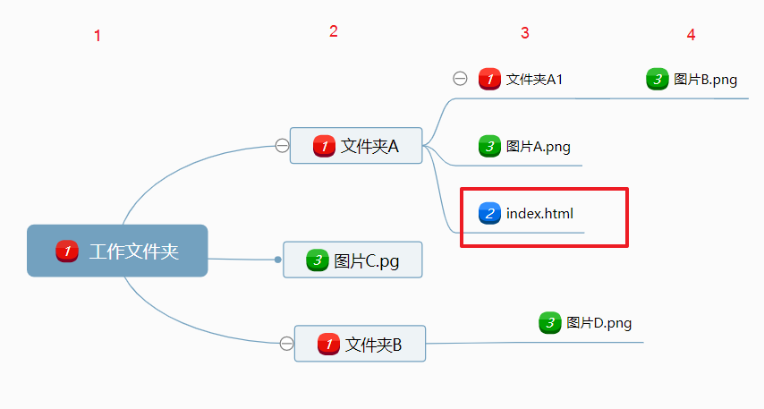

HTML路径有三种
> 1）网上 url  
2）本地的绝对路径  
3）本地的相对路径  

但事实上url也是属于绝对路径的。

## 绝对路径

从名称入手理解，既然称得上“绝对”二字，那么路径的表现形式就比较直观，能完整描述文件在磁盘上的位置。  

绝对路径一般来说主要有两种形式:  

1. 完整的磁盘路径:  
D:\mytest\web\images\pic.jpg是一个绝对路径，看到它就能够明确的找到图片在磁盘中的位置，不过在web中很少使用此种形式的绝对路径。  

2. 完整的url路径:  
<https://github.com/catlair/web-note/raw/master/Emmet插件/images/emmet-doc.gif>也是一个绝对路径。它虽然看没有描述文件的完整路径，其实不然，域名会指向磁盘的一个目录，那么一个带有域名的url地址也是一个绝对路径。  

## 相对路径

相对路径与绝对路径相比要复杂一些，同样可以从名称入手，之所以叫做相对路径，那么首先就要确定一个路径参考点；其他文件的路径都是相对于当前文件位置来确定的,HTML中正是当前html文件作为参考点。   

> 1）`../`：代表当前文件所在目录的上一级目录。  
2）`../../`：代表当前文件所在目录的上上级目录。  
3）`../....../../`：可以依次类推。  
4）`/`：代表根目录。 
5）`./`：表示当前目录，HTML中，可以省略直接写目录名或文件名。  

下面给出一个例子：  


```html
    <!-- 使用图片A，./是可以省略的 -->
    

    <!-- 使用图片B ./是可以省略的 -->
    

    <!-- 使用图片C -->
    
```

## 根目录（理解）

1. Linux有一个根目录

`'/'`在linux中表示根目录。在Linux系统中，除根目录(root)以外，所有文件和目录都包含在相应的目录文件中。Linux文件系统采用带链接的树形目录结构，即只有一个根目录（通常用'/'表示），其中含有下级子目录或文件的信息；子目录中又可含有更下级的子目录或者文件的信息。这样一层一层地延伸下去，构成一棵倒置的树。  

2. Windows 每个磁盘都有一个"根目录"  

`'/'`在windows中也表示根目录，但此跟目录非彼根目录。windows对磁盘分区后会有多个磁盘，通常系统会装在C盘。windows有多个磁盘所以就会有‘多个根目录’，在dos命令模式下，在D盘的某文件夹中输入'cd /'命令回车后会直接回到D盘的根目录。其它磁盘下也会回到该磁盘的目录。在哪个磁盘下使用'/'，它就表示哪个磁盘的根目录。

3. 网站也有自己的根目录

网站的根目录的文件框架会根据自己或者空间提供商的配置不同有区别。  
但表示成url给外部使用时，`域名/`表示根目录。  