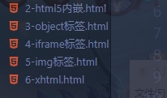

## 简单例子

```svg
<svg version="1.1"
     baseProfile="full"
     width="300" height="200"
     xmlns="http://www.w3.org/2000/svg">

  <rect width="100%" height="100%" fill="red" />

  <circle cx="150" cy="100" r="80" fill="green" />

  <text x="150" y="125" font-size="60" text-anchor="middle" fill="white">SVG</text>

</svg>
```

注意:

如果要浏览器解析`xmlns="http://www.w3.org/2000/svg"`是必不可少的,否则会解释失败


## 引入 SVG

之后就一直采用 svg 文件写,这里不做过多解释



### 使用 html5 内嵌

```html
<!DOCTYPE html>
<html lang="zh-cmn-Hans">
  <head>
    <meta charset="UTF-8" />
    <meta name="viewport" content="width=device-width, initial-scale=1.0" />
    <title>Document</title>
  </head>

  <body>
    <svg
      version="1.1"
      baseProfile="full"
      width="300"
      height="200"
      xmlns="http://www.w3.org/2000/svg"
    >
      <rect width="100%" height="100%" fill="red" />

      <circle cx="150" cy="100" r="80" fill="green" />

      <text x="150" y="125" font-size="60" text-anchor="middle" fill="white">
        SVG
      </text>
    </svg>
  </body>
</html>
```

## 文件类型

`.svg`和 gzip 压缩的`.svgz`格式

HTTP 响应头

```
Content-Type: image/svg+xml
Vary: Accept-Encoding
```

```
Content-Type: image/svg+xml
Content-Encoding: gzip
Vary: Accept-Encoding
```
