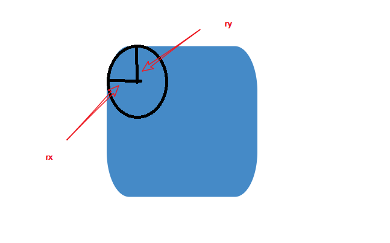

## 矩形

```xml
<rect x="10" y="10" width="30" height="30"/>
<rect x="60" y="10" rx="10" ry="10" width="30" height="30"/>
```

**x**

矩形左上角的 x 位置

**y**

矩形左上角的 y 位置

**width**

矩形的宽度

**height**

矩形的高度

**rx**

圆角的 x 方位的半径

**ry**

圆角的 y 方位的半径



## 圆形

```xml
<circle cx="25" cy="75" r="20"/>
```

**r**

圆的半径

**cx**

圆心的 x 位置

**cy**

圆心的 y 位置

## 椭圆

```xml
<ellipse cx="75" cy="75" rx="20" ry="5"/>
```

**rx**

椭圆的 x 半径

**ry**

椭圆的 y 半径

**cx**

椭圆中心的 x 位置

**cy**

椭圆中心的 y 位置

## 线条

```xml
<line x1="10" x2="50" y1="110" y2="150"/>
```

**x1**

起点的 x 位置

**y1**

起点的 y 位置

**x2**

终点的 x 位置

**y2**

终点的 y 位置

## 折线

```xml
<polyline points="60 110, 65 120, 70 115, 75 130, 80 125, 85 140, 90 135, 95 150, 100 145"/>
```

**points**

点集数列。每个点必须包含 2 个数字，xy 坐标。所以点列表 (0,0), (1,1) 和(2,2)可以写成这样：“0 0, 1 1, 2 2”。

## 多边形

```xml
<polygon points="50 160, 55 180, 70 180, 60 190, 65 205, 50 195, 35 205, 40 190, 30 180, 45 180"/>
```

**折线多了一个自动闭合路径功能**

## 路径

```xml
<path d="M 20 230 Q 40 205, 50 230 T 90230"/>
```

**d**

一个点集数列以及其它关于如何绘制路径的信息。
