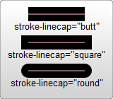
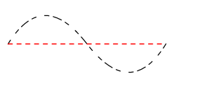

## 上色和描边

```xml
 <rect x="10" y="10" width="100" height="100" stroke="blue" fill="purple"
       fill-opacity="0.5" stroke-opacity="0.8"/>
```

**fill**

填充色

**stroke**

描边色

**`*-opacity`**

控制不透明度

**stroke-width**

描边宽度

### 描边方式

```xml
<?xml version="1.0" standalone="no"?>
<svg width="160" height="140" xmlns="http://www.w3.org/2000/svg" version="1.1">
  <line x1="40" x2="120" y1="20" y2="20" stroke="black" stroke-width="20" stroke-linecap="butt"/>
  <line x1="40" x2="120" y1="60" y2="60" stroke="black" stroke-width="20" stroke-linecap="square"/>
  <line x1="40" x2="120" y1="100" y2="100" stroke="black" stroke-width="20" stroke-linecap="round"/>
</svg>
```



`troke-linecap`属性的值有三种可能值：

- `butt`用直边结束线段，它是常规做法，线段边界 90 度垂直于描边的方向、贯穿它的终点。
- `square`的效果差不多，但是会稍微超出`实际路径`的范围，超出的大小由`stroke-width`控制。
- `round`表示边框的终点是圆角，圆角的半径也是由`stroke-width`控制的。


`stroke-linejoin`属性，用来控制两条描边线段之间，用什么方式连接。



`stroke-dasharray`属性，将虚线类型应用在描边上。

```xml
<path d="M 10 75 L 190 75" stroke="red"
    stroke-linecap="round" stroke-width="1" stroke-dasharray="5,5" fill="none"/>
```

`stroke-dasharray`属性的参数

一组用**逗号分割**的数字组成的数列。

还有一些关于填充和边框的属性，包括`fill-rule`，用于定义如何给图形重叠的区域上色；`stroke-miterlimit`，定义什么情况下绘制或不绘制边框连接的`miter`效果；还有`stroke-dashoffset`，定义虚线开始的位置。
