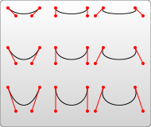

## 引言

**path**元素的形状是通过属性`d`定义的，属性`d`的值是一个“命令+参数”的序列，我们将讲解这些可用的命令，并且展示一些示例。

每一个命令都有两种表示方式，一种是用**大写字母**，表示采用绝对定位。另一种是用**小写字母**，表示采用相对定位（例如：_从上一个点开始，向上移动 10px，向左移动 7px_）。

`因为属性d`采用的是用户坐标系统，所以**不需标明单位**。

## 直线命令

### Move TO

```
M x y
```

```
m dx dy
```

## Line To

```html
L x y (or l dx dy)
```

#### 简写

```html
H x (or h dx) //水平线 V y (or v dy) //垂直线
```

## 闭合命令

```html
Z (or z)
```

Z 命令不用区分大小写。

```xml
<path d="M10 10 h 80 v 80 h -80 Z" fill="transparent" stroke="black"/>
```

## 曲线命令

### 贝塞尔曲线

#### 三次

```html
C x1 y1, x2 y2, x y (or c dx1 dy1, dx2 dy2, dx dy)
```

前面两个是控制点,后一个是终止坐标点

```xml
<?xml version="1.0" standalone="no"?>

<svg width="190px" height="160px" version="1.1" xmlns="http://www.w3.org/2000/svg">

  <path d="M10 10 C 20 20, 40 20, 50 10" stroke="black" fill="transparent"/>
  <path d="M70 10 C 70 20, 120 20, 120 10" stroke="black" fill="transparent"/>
  <path d="M130 10 C 120 20, 180 20, 170 10" stroke="black" fill="transparent"/>
  <path d="M10 60 C 20 80, 40 80, 50 60" stroke="black" fill="transparent"/>
  <path d="M70 60 C 70 80, 110 80, 110 60" stroke="black" fill="transparent"/>
  <path d="M130 60 C 120 80, 180 80, 170 60" stroke="black" fill="transparent"/>
  <path d="M10 110 C 20 140, 40 140, 50 110" stroke="black" fill="transparent"/>
  <path d="M70 110 C 70 140, 110 140, 110 110" stroke="black" fill="transparent"/>
  <path d="M130 110 C 120 140, 180 140, 170 110" stroke="black" fill="transparent"/>

</svg>
```


