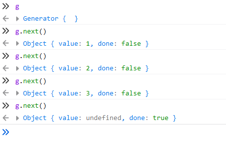
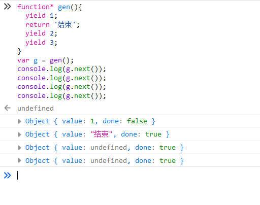

## 语法

生成器对象是由一个 **generator function** 返回的,并且它符合**可迭代协议**和**迭代器协议**。

```javascript
function* gen() {
  yield 1;
  yield 2;
  yield 3;
}

let g = gen();
// "Generator { }"
```



## Generator.prototype 方法

### next()

返回一个由 [yield](https://developer.mozilla.org/zh-CN/docs/Web/JavaScript/Reference/Operators/yield)表达式生成的值

### return()

```javascript
function* gen() {
  yield 1;
  yield 2;
}

var g = gen();

g.next(); // { value: 1, done: false }
g.return('foo'); // { value: "foo", done: true }
g.next(); // { value: undefined, done: true }
```

```javascript
function* gen() {
  yield 1;
  yield 2;
}

var g = gen();
g.next(); // { value: 1, done: false }
g.next(); // { value: 2, done: false }
g.next(); // { value: undefined, done: true }
g.return(); // { value: undefined, done: true }
g.return(1); // { value: 1, done: true }
```

### [throw()](https://developer.mozilla.org/zh-CN/docs/Web/JavaScript/Reference/Global_Objects/Generator/throw)

向生成器抛出一个错误。

## [function\* 生成器函数](https://developer.mozilla.org/zh-CN/docs/Web/JavaScript/Reference/Statements/function*)

生成器函数语法与普通函数一致,只是`function`后多个`*`,并且不能用作构造函数

**生成器函数**在执行时能暂停，后面又能从暂停处继续执行。

调用一个生成器函数并不会马上执行它里面的语句，而是返回一个这个生成器的 迭代器 （ `iterator` ）对象。当这个迭代器的 `next()` 方法被首次（后续）调用时，其内的语句会执行到第一个（后续）出现 yield 的位置为止，`yield` 后紧跟迭代器要返回的值。或者如果用的是 `yield*`（多了个星号），则表示将执行权移交给另一个生成器函数（当前生成器暂停执行）。

调用 `next()`方法时，如果传入了参数，那么这个参数会传给上一条执行的 `yield`语句左边的变量，例如下面例子中的 x ：

```javascript
function* gen() {
  yield 10;
  x = yield 'foo';
  yield x;
}

var gen_obj = gen();
console.log(gen_obj.next());
// 执行 yield 10，返回 10
console.log(gen_obj.next());
// 将 100 赋给上一条 yield
console.log(gen_obj.next(100));
// 将 100 赋给上一条 yield 'foo' 的左值，即执行 x=100，返回 100
console.log(gen_obj.next());
// 执行完毕，value 为 undefined，done 为 true
```

如果在生成器函数中显示`return`,那么`next()`会返回 return 的值,并将`done`值变成 true.(变成执行完毕状态)

```javascript
function* gen() {
  yield 1;
  return '结束';
  yield 2;
  yield 3;
}
var g = gen();
console.log(g.next());
console.log(g.next());
console.log(g.next());
console.log(g.next());
```



[更多示例](https://developer.mozilla.org/zh-CN/docs/Web/JavaScript/Reference/Statements/function*#示例)
