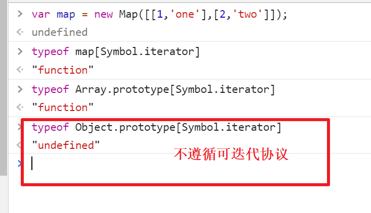
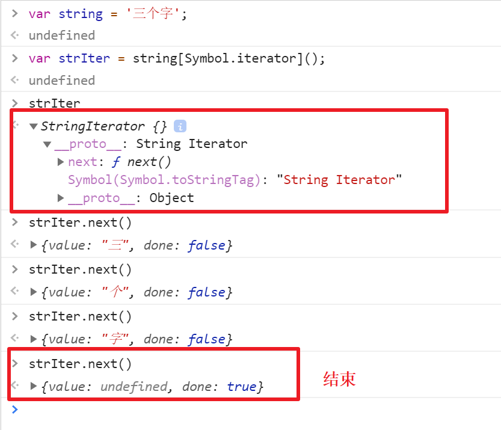
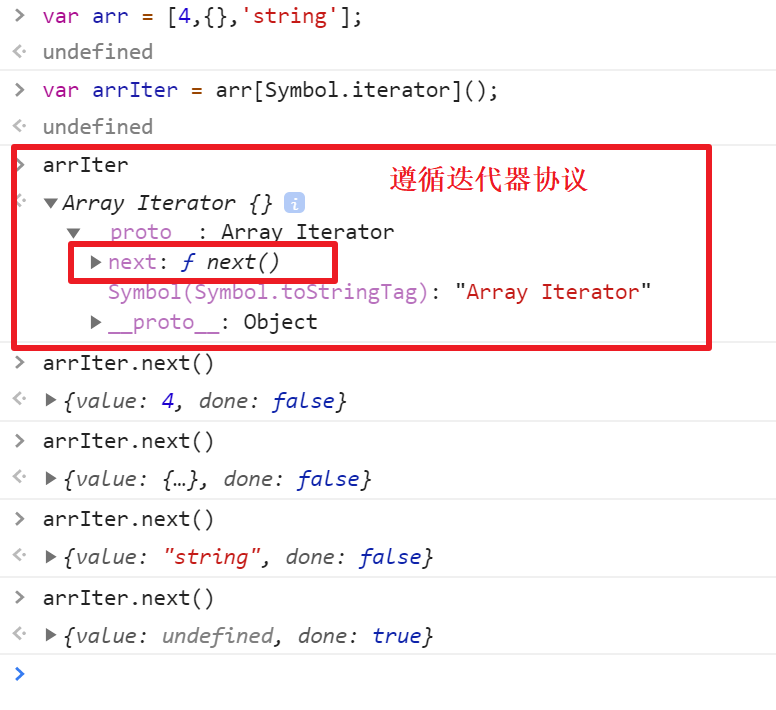

ECMAScript 2015 的几个补充，并不是新的内置实现或语法，而是协议。这些协议可以被任何遵循某些约定的对象来实现。

有两个协议：可迭代协议和迭代器协议。

## 可迭代协议

属性 `[Symbol.iterator]`  
返回一个对象的无参函数，被返回对象符合迭代器协议。

为了变成可迭代对象， 一个对象必须实现 @@iterator 方法, 意思是这个对象（或者它原型链 prototype chain 上的某个对象）必须有一个名字是 `Symbol.iterator` 的属性.



## Symbol.iterator

当一个对象需要被迭代的时候（比如开始用于一个`for..of`循环中），它的`@@iterator`方法被调用并且无参数，然后**返回**一个用于在迭代中获得值的**迭代器**。

下表中的内置类型拥有默认的@@iterator 方法：

- `Array.prototype[@@iterator]()`
- `TypedArray.prototype[@@iterator]()`
- `String.prototype[@@iterator]()`
- `Map.prototype[@@iterator]()`
- `Set.prototype[@@iterator]()`

## 迭代器协议

该迭代器协议定义了一种标准的方式来产生一个有限或无限序列的值，并且当所有的值都已经被迭代后，就会有一个默认的返回值。

当一个对象只有满足下述条件才会被认为是一个迭代器：  
它实现了一个`next()`的方法并且拥有以下含义：

属性 `next`  
返回一个对象的无参函数，被返回对象拥有两个属性：  
**done (boolean)**

- **true:**迭代器已经超过了可迭代次数。这种情况下,value 的值可以被省略
- **false:**如果迭代器可以产生序列中的下一个值，则为 false。这等效于没有指定 done 这个属性。

**value**

- 迭代器返回的任何 JavaScript 值。`done` 为 `true` 时可省略(默认的迭代器为`undefined`)。

`next` 方法必须要返回一一个对象，该对象有两个必要的属性： `done`和`value`，如果返回一个非对象值（比如`false`和`undefined`) 会展示一个 `TypeError ("iterator.next() returned a non-object value")` 的错误

### 演示

String



Array



## 自定义一个满足协议的对象

```javascript
var myIterator = {
  next: function() {
    // ...
  },
  [Symbol.iterator]: function() {
    return this;
  },
};
```
