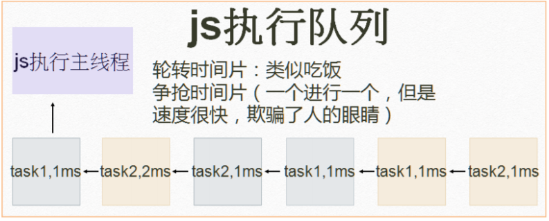

## 概念：一门客户端脚本语言

运行在客户端游览器中的，每一个游览器都有 javaScript 的解析引擎。

脚本语言：不需要编译，直接就可以被游览器解析执行了。

## 功能：

可以来增强用户和 html 页面的交互过程，可以控制 html 元素，让页面有一些动态的效果，增强用户的体验。

## web 发展史

Mosaic，是互联网历史上第一个获普遍使用和能够显示图片的网页浏览器。于 1993 年问世。
1994 年 4 月，马克.安德森和 Silicon Graphics（简称为 SGI，中译为“视算科技”或“硅图”）公司的创始人吉姆·克拉克（Jim Clark）在美国加州设立了“Mosaic Communication Corporation”。
Mosaic 公司成立后，由于伊利诺伊大学拥有 Mosaic 的商标权，且伊利诺伊大学已将技术转让给 Spy Glass 公司，开发团队必须彻底重新撰写浏览器程式码，且浏览器名称更改为 Netscape Navigator，公司名字于 1994 年 11 月改名为“Netscape Communication Corporation”，此后沿用至今，中译为“网景”。
微软的 Internet Explorer 及 Mozilla Firefox 等，其早期版本皆以 Mosaic 为基础而开发。
微软随后买下 Spy Glass 公司的技术开发出 Internet Explorer 浏览器，而 Mozilla Firefox 则是网景通讯家开放源代码后所衍生出的版本。

## javaScript 发展史：

1. 1992 年，nombase 公司，开发出第一门客户端脚本语言，专门用于表单的校验。命名为：c--后来更名为 ScriptEase

2. 1995 年,nerscape(网景)，开发一门客户端脚本语言 ：LiveScript.后来，请来了 sun 公司的专家，修改 LiveScript，改名为 javaScript

3. 1996 年，微软抄袭 JavaScript 开发出 JScript 语言

4. 1997 年，ECMA(欧洲计算机制造商协会)，ECMAScript，就是所有客户端脚本语言的标准。

JavaScript=ECMA+JavaScript 自己特有的东西（BOM+DOM）

ECMAScript：客户端脚本语言的标准

## 浏览器组成

1. shell 部分——用户能操作部分(壳)
2. 内核部分——用户看不到的部分
   1. 渲染引擎（语法规则和渲染）
   2. js 引擎
   3. 其他模块（如异步）

## js 引擎

2001 年发布 ie6，首次实现对 js 引擎的优化。
2008 年 Google 发布最新浏览器 Chrome，它是采用优化后的 javascript 引擎，引擎代号 V8，因能把 js 代码直接转化为机械码来执行，进而以速度快而闻名。
后 Firefox 也推出了具备强大功能的 js 引擎
Firefox3.5 TraceMonkey（对频繁执行的代码做了路径优化）
Firefox4.0 JeagerMonkey

## 渲染引擎

主流浏览器和内核(这里的内核通常指渲染引擎)，主流浏览器是有一定市场份额，并且有自己独立研发的内核浏览器分 shell+内核

| 主流浏览器（必须有独立内核）市场份额大于 3% | 内核         |
| :-----------------------------------------: | ------------ |
|                     IE                      | trident      |
|                   Friefox                   | Gecko        |
|                Google Chrome                | Webkit/blink |
|                   Safari                    | Webkit       |
|                    Opera                    | presto/blink |

Presto 是一个由 Opera Software 开发的浏览器排版引擎（非开源），供 Opera 7.0~10.00 版使用。
2013 年 2 月 14 日 Opera 将采用 webkit  
4 月,放弃 webkit 使用 blink  
16 年,曾经与 IE、Firefox 并称的三大浏览器之一因市场占有率不及 2%,后被昆仑万维收购

## js 特点


js 是解释性语言：(不需要编译成文件）跨平台  
java 先通过 javac，编译成.class 文件，通过 jvm（Java 虚拟机）进行解释执行
.java→javac→ 编译 →.class→jvm→ 解释执行（java 可以跨平台）（java 是 oak 语言）  
ECMA（欧洲计算机制造联合会）标注：为了取得技术优势，微软推出了 JScript，CEnvi 推出 ScriptEase，与 JavaScript 同样可在浏览器上运行。为了统一规格 JavaScript 兼容于 ECMA 标准，因此也称为 ECMAScript。



### 一.基本语法

1. 内部 JS：定义 `<script>` 标签体内容就是 JS 代码
2. 外部 JS：定义 `<script>` 通过 src 属性引入外部的 js 文件

**注意：`<script>`可以定义到 html 页面的任何地方，但是定义的位置会影响执行顺序。**

### 二.注释

1. 单行注释//注释内容

2. 多行注释/_ 注释内容 _/

### 三.数据类型：

1 原始数据类型（基本数据类型）：

- `number`:数字 整数/小数/NaN（not a number 一个不是数字的数字类型）

- `string`：字符串 字符/字符串/ “abc” ‘a’ "abc"

- `boolean` true 和 false

- `null` 一个对象为空的占位符

- `underfined` 未定义。 如果一个变量没有给初始化值，则会被默认赋值 underfined。

  2.引用数据类型：对象

### 四.变量

_变量：一小块存储数据的内存空间_

**java 语言是强类型语言，而 JavaScript 是弱类型语言。**

`强类型`：在开辟变量存储空间时，定义了空间将来存储的数据的数据类型。只能存储固定类型的数据。

`弱类型`：在开辟变量存储空间时，不定义空间将来存储的数据类型，可以存放任意类型的数据。

语法： var 变量名=初始化值；

### 五.运算符

#### 1.一元运算符；只有一个运算数的运算数

++ -- ，+（正号）

+(-)：正负号

**注意：在 JS 中，如果运算数不是运算符所要求的类型，**

**那么 js 引擎会自动将运算数进行类型转换。**

#### 其他类型转 number：

`string转number`：按照字面值转换，如果字面值不是数字，则转为 NaN（不是数字的 数字）。

`Boolean转number`：true 转为 1，false 转为 0。

#### 2.算数运算符

+，-,\*,/,%

#### 3.赋值运算符

= += -+ ....

#### 4.比较运算符

<, < > = <= == ===(全等于)

#### 比较方式：

1.类型相同，直接比较

字符串：按照字符字典顺序比较（ASCII），换位逐一比较，直接得出大小为止。

2.类型不同，先进行类型转换，再比较

=== 全等于，在比较之前，先判断类型，如果类型不一样，则直接返回 false

#### 5.逻辑运算符

1. JS 中的`||`符号：

运算方法：

只要“||”前面为 false,不管“||”后面是 true 还是 false，都返回“||”后面的值。

只要“||”前面为 true,不管“||”后面是 true 还是 false，都返回“||”前面的值。

总结：真前假后

2. JS 中的`&&`符号：

运算方法：

只要“&&”前面是 false，无论“&&”后面是 true 还是 false，结果都将返“&&”前面的值;

只要“&&”前面是 true，无论“&&”后面是 true 还是 false，结果都将返“&&”后面的值;

**总结：假前真后**

3. 位运算符：`|`

   运算方法：

   两个位只要有一个为 1，那么结果都为 1。否则就为 0

4. 位运算符：`&`

   运算方法：

   两个数值的个位分别相与，同时为 1 才得 1，只要一个为 0 就为 0。

#### 其他类型转 boolean

`number` :0 或 NaN 为假，其他为真

`string`:除了空字符串（" "）,其他都是 true

`null&&underfined`：都是 false

`对象`：所有对象都是 true

#### 6.三元运算符

`a判断符号b？A值：B值`表达式

- 如果`a>b` true 返回 A 值

- 如果 a<b false 返回 B 值

例子：

```js
<script>var a=3; var b=4; var c= a>b?1:0; //输入 0</script>
```

语法：

表达式？值 1：值 2

判断表达式的值，如果是 true 则取值 1，如果是 false 则取值 2

### 六.流程控制语句

1. `if ···else`
2. `switch`

`case：`

在 JS，switch 语句可以接受任意的原始数据类型

3. `while`

4. `do while`

5. `for`

### 七.JS 特殊语法(不建议使用）

1. 语句以；结尾；如果一行只有一条语句则；可以省略。

2. 变量的定义使用 var 关键字，也可以不使用。

用，定义的变量是局部变量。

不用，定义的变量是全局变量。

### 八.基本对象

#### Function 函数方法对象

```js
//1. 创建：

//2. var fun=new Function(形式参数列表，方法体)；
var fun =new Function(int a,b);

//3. function 方法名称（形式参数列表）
function a(int A){

方法体；

}

//4. var 方法名=function（形式参数列表）
var a= function(int a)
{

方法体；

}
```

length：代表形参的个数；

4. 特点
5. 方法定义是，形参的类型不用写（都是 var），返回值类型也可以不用写
6. 方法是一个对象，如果定义名称相同的方法，会覆盖。
7. 在 JS 中，`方法的调用只与方法的名称有关，和参数列表无关`。
8. **在方法声明中有一个隐藏的内置对象（数组），arugments，封装所有的实际参数**。

```js
function add() {
  var sum = 0;
  for (var i = 0; i < arugments.length; i++) {
    sum += arugment[i];
  }
}
sum = add(1, 2, 3);
alert(sum);
```

9. 调用：

**方法参数（实际参数列表）；**

#### Array

创建

1. var arr=new Array(元素列表)；
2. var arr =new Array(默认长度)；
3. var arr=[元素列表]；

方法

join（参数）：将数组中的元素按照指定分隔符拼接为字符串

push():向数组的末尾添加一个或更多元素，并返回新的长度。

属性

length：数组的长度；

特点

5. 在 JS 中，数组元素的类型可变的。

6. 在 JS 中，数组的长度是可变的。

#### Boolean

#### Date

1. 创建

var date =new Date（）；

2. 方法

toLocaleString （）返回当前 date 对象的时间本地字符串格式。

getTime（）：获取毫秒值，返回当前如期对象描述的时间

#### Math

1. 创建：

Math 对象不用创建，直接使用 Math（）；

2. 方法：

`random（）` 返回 0~1 之间的随机值

`cell（）` 对数字进行上舍入

```js
Math.cell(12.4);
//13
```

`floor（）`对数字继续下舍入

```js
Math.floor(12.4);
//12
```

`round（）` 把数四舍五入为最接近的整数

```js
Math.round(12.5);
//13
Math.round(12.6);
//13
Math.round(12.4);
```

#### Number

#### String

#### RegExp：正则表达式对象

1. 表示要求字符串中，是否包含字母 e

```javascript
var patt = new RegExp('e');
```

```
var patt= /e/;
```

2. 表示要求字符串中，是否包含字母 a 或 b 或 c

```js
var patt = /[abc]/;
```

3. 表示要求字符串中,是否包小写字母（或大写）

```js
var patt = /[a-z]/;
//小写
var patt = /[A-Z]/;
//大写
```

4. 表示要求字符串中，是否包含任意数字

```js
var patt = /[0-9]/;
```

5. 表示要求字符串中，是否包含字母，数字，下划线

```js
var patt = /w/;
```

6. 表示要求 字符串中是否包含至少一个 a

```js
var patt = /a/;
```

7. 表示要求字符串中是否包含零个或多个 a

```js
var patt = /a */;
```

8. 表示要求字符串是否包含一个或零个 a

```js
var patt = /a?/;
```

9. 表示要求是否包含至少 3 个连续的 a，最多 5 个连续的 a

```js
var patt = /a{3,5}/;
//{m,n} 最少m最多n
//{m,}最少m
//{，n}最多n
```

开始符号^

结束符号\$

#### Global

相当于 window

### 九.DOM

概念：Document Object Model 文档对象模型

将标记语言文档的各个组成部分，封装为对象。可以使用这些对象，对标记语言文档进行 CRUD 的动态操作。

功能：控制 html 文档的内容

DOM 树


注:某些标签没有直接的对象比如`HTMLStrongElement`
`EventTarget`面是 Object
`document`是 HTMLDocument 构造的

代码：获取页面标签（元素）对象 Element

`document.getElementById("id值")`：通过元素的 id 获取元素对象

`document.getElementsByName(”name属性值“)` 通过元素的 name 值获取一组伪数组 （伪数组无法调用数组的方法）

`document.getElementsByClassName（"class属性值"）`通过元素的 class 属性获取一组伪数组

`document.getElementsByTagName("标签")`通过元素的标签获取一组伪数组

注意：document 对象的三个查询方法：

如果有 id 属性，优先使用`getElementsById`方法来进行查询

如果没有 id 属性，则优先使用`getElementsByName`方法来进行查询

如果 id 属性和 name 都没有最后再按标签名查询`getElementsByTagName`。

**以上三个方法一定要在页面加载完成之后执行，才能查询到标签。**

操作 Element 对象：

1. 修改属性值：

2. 明确获取的对象是哪一个？

3. 查看 API 文档，找其中有那些属性可以设置

4. 修改标签体内容：

属性：`innerHTML`

1. 获取元素对象

2. 使用 innerHTML 属性修改标签体内容

事件

功能：某些组件被执行了某些操作后，出发某些代码的执行。

如何绑定事件

1. 直接在 html 标签内，指定事件的属性（操作），属性值就是 JS 代码。

事件：onlick···单击事件

2. 通过 JS 获取元素对象，指定事件属性，设置一个函数

### 十.BOM

1. 概念：Browser Object Model 游览器对象模型

将游览器各个组成部分封装成对象

2. 组成：

window：窗口对象

1. 创建

2. 方法

3. 与弹出框有关的方法：

`alert（）` 显示带有一段消息和一个确认按钮的警告框

`confirm（）` 显示带有一段消息以及确认按钮和取消按钮的对话框

- 如果用户点击确认按钮，则方法返回 true

- 如果用户点击取消按钮，则方法返回 false

`prompt（）` 显示可提示用户输入的对话框。

返回值：获取用户输入的值

2. 与开发关闭有关的方法：

`close（）`关闭游览器窗口；

谁调用我，我关闭谁。

`open（）`打开一个新的游览器窗口；

返回一个新的 window 对象

3. 与定时器有关的方法

`setTimeout（）` 在指定的毫秒数后调用函数或计算表达式。

`clearTimeout（）`取消由`setTimeout（）`方法设置的 timeout

`setInterval（）`按照指定的周期（以毫秒计）来调用函数或计算表达式。

`clearInterval（)` 取消循环计数器

3. 属性

4. 特点

window 对象不需要创建可以直接使用 window 使用，window.方法名（）;

Window 引用可以省略, 方法名（）；

Navigator：游览器对象

Screen：显示器屏幕对象

History：历史记录对象

Location：地址栏对象

## 十一. 事件

什么是事件？事件是电脑输入设备与页面进行交互的响应。我们称之为事件。

常用事件：

1. `onload`：加载完成事件 页面加载完之后，常用于做页面 js 代码初始化操作
2. `onclick`：单击事件 常用于按钮得点击响应操作
3. `onblur`：失去焦点事件 常用于输入框失去焦点后验证其输入内容是否合法。
4. `onchanger` 内容发生改变事件 常用于下拉列表和输入框发生改变后操作
5. `onsubmit` 表单提交事件 常用于表单提交前，验证所有表单是否合法。

事件的注册又分为静态注册和动态注册

告诉游览器，当事件响应后要执行那些操作代码。叫事件注册或事件绑定。

静态注册事件：通过 html 标签的事件属性直接赋予事件响应后的代码。

动态注册事件：是指先通过 js 代码得到标签的 dom 对象，然后再通过 dom 对象事件名-function(){} 这种形式赋予事件响应后的代码。

动态注册基本步骤“

1.获取标签对象

2/标签对象.事件名=function（）{};

## 事件捕获和冒泡介绍

1. IE 提出的事件流叫做事件冒泡，即事件开始时由最具体的元素接收，然后逐级向上传播到较为不具体的节点
2. 网景公司提出的事件流叫事件捕获流。
3. W3C 为了统一标准,将两个都采用了,但**默认使用冒泡**,冒泡相对更符合习惯
4. 最外层主线可能是`document`(ie)或者 document 上的`window`(其他现代浏览器)
5. **先捕获后冒泡**(如果都有的话)
   当一个事件发生在具有父元素的目标源元素上时，现代浏览器运行两个不同的阶段 --- 捕获阶段和冒泡阶段。
   注:下面用`click`代表事件,`document`代表最终父级.(只为方便而已)

## 捕获

ie 和老版本火狐没有捕获

结构上(非视觉上)嵌套关系的元素,会存在事件捕获的功能,即同一事件,**自父元素捕获至子元素(事件发生元素)**.(自顶而下)

- 浏览器检查元素的最外层祖先`document`，是否在捕获阶段中注册了一个`onclick`事件处理程序，如果是，则运行它。
- 然后，它移动到`document`中单击元素的下一个祖先元素，并执行相同的操作，然后是单击元素再下一个祖先元素，依此类推，直到到达实际点击的元素。

当 addEventListener 的第三个参数是 true 时,变成捕获模型

```javascript
wrapper.addEventListener(
  'click',
  function() {
    console.log('捕获wrapper');
  },
  true
);
content.addEventListener(
  'click',
  function() {
    console.log('捕获content');
  },
  true
);
box.addEventListener(
  'click',
  function() {
    console.log('捕获box');
  },
  true
);
```

点击橙色区域(box)


## 冒泡

结构上(非视觉上)嵌套关系元素,会存在事件冒泡功能,即同一事件,**自子元素冒泡向父元素**.(自底而上)

- 浏览器检查实际点击的元素是否在冒泡阶段中注册了一个`onclick`事件处理程序，如果是，则运行它
- 然后它移动到下一个直接的祖先元素，并做同样的事情，然后是下一个，等等，直到它到达`document`。

```html
<div class="wrapper">
  <div class="content">
    <div class="box"></div>
  </div>
</div>
```

```javascript
var wrapper = document.getElementsByClassName('wrapper')[0];
var content = document.getElementsByClassName('content')[0];
var box = document.getElementsByClassName('box')[0];
```

```javascript
wrapper.addEventListener(
  'click',
  function() {
    console.log('冒泡wrapper');
  },
  false
);
content.addEventListener(
  'click',
  function() {
    console.log('冒泡content');
  },
  false
);
box.addEventListener(
  'click',
  function() {
    console.log('冒泡box');
  },
  false
);
```

点击橙色区域(box)


## 补充

冒泡/捕获到自身时,**会执行先绑定的**(替换了原来的事件免谈),而不是看第三个参数是不是 true

**容易产生的误区:**


图中红框圈出的是`wrapper`最后捕获到了`box`,而`box`上面事件的执行顺序和绑定顺序有关(看下面)


上图的例子中打印的顺序只和下面两行代码的顺序有关(先绑定,先打印)

```javascript
wrapper.addEventListener(
  'click',
  function() {
    console.log('冒泡wrapper');
  },
  false
);
wrapper.addEventListener(
  'click',
  function() {
    console.log('捕获wrapper');
  },
  true
);
```

先捕获(显示捕获 wrapper,然后根据 content 中的绑定顺序,先显示冒泡 content,再捕获 content)
然后冒泡(显示冒泡 wrapper)


## 注意

**`focus`,`blur`,`change`,`submit`,`reset`,`select`等事件不冒泡**

## 事件对象介绍

事件对象 Event

```javascript
div.onclick = function(e) {
  console.log(e);
};
```

这里的参数`e`就是事件对象,是系统自动传入的
通常把它自定义为`e`,`evt`或者`event`,毕竟一看就是

## 兼容性

在 ie 上 event 参数是直接给`window.event`的

所以兼容就是

```javascript
div.onclick = function(e) {
  var evt = e || window.event;
};
```

## 取消冒泡

- event.stopPropagation();

不支持 ie9 以下版本

- event.cancelBubble = true;

ie 方法

```javascript
function stopBubble(event) {
  if (event.stopPropagation) {
    event.stopPropagation();
  } else {
    event.cancelBubble = true;
  }
}
```

## 取消默认事件

1. `return false`句柄的方法实现的
   下面的例子取消掉了右键菜单

```javascript
document.oncontextmenu = function() {
  return false;
};
```

2. `event.preventDefault()`
   ie9 以下不兼容

```javascript
document.oncontextmenu = function(e) {
  e.preventDefault();
};
```

3. `event.returnValue = false`
   ie 用

### 封装和应用

```javascript
function cancelHandler(e) {
  if (e.preventDefault) {
    e.preventDefault();
  } else {
    e.returnValue = false;
  }
}
```

- 取消 a 标签默认事件
  或者直接这样取消

```html
<a href="javascript:void(false)">点我也没用</a>
```

## 事件源对象

1. event.target
   火狐用
2. event.srcElement
   ie 用

chrome 都有

## 事件委托/事件代理

利用事件冒泡和事件源对象进行处理

优点:

1. 性能: 不需要循环所有元素进行事件绑定
2. 灵活: 当出现新的子元素时不需要重新绑定

## 十二.节点的常用属性和方法

节点就是标签对象
