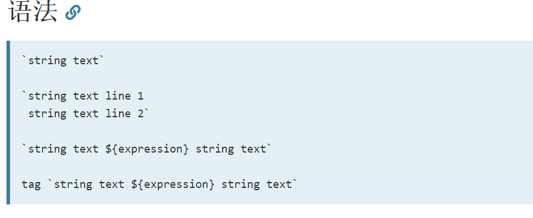

## windows.alert

显示一个警告对话框,上面显示有指定的文本内容以及一个"确定"按钮。

```javascript
function printHello(user) {
  alert(`hello             ${user}`);
}
printHello('jiangdahai');
```

## 模版字符串

[mdn 的介绍](https://developer.mozilla.org/zh-CN/docs/Web/JavaScript/Reference/template_strings)



## 字面量

字面量（literal）用于表达源代码中一个固定值的表示法（notation），整数、浮点数以及字符串等等都是字面量。

```javascript
var a = 1; // a 是变量，1 是字面量
```

```javascript
const hello = 'hello world';
//"hello world"是字面量
```

## eval

eval() 函数会将传入的字符串当做 JavaScript 代码进行执行。
