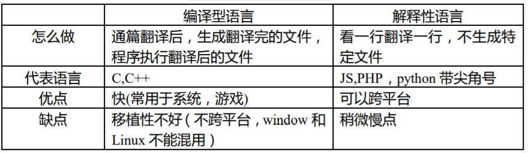
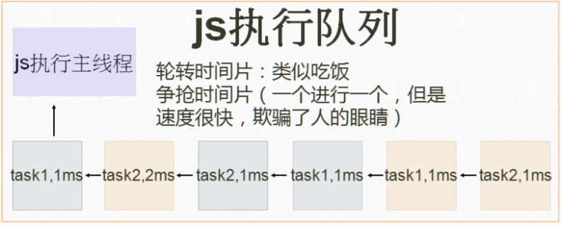

## web 发展史

Mosaic，是互联网历史上第一个获普遍使用和能够显示图片的网页浏览器。于 1993 年问世。  
1994 年 4 月，马克.安德森和 Silicon Graphics（简称为 SGI，中译为“视算科技”或“硅图”）公司的创始人吉姆·克拉克（Jim Clark）在美国加州设立了“Mosaic Communication Corporation”。  
Mosaic 公司成立后，由于伊利诺伊大学拥有 Mosaic 的商标权，且伊利诺伊大学已将技术转让给 Spy Glass 公司，开发团队必须彻底重新撰写浏览器程式码，且浏览器名称更改为 Netscape Navigator，公司名字于 1994 年 11 月改名为“Netscape Communication Corporation”，此后沿用至今，中译为“网景”。  
微软的 Internet Explorer 及 Mozilla Firefox 等，其早期版本皆以 Mosaic 为基础而开发。  
微软随后买下 Spy Glass 公司的技术开发出 Internet Explorer 浏览器，而 Mozilla Firefox 则是网景通讯家开放源代码后所衍生出的版本。

## js 历史

JavaScript 作为 Netscape Navigator 浏览器的一部分首次出现在 1996 年。它最初的设计目标是改善网页的用户体验。  
作者：Brendan Eich  
期初 JavaScript 被命名为 LiveScript，后因和 Sun 公司合作，因市场宣传需要改名 JavaScript(借用 JAVA 名声)。后来 Sun 公司被 Oracle 收购，JavaScript 版权归 Oracle 所有。

## 浏览器组成

1. shell 部分——用户能操作部分(壳)
2. 内核部分——用户看不到的部分
   1. 渲染引擎（语法规则和渲染）
   2. js 引擎
   3. 其他模块（如异步）

## js 引擎

2001 年发布 ie6，首次实现对 js 引擎的优化。  
2008 年 Google 发布最新浏览器 Chrome，它是采用优化后的 javascript 引擎，引擎代号 V8，因能把 js 代码直接转化为机械码来执行，进而以速度快而闻名。  
后 Firefox 也推出了具备强大功能的 js 引擎
Firefox3.5 TraceMonkey（对频繁执行的代码做了路径优化）  
Firefox4.0 JeagerMonkey

## 渲染引擎

主流浏览器和内核(这里的内核通常指渲染引擎)，主流浏览器是有一定市场份额，并且有自己独立研发的内核浏览器分 shell+内核

| 主流浏览器（必须有独立内核）市场份额大于 3% | 内核         |
| :-----------------------------------------: | ------------ |
|                     IE                      | trident      |
|                   Friefox                   | Gecko        |
|                Google Chrome                | Webkit/blink |
|                   Safari                    | Webkit       |
|                    Opera                    | presto/blink |

Presto 是一个由 Opera Software 开发的浏览器排版引擎（非开源），供 Opera 7.0~10.00 版使用。
2013 年 2 月 14 日 Opera 将采用 webkit  
4 月,放弃 webkit 使用 blink  
16 年,曾经与 IE、Firefox 并称的三大浏览器之一因市场占有率不及 2%,后被昆仑万维收购

## js 特色



js 是解释性语言：(不需要编译成文件）跨平台  
java 先通过 javac，编译成.class 文件，通过 jvm（Java 虚拟机）进行解释执行
.java→javac→ 编译 →.class→jvm→ 解释执行（java 可以跨平台）（java 是 oak 语言）  
ECMA（欧洲计算机制造联合会）标注：为了取得技术优势，微软推出了 JScript，CEnvi 推出 ScriptEase，与 JavaScript 同样可在浏览器上运行。为了统一规格 JavaScript 兼容于 ECMA 标准，因此也称为 ECMAScript。



## 开始学习 js

js 三大部分 ECMAScript、DOM、BOM  
如何引入 js?

1. 页面内嵌`<script></script>`标签,写 `head` 里面也行,写 `body` 里面也行
   例

```html
<body>
  <script type="text/javascript">
    //type是告诉浏览器我们是 js(废话,可不写)
  </script>
</body>
```

2. 外部 js 文件，引入

```html
<script src="location.js"></script>
```

例如：以 lesson.js 保存文件，再引入到 html 中
为符合 web 标准（w3c 标准中的一项）结构（html）、行为（js）、样式（css）相分离，通常会采用外部引入。  
一个文件中可以包括多个 css，js——不混用  
特殊写页面，大部分写在外部——不混用  
如果同时写了内部的 js 和外部的 js，那么是外部的 js 文件显示出来
