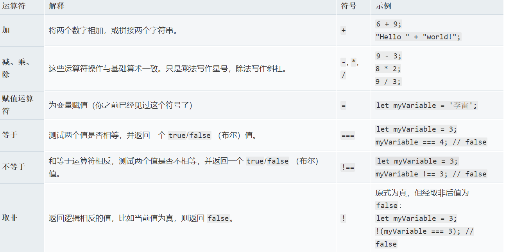

## 运算符

运算符 是一类数学符号，可以根据两个值（或变量）产生结果。以下表格中介绍了一些最简单的运算符，可以在浏览器控制台里尝试一下后面的示例。



[更多运算符](https://developer.cdn.mozilla.net/zh-CN/docs/Web/JavaScript/Reference/Operators)

二元运算符`+`能够将数字和字符串相加值为字符串;

数字类型只有一个整数，它有两种表示方法： 0 可表示为 -0 和 +0（"0" 是 +0 的简写）。 在实践中，这也几乎没有影响。 例如`+0 === -0`为真。 但是，你可能要注意除以 0 的时候：

```javascript
42 / +0; // Infinity
42 / -0; // -Infinity
```
