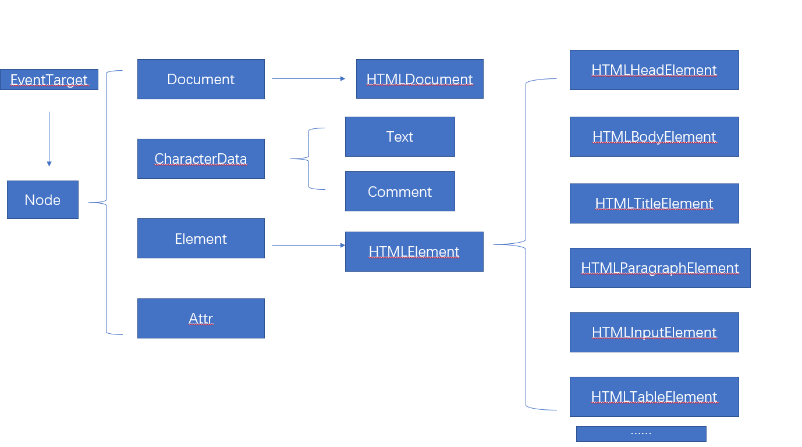

## DOM 结构树



注:某些标签没有直接的对象比如`HTMLStrongElement`
EventTarget 上面是 Object
document 是 HTMLDocument 构造的

## DOM 的一些定义

[Document MDN](https://developer.mozilla.org/zh-CN/docs/Web/API/Document)

1. `getElementById`方法定义在`Document.prototype`上,即`Element`节点上不能使用
2. `getElementsByName`方法定义在`HTMLDocument.prototype`上,即只 html 的 document 才能用(Element 和 xml 的 document 不能用)
3. `getElementsByTagName`方法定义在`Document.prototype`和`Element.prototype`上,所以元素也能用`ByTagName`

```javascript
    <div>
        <span>1</span>
    </div>
    <span>2</span>

    var div = document.getElementsByTagName('div')[0];
    var span1 = div.getElementsByTagName('span')[0];
    //<span>1</span>
```

4. `HTMLDocument.prototype`上定义了一些常用的属性,例如`body`和`head`用来指代`<body>`和`<head>`标签
5. `Document.prototype`定义了`documentElement`属性,指代文档的根元素,HTML 文档中总是指代`<html>`元素
6. `getElement.prototype,querySelector,querySelectorAll`在`Document.prototype,Element.prototype`类中均有定义

## DOM 节点的基本操作

[MDN ChildNode 孩子节点](https://developer.mozilla.org/zh-CN/docs/Web/API/ChildNode)

### 增

- document.createElement() 创建元素节点
- document.createTextNode() 创建文本节点
- document.createComment() 创建注释节点

### 插

- Node.appendChild() 类似于 push 的插入,把已有的插入某个地方,已有的会消失(类似于剪切)
- Node.insertBefore(a,b) 在 Node 节点中把 a 插入 b 前面

### 删

- Node.removeChild() 方法从 DOM 中删除一个子节点。返回删除的节点。(**谋杀**)
- ChildNode.remove() **自杀**?(ie 都不支持)
- ChildNode.before()和 ChildNode.after()在前面后面插入(**实验中的功能**,写出来一下,反正新的浏览器早就支持了)

### 替换

- ChildNode.replaceWith(a) 用 a 替换自己 (ie 并不支持)
- Node.replaceChild(a,b) 用 a 节点替换当前节点的一个子节点 b，并返回被替换掉的节点。

## 元素节点的基本操作

### 属性

- Element.innerHTML 属性设置或获取 HTML 语法表示的元素的后代
- HTMLElement.innerText 属性表示一个节点及其后代的“渲染”文本内容。
- Node.textContent 属性表示一个节点及其后代的文本内容。(和前者的区别,该属性不修改渲染后的)
- Element.className 直接获取 class 或者修改 class

### 方法

- Element.setAttribute(name, value) 设置指定元素上的某个属性值。如果属性已经存在，则更新该值；否则，使用指定的名称和值添加一个新的属性。
- Element.getAttribute() 返回元素上一个指定的属性值。如果指定的属性不存在，则返回 null 或 ""
- Element.removeAttribute() 从指定的元素中删除一个属性。
