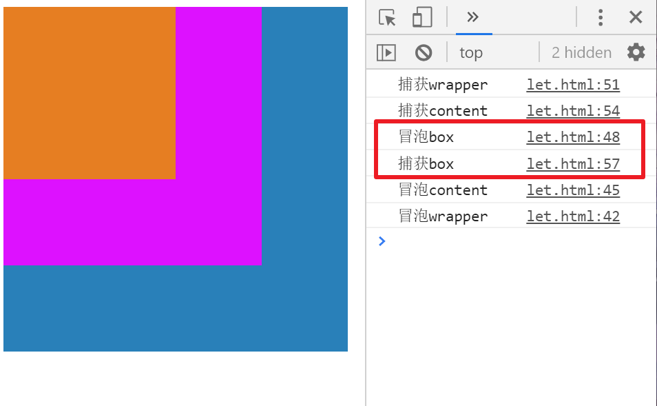

内容进行了修改

## 介绍

1. IE 提出的事件流叫做事件冒泡，即事件开始时由最具体的元素接收，然后逐级向上传播到较为不具体的节点
2. 网景公司提出的事件流叫事件捕获流。
3. W3C 为了统一标准,将两个都采用了,但**默认使用冒泡**,冒泡相对更符合习惯
4. 最外层主线可能是`document`(ie)或者 document 上的`window`(其他现代浏览器)
5. **先捕获后冒泡**(如果都有的话)
   当一个事件发生在具有父元素的目标源元素上时，现代浏览器运行两个不同的阶段 --- 捕获阶段和冒泡阶段。
   注:下面用`click`代表事件,`document`代表最终父级.(只为方便而已)

## 捕获

ie 和老版本火狐没有捕获

结构上(非视觉上)嵌套关系的元素,会存在事件捕获的功能,即同一事件,**自父元素捕获至子元素(事件发生元素)**.(自顶而下)

- 浏览器检查元素的最外层祖先`document`，是否在捕获阶段中注册了一个`onclick`事件处理程序，如果是，则运行它。
- 然后，它移动到`document`中单击元素的下一个祖先元素，并执行相同的操作，然后是单击元素再下一个祖先元素，依此类推，直到到达实际点击的元素。

当 addEventListener 的第三个参数是 true 时,变成捕获模型

```javascript
wrapper.addEventListener(
  'click',
  function() {
    console.log('捕获wrapper');
  },
  true
);
content.addEventListener(
  'click',
  function() {
    console.log('捕获content');
  },
  true
);
box.addEventListener(
  'click',
  function() {
    console.log('捕获box');
  },
  true
);
```

点击橙色区域(box)


## 冒泡

结构上(非视觉上)嵌套关系元素,会存在事件冒泡功能,即同一事件,**自子元素冒泡向父元素**.(自底而上)

- 浏览器检查实际点击的元素是否在冒泡阶段中注册了一个`onclick`事件处理程序，如果是，则运行它
- 然后它移动到下一个直接的祖先元素，并做同样的事情，然后是下一个，等等，直到它到达`document`。

```html
<div class="wrapper">
  <div class="content">
    <div class="box"></div>
  </div>
</div>
```

```javascript
var wrapper = document.getElementsByClassName('wrapper')[0];
var content = document.getElementsByClassName('content')[0];
var box = document.getElementsByClassName('box')[0];
```

```javascript
wrapper.addEventListener(
  'click',
  function() {
    console.log('冒泡wrapper');
  },
  false
);
content.addEventListener(
  'click',
  function() {
    console.log('冒泡content');
  },
  false
);
box.addEventListener(
  'click',
  function() {
    console.log('冒泡box');
  },
  false
);
```

点击橙色区域(box)


## 补充

冒泡/捕获到自身时,**会执行先绑定的**(替换了原来的事件免谈),而不是看第三个参数是不是 true

**容易产生的误区:**




图中红框圈出的是`wrapper`最后捕获到了`box`,而`box`上面事件的执行顺序和绑定顺序有关(看下面)


上图的例子中打印的顺序只和下面两行代码的顺序有关(先绑定,先打印)

```javascript
wrapper.addEventListener(
  'click',
  function() {
    console.log('冒泡wrapper');
  },
  false
);
wrapper.addEventListener(
  'click',
  function() {
    console.log('捕获wrapper');
  },
  true
);
```

先捕获(显示捕获 wrapper,然后根据 content 中的绑定顺序,先显示冒泡 content,再捕获 content)
然后冒泡(显示冒泡 wrapper)


## 注意

**`focus`,`blur`,`change`,`submit`,`reset`,`select`等事件不冒泡**

## 取消冒泡

看下一节,对象事件
