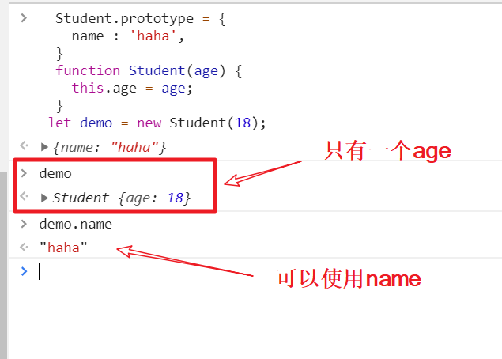
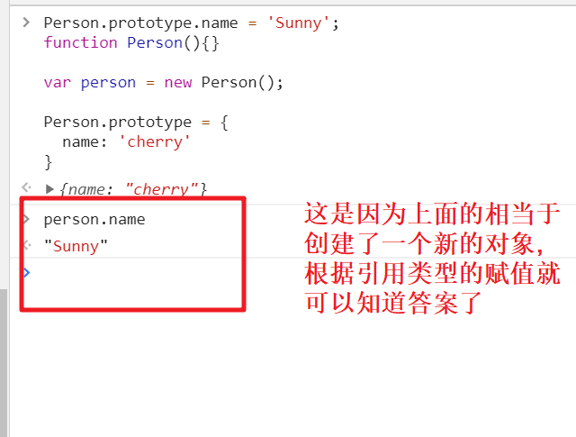
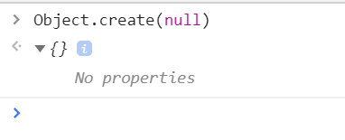

## prototype 原型

> JavaScript 常被描述为一种基于原型的语言 (prototype-based language)——每个对象拥有一个原型对象，对象以其原型为模板、从原型继承方法和属性。原型对象也可能拥有原型，并从中继承方法和属性，一层一层、以此类推。这种关系常被称为原型链 (prototype chain)，它解释了为何一个对象会拥有定义在其他对象中的属性和方法。

> 准确地说，这些属性和方法定义在 Object 的构造器函数(constructor functions)之上的 prototype 属性上，而非对象实例本身。

```javascript
function Student() {}
let demo = new Student();
```

也就是说上面的对象构造器默认就会有一个下面这样的**祖先**(实际并不是空的)

`Student.prototype = {}`

当然可以自己对这个祖先动手脚

```javascript
Student.prototype = {
  name: 'haha',
};
function Student(age) {
  this.age = age;
}
let demo = new Student(18);
```



如果自己设置有这个方法和属性,那么就是使用自己的而不是继承来的属性和方法.

## 原型的使用

自定义构造函数可以用原型设置公有属性,而不是在在构造函数中设置

## constructor 属性

对象会有个自带的 constructor 属性,这个属性记录了自己是由哪个构造函数生成的

## **proto**属性

`__proto__`是由系统自定义的属性,这个属性可以理解成他指向了这个对象的原型,或者说指向了他的父亲,所以可以在`__proto__`中找到另一个`__proto__`
这个`__proto__`是可以自己修改的,让他指向另一个对象

## 一个题



## 原型链

简单的说,就是原型也有原型,这就是原型链

绝大多数对象的最终原型是`Object.prototype`
特例如下(create 可以看下面一节了解)



## create()

`person1`是一个对象

```javascript
var person2 = Object.create(person1);
```

`create()` 实际做的是从指定原型对象创建一个新的对象。这里以 person1 为原型对象创建了 person2 对象。在控制台输入：
`person2.__proto__`
结果返回对象`person1`。

## 链接

[MDN 对象原型](https://developer.mozilla.org/zh-CN/docs/Learn/JavaScript/Objects/Object_prototypes)
