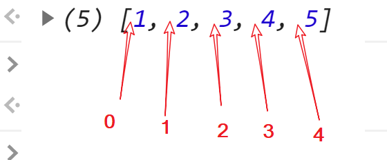
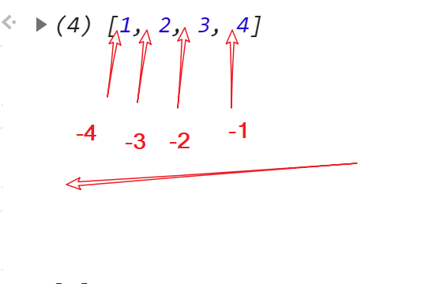

## 创建

1. 数组字面量

```javascript
let arr = [1, , , 1]; //稀松数组
let arr = [1, , ,]; //如果最后是逗号,这个逗号会被忽略
```

1. 构造数组

```javascript
    var arr = new Array(1,2,3);
    //如果参数只有一个,这个参数代表数组长度,而不是他的值
    var arr Array(10); //长度为10的空数组
```

## 改变原数组的方法

- 以下方法都能改变原数组
- 这些方法都在`Array.prototype`上

### push

**向数组末尾添加数据**(可以加入 n 个)
返回数组长度

```javascript
var newLength = fruits.push('Orange', '辣鸡');
```

自己做一个

```javascript
Array.prototype.push = function() {
  for (let i = 0; i < arguments.length; i++) {
    this[this.length] = arguments[i];
  }
  return this.length;
};
```

### pop

**把数组最后一位剪切**
返回剪切出的内容
没有参数的方法

### shift

**删除数组最前面（头部）的元素**
返回删除的值
没有参数的方法

### unshift

**添加元素到数组的头部**(可以添加 n 个)
返回数组长度

### reverse

**把数组倒置**

### splice

```javascript
  array.splice(start[, deleteCount[, item1[, item2[, ...]]]])
```

- **start​**
  指定修改的开始位置（从 0 计数）。如果超出了数组的长度，则从数组末尾开始添加内容；如果是负值，则表示从数组末位开始的第几位（从-1 计数，这意味着-n 是倒数第 n 个元素并且等价于 array.length-n）；如果负数的绝对值大于数组的长度，则表示开始位置为第 0 位。
- **deleteCount** (可选)
  整数，表示要移除的数组元素的个数。
  如果 deleteCount 大于 start 之后的元素的总数，则从 start 后面的元素都将被删除（含第 start 位）。
  如果 deleteCount 被省略了，或者它的值大于等于 array.length - start(也就是说，如果它大于或者等于 start 之后的所有元素的数量)，那么 start 之后数组的所有元素都会被删除。
  如果 deleteCount 是 0 或者负数，则不移除元素。这种情况下，至少应添加一个新元素。
- **item1, item2, ...** (可选)
  要添加进数组的元素,从 start 位置开始。如果不指定，则 splice() 将只删除数组元素。

```javascript
var arr = [1, 2, 3, 5];
arr.splice(3, 0, 4);
//arr = [1,2,3,4,5]
```

**简单的说就是从第几位开始,截取多长的长度,在切口处添加新的数据组,然后返回截取产生的数组**




上面两个图表示 splice 所操作的开始位置

由此可知,用 splice 能在数组前面加,中间加,但是不能在数组后面加

> **方法使用负数序号的处理**

类似于这样的吧

```javascript
pos += pos > 0 ? 0 : this.length;
```

### sort

```javascript
arr.sort([compareFunction]);
```

> 用原地算法对数组的元素进行排序，并返回数组。默认排序顺序是在将元素转换为字符串，然后比较它们的 UTF-16 代码单元值序列时构建的.

> 如果指明了 compareFunction ，那么数组会按照调用该函数的返回值排序。即 a 和 b 是两个将要被比较的元素：

- 如果 compareFunction(a, b) 小于 0 ，那么 a 会被排列到 b 之前；
- 如果 compareFunction(a, b) 等于 0 ， a 和 b 的相对位置不变。备注： ECMAScript 标准并不保证这一行为，而且也不是所有浏览器都会遵守（例如 Mozilla 在 2003 年之前的版本）；
- 如果 compareFunction(a, b) 大于 0 ， b 会被排列到 a 之前。
  compareFunction(a, b) 必须总是对相同的输入返回相同的比较结果，否则排序的结果将是不确定的。

例如:数组升序排序

```javascript
arr.sort(function(a, b) {
  //升序
  return a - b;
  //倒序
  // return b - a;
});
```

例如:数组乱序

自己的想法

```javascript
arr.sort(function() {
  return Math.random() > 0.5 ? -1 : 1;
});
```

大佬的

```javascript
arr.sort(function() {
  return Math.random() - 0.5;
});
```

## 不改变原数组的方法

### concat

将多个数组拼接起来
返回新数组

```javascript
    var new_array = old_array.concat(value1[, value2[, ...[, valueN]]]);
```

### toString

返回字符串

```javascript
let newArr = arr.toString();
```

### join

用符号将数组链接,`""`空串表示直接链接,如果不给参数就是用逗号`(,)`链接
返回字符串

```javascript
arr.join([separator]);
```

#### String.prototype.split()

这是 String 的方法,但是用来得到数组的所以放到这里一下
