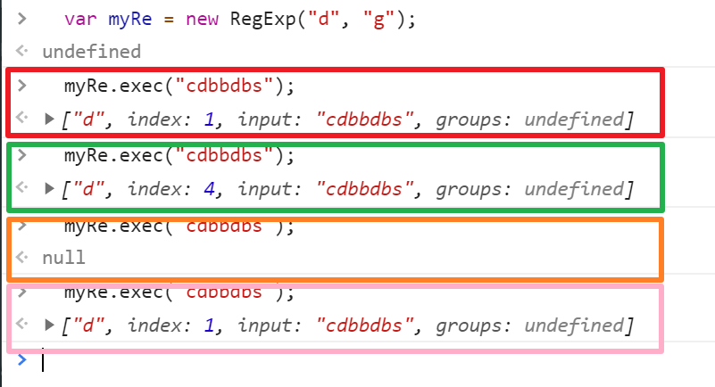
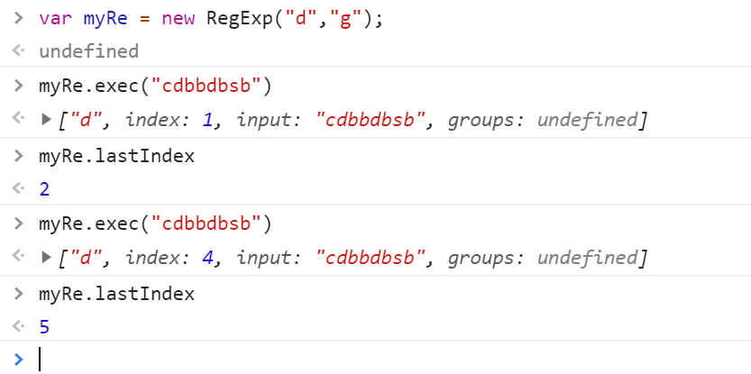
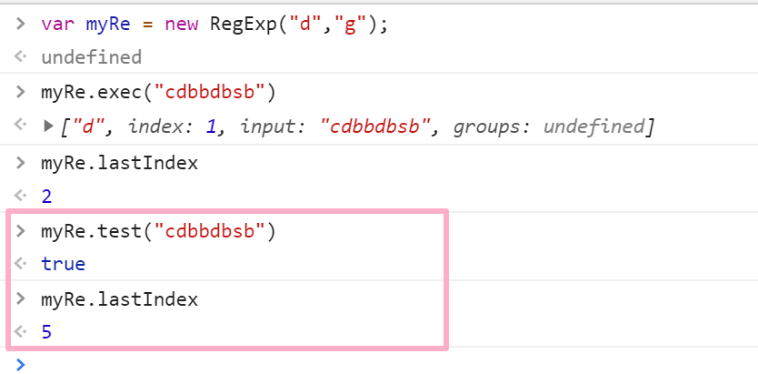
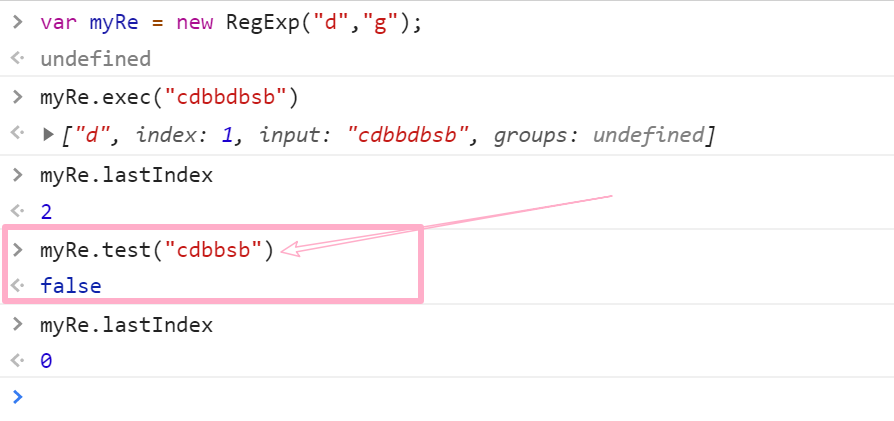
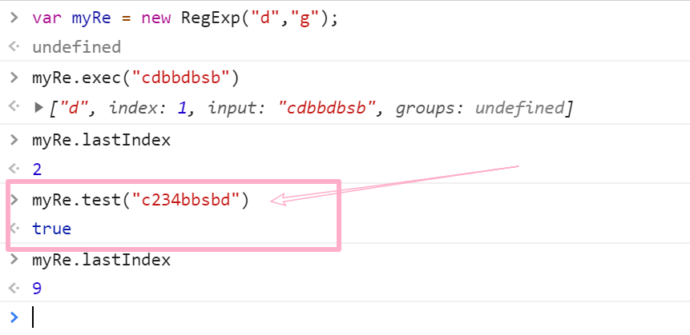

正则表达式的规则应该是通用的,并不局限于`js`,但`js`添加了自己的方法和属性

下面的并不详细,更多可以 mdn 和其他网站找找

## 创建一个正则表达式

- 字面量

```javascript
var re = /ab+c/;
var re1 = /ab+c/i;
```

- 构造函数

```javascript
var re = new RegExp('ab+c');
var re1 = new RegExp('ab+c', 'i');
```

构造函数还可以构造已知的表达式

```javascript
var re = /ab+c/i;
var reg = new RegExp(re, 'g');
//re = /ab+c/i;
//reg = /ab+c/g;
```

如果不传第二个参数,然后不加 new 的话两个是同一个(re = reg).(不加 new 有毛病吧)

## 正则表达式标志

标志的使用看上面的创建正则表达式

| 标志 | 描述                                                             |
| ---- | ---------------------------------------------------------------- |
| g    | 全局搜索(不加 g,最多就只能匹配到一个结果)                        |
| i    | 忽略大小写(A 和 a 是一样的)                                      |
| m    | 多行匹配(\n 换行后依然能匹配)                                    |
| s    | 允许`.`匹配换行符                                                |
| u    | 使用 unicode 码模式进行匹配                                      |
| y    | 执行“粘性”搜索,匹配从目标字符串的当前位置开始，可以使用 y 标志。 |

## 正则表达式规则

### 括号

- [abc] 括号中的任意一个字符 例如`ahsfj` -> `a`
- [0-4] ,[a-z] ,[A-Z] ,[A-z] 和上面一样,但是表示范围区间
- (x|y|z) 查找由 `|` 分隔的任何选项。
- [^0-4] `^`非,匹配`0-4`以外的

### 元字符

| 元字符 | 描述                             |
| ------ | -------------------------------- |
| .      | 查找单个字符(除了换行和行结束符) |
| \w \W  | 单词\非单词                      |
| \d \D  | 数字\非数字                      |
| \s \S  | 空白\非空白 `\s=[\t\n\r\v\f]`    |
| \b \B  | 单词边界\非单词边界              |
| \f     | 换页                             |
| \n     | 换行                             |
| \r     | 回车                             |
| \t     | 制表符                           |
| \v     | 垂直制表符                       |
| \xxx   | 八进制字符                       |
| \xdd   | 十六进制字符                     |
| \uxxxx | 十六进制 unicode 字符            |
| \0     | NULL 字符(c 语言中学过)          |

### 量词

使用量词默认遵循**贪婪模式**

| 量词   | 描述         |
| ------ | ------------ |
| n+     | 至少一个 n   |
| n\*    | 零个或者多个 |
| n?     | 零个或者一个 |
| n{x}   | x 个         |
| n{x,y} | x 至 y 个    |
| n{x,}  | 至少 x 个    |

注意:
如果`?`紧跟在任何量词 `*`、 `+`、`?` 或 `{}` 的后面，将会使量词变为**非贪婪**（匹配尽量少的字符），和缺省使用的**贪婪模式**（匹配尽可能多的字符）正好相反。例如，对 `"123abc"` 使用 `/\d+/` 将会匹配 `"123"`，而使用 `/\d+?/` 则只会匹配到 `"1"`。

## 先行断言/后行断言/正向否定查找/反向否定查找

- `x(?=y)` 匹配'x'仅仅当'x'后面跟着'y'.这种叫做先行断言。
- `(?<=y)x` 匹配'x'仅仅当'x'前面是'y'.这种叫做后行断言。
- `x(?!y)` 仅仅当'x'后面不跟着'y'时匹配'x'，这被称为正向否定查找。
- `(?<!y)x` 仅仅当'x'前面不是'y'时匹配'x'，这被称为反向否定查找。

### 其他

| 规则 | 描述                     |
| ---- | ------------------------ |
| ^n   | 以 n 开头(受 m 多行影响) |
| n\$  | 以 n 结尾(受 m 多行影响) |

## 属性

属性和方法都是可以在字面量后直接用的,例如`/abc/i.ignoreCase`返回 true

- `global` RegExp 对象是否具有标志 g。返回布尔
- `ignoreCase` RegExp 对象是否具有标志 i。
- **`lastIndex`** 返回一个整数，标示开始下一次匹配的字符位置。
- `multiline` RegExp 对象是否具有标志 m。
- `source` 正则表达式的源文本字符串。

## RegExp 方法

- `exec`
  一个在字符串中执行查找匹配的 RegExp 方法，它返回一个数组（未匹配到则返回 null）。

- `test`
  一个在字符串中测试是否匹配的 RegExp 方法，它返回 true 或 false。

## String 方法

- `match`
  一个在字符串中执行查找匹配的 String 方法，它返回一个数组，在未匹配到时会返回 null。

- `matchAll`
  一个在字符串中执行查找所有匹配的 String 方法，它返回一个迭代器（iterator）。

- `search`
  一个在字符串中测试匹配的 String 方法，它返回匹配到的位置索引，或者在失败时返回-1。

- `replace`
  一个在字符串中执行查找匹配的 String 方法，并且使用替换字符串替换掉匹配到的子字符串。

- `split`
  一个使用正则表达式或者一个固定字符串分隔一个字符串，并将分隔后的子字符串存储到数组中的 String 方法。

## exec()方法详解

```javascript
var myRe = new RegExp('d', 'g');
myRe.exec('cdbbdbsb');
```



整个数组能够匹配到两个`d`
第一个在索引为`1`,第二个在`4`,第三次没有`null`,第四次又重头开始

如果不是`g`,

```javascript
var myRe = new RegExp('d');
myRe.exec('cdbbdbsb');
```

那么每次返回都是`index :1`

要想取出索引可以使用`lastIndex`属性,(使用全局匹配下)



该属性可以修改

```javascript
var myRe = new RegExp('d', 'g');
myRe.exec('cdbbdbsb'); //index 是 2
myRe.lastIndex = 5; //改为5
myRe.exec('cdbbdbsb'); //null ,因为第二个d在索引(4)
```

`test`方法共用同一索引



然后发现个神奇的东西





根据索引有

```javascript
var myRe = new RegExp('d', 'g');
myRe.test('c234bbsbd'); //true
myRe.test('c234bbsbd'); //false
myRe.test('c234bbsbd'); //true
```

## 捕获

`(x)`

匹配 'x' 并且记住匹配项。其中括号被称为捕获括号。

模式 `/(foo) (bar) \1 \2/` 中的 `'(foo)'` 和 `'(bar)'` 匹配并记住字符串 `"foo bar foo bar"` 中前两个单词。模式中的 `\1` 和 `\2` 表示第一个和第二个被捕获括号匹配的子字符串，即 `foo` 和 `bar`，匹配了原字符串中的后两个单词。注意 `\1、\2、...、\n` 是用在正则表达式的匹配环节，详情可以参阅后文的 `\n` 条目。而在正则表达式的替换环节，则要使用像 `$1、$2、...、$n` 这样的语法，例如，`'bar foo'.replace(/(...) (...)/, '$2 $1')`。\$& 表示整个用于匹配的原字符串。
