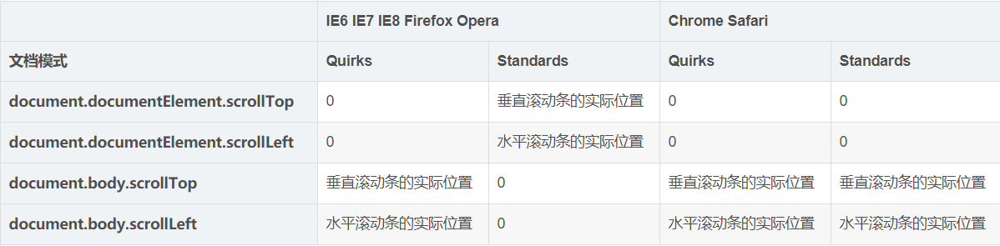

## 介绍一下如何获知渲染模式

辨别现在的模式使用`document.compatMode`,如果返回`CSS1Compat`则是标准模式,如果返回`BackCompat`则是怪异模式

## 查看滚动条的滚动距离

- `window.pageYOffset/window.pageXOffset` 只读属性,返回文档在垂直/水平方向已滚动的像素值
- `window.scrollY/scrollX` 上面的属性是这两个的别名(兼容性不如上面两者)
- `document.body.scrollLeft/scrollTop` 和上面一样(Left 水平,top 垂直),用于 ie9 以下的兼容
- `document.documentElement.scrollLeft/scrollTop` 和上面一样,用于 ie9 以下的兼容

注:上面有两组是 ie9 以下兼容性问题用的,但是其他浏览器也支持这个属性,具体使用时和浏览器的渲染模式有关
关于不同浏览器及其模式的兼容性:


解决兼容性问题时非 ie9 以上不用管上面的表,因为可以直接用`window.pageXOffset`,ie9 以下特殊处理如下

```javascript
var supportPageOffset = window.pageXOffset !== undefined;
var isCSS1Compat = (document.compatMode || '') === 'CSS1Compat';

var x = supportPageOffset
  ? window.pageXOffset
  : isCSS1Compat
  ? document.documentElement.scrollLeft
  : document.body.scrollLeft;
var y = supportPageOffset
  ? window.pageYOffset
  : isCSS1Compat
  ? document.documentElement.scrollTop
  : document.body.scrollTop;
```

由于不对的模式也会返回`0`
也可以这样解决兼容性问题(个人觉得好理解点)

```javascript
var supportPageOffset = window.pageXOffset !== undefined;
var x = supportPageOffset
  ? window.pageXOffset
  : document.documentElement.scrollLeft + document.body.scrollLeft;
var y = supportPageOffset
  ? window.pageYOffset
  : document.documentElement.scrollTop + document.body.scrollTop;
```

## 可视窗口的属性

- window.innerWidth/innerHeight 获取可视区宽度/高度 ie9 以下不支持
- document.documentElement.clientWidth/clientHeight 标准模式下都可以用
- document.body.clientWidth/clientHeight 适合怪异模式

在 ie 中试了一下,ie9 及以上,三个获得的值都不一样,ie9 以下,两个不仅不一样,换成怪异模式和标准模式也不一样????????????????
