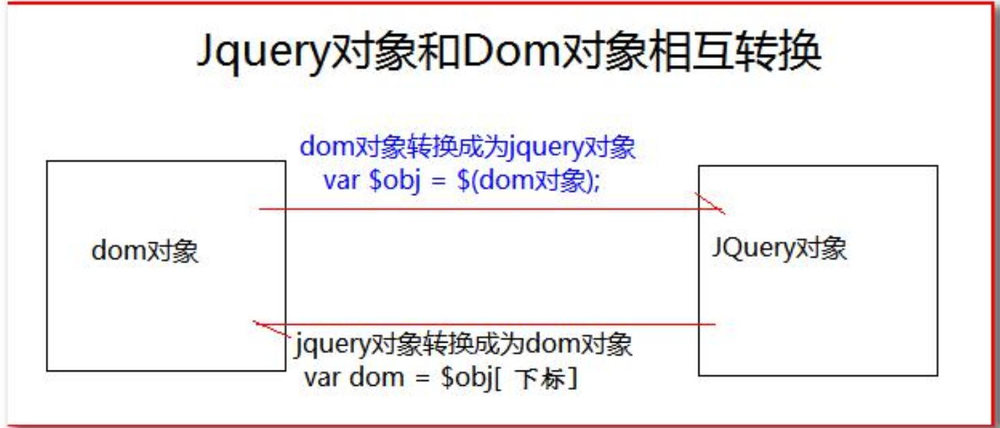

## 一.概念

javaScript 和查询 Query,它是辅助 JavaScript 开发的 js 类库

jQuery 核心思想：write less do more

**好处：**

jQuery 是免费 开源的。jQuery 的语法设计可以使开发更加便捷 例如：操作文档对象、选择 DOM 元素、制作动画效果、事件处理、使用 Ajax 以及其他功能

使用 jQuery 一定引入 jQuery 文件

jQuery 是一个函数

按钮添加点击响应函数

1. 使用 jQuery 查询到标签对象
2. 使用标签对象.click(function(){})

## 二.jQuery 核心函数

$是jQuery的核心函数，能完成jQuery的很多功能 ${}就是调用\$这个函数
**1.传入参数为|函数|时**
表示页面加载完成之后。相当于 window.onload=function(){}

**2.传入参数为|HTMl 字符串|时**
会对我们创建这个 html 标签对象

```js
$("<div><span></span><span></span></div>")//等于下面
<body><div><span></span><span></span></div></body>
```

**3.传入参数为|选择器字符串|时**
$("#id属性值") id选择器，根据id查询标签对象
$("标签名") 标签选择器 根据指定标签名查询标签对象
\$("class 属性值")类型选择器 根据 class 属性查询标签对象 4.传入参数为|DOM 对象|时

会把这个 dom 对象转换为 jQuery 对象

```js
var btnObj2 = document.getElementById('btnID1');
alert($(btnObj2));
```

## 三.jQuery 对象和 DOM 对象

### DOM 对象

1. 通过`getElementBy()`查询出来的标签对象是 dom 对象

2. 通过`getElementsByName（）`查询出来的标签对象是 dom 对象

3. 通过`getElementsByTagName（）`查询出来的标签对象是 dom 对象

4. 通过`createElement（）`方法创建的对象，是 dom 对象。

DOM 对象 Alert 出来的效果是[object HTMl 标签名 Element]

### jQuery 对象

1. 通过 jQuery 提供的 API 创建的对象，是 jQuery 对象
2. 通过 jQuery 包装的 dom 对象，也是 jQuery 对象
3. 通过 jQuery 提供的 API 查询的对象，是 jQuery 对象

jQuery 对象 Alert 出来的效果是[object object]

**jQuery 对象本质是 dom 对象的数组+jQuery 提供的一系列功能函数**

jQuery 对象不能使用 dom 对象的属性和方法

dom 对象也不能使用 jQuery 对象的属性和方法

### dom 对象和 jQuery 对象互转

1.dom 对象转化为 jQuery 对象

1. 现有 dom 对象
2. \$(dom 对象)就可以转换成 jQuery 对象

2.jQuery 对象转为 dom 对象

1. 先有 jQuery 对象
2. jQuery 对象|下标|取出相应的 dom 对象



## 四.jQuery 基本选择器

ID 选择器

class 选择器

element 选择器

\*选择器

selector1，selector2 组合选择器

## jQuery 层级选择器

```js
<!--    :*//所有-->
<!--    :#//id-->
<!--    :.//class-->
<!--    :>//父类-->
<!--    :+//后面一个-->
<!--    :~//后面所有-->
  // $("标签");元素选择器
            // $("#id属性")id选择器
            // $(".class属性")class选择器
            // $(">")父级选择器
            // $("~")祖孙选择器
            //$(":type属性值")input选择器
```

## jQuery 过滤选择器

- 基本过滤器

- 内容过滤器

- 属性过滤器

- 表单过滤器

## jQuery 属性操作

`html（）`可以设置和获取起始标签和结束标签中的内容

跟 dom 属性 innerHTML 一样

`text()`：可以设置和获取起始标签和结束标签中的文本

跟 dom 属性 innerText 一样

`val()`：获取表单项 value 属性值

跟 dom 属性 value 一样

```js
$(function() {
  console.log($('div').html()); //不传参数 获取
  $('div').html('<h1>123</h1>'); //传参数 设置
});
```

`attr()`：可以设置和获取属性的值

不推荐操作 checked、readonly、selected、disabled 等等

`prop()`:可以设置和获取属性的值

只推荐操作 checked、readonly、selected、disabled 等等

```js
$(function() {
  $(':checkbox:first').attr('name'); //获取name
  $(':checkbox:first').attr('name', 'abc');
  //设置 前面是获取name属性值 后面是修改name属性值
  alert($(':checkbox:first').attr('checked'));
  //返回underfined 只是没选中
  $(':checkbox:first').prop('checked');
  //当前没有选中 没有返回返回false 选中 返回true 所以返回false
});
```

单选多选反选功能

```js
<script>
    $(function () {

//id选择器
        $("#checkAll").click(function () {//全选
            $(":checkbox").prop("checked", true);
        })
        $("#checkNot").click(function () {//全不选
            $(":checkbox").prop("checked", false);
        })
        $("#reserve").click(function () {
            //input type:check name="checkbox"
            $(":checkbox[name='checkbox']").each(function () {
                //this代表当前dom对象 在这里指的是input
                this.checked = !this.checked;
                //以上是完成单个或多选的反选
                var allCount = $(":checkbox[name='checkbox']").length;//选择项总共几个
                var checkCount = $(":checkbox[name='checkbox']:checked").length;//全选中的选项
                if (allCount == checkCount) {
                    $("#checkAll").prop("checked", true);

                } else {
                    $("#checkAll").prop("checked", false);
                }
//$("#checkAll").prop("checked",allCount==checkCount); 上面if语句可以替换成这一句代码

            })
        })
        $("#sendbtn").click(function () {
           alert($(":checkbox[name='checkbox']:checked").val());

        })

    })
    //?addEventListener removeEventListener
</script>
城市：
<input type="checkbox" name="checkbox" value="beijing">北京
<input type="checkbox" name="checkbox" value="shanghai">上海
<input type="checkbox" name="checkbox" value="shenzhen">深圳
<br>
<button id="checkAll">全选</button>
<button id="checkNot">全不选</button>
<button id="reserve">反选</button>
<button id="sendbtn">提交</button>
```

## JQuery 的增删改 js

### 内部插入

| 方法          | 使用            | 作用描述                                     |
| ------------- | --------------- | -------------------------------------------- |
| `appendTo()`  | a.appendTo（b） | 把 a 插入 b 子元素末尾，成为最后一个子元素   |
| `prependTo()` | a.perpendTo(b)  | 把 a 插到 b 所有子元素前面，成为第一个子元素 |

### 外部插入

| 方法             | 使用             | 作用 |
| ---------------- | ---------------- | ---- |
| `insertAfter()`  | a.insertAfter(b) | ab   |
| `insertBefore()` | a.inserbefor(b)  | ba   |

### 替换：

| 方法            | 使用             | 作用         |
| --------------- | ---------------- | ------------ |
| `replaceWith()` | a.replaceWith(b) | b 替换 a     |
| `replaceAll()`  | a.replaceAll(b)  | a 替换所有 b |

### 删除：

| 方法       | 使用                     |
| ---------- | ------------------------ |
| `remove()` | a.remove() 删除 a 标签   |
| `empty()`  | a.empty()清空 a 标签内容 |

动态添加和删除表格信息

```js
   <script>
        $(function () {
           var Deletefun=function(){//复用性删除函数
               var $trObj = $(this).parent().parent();//tr>td>a
               var name = $trObj.find("td:first").text();
               if (confirm("确认要删除[" + name + "]")
                   /*confirm是javaScript提供一个提示框函数 你写什么它就提示什么
                   当用户点击确定 返回true 当用户点击取消 返回false*/) {
                   $trObj.remove();
               }//删除学生信息;
               return false;//阻止元素默认行为;
           }
            $("#addEmpbtn").click(function () {//给[submit]按钮绑定单击事件
                //获取学生信息、班级、姓名、联系方式
                var studentName = $("#Name").val();
                var studentClass = $("#Class").val();
                var studentTelephone = $("#telephone").val();

//创建一个行对象
                var trObj = $("<tr>\n" +
                    "    <td>" + studentName + "</td>\n" +
                    "    <td>" + studentClass + "</td>\n" +
                    "    <td>" + studentTelephone + "</td>\n" +
                    "    <td><a href=\"deleteEmp?id=1\">delete</a></td>\n" +
                    "    </tr>");
                trObj.appendTo($("#manager"));//添加到表格里面
                trObj.find("a").click(Deletefun);


            })
            $("a").click(Deletefun);
        })

    </script>

    <table border="1" id="manager">
    <tr>学生信息表
        <td>班级</td>
        <td>姓名</td>
        <td>联系方式</td>
        <td></td>
    </tr>
    <tr>
        <td>1</td>
        <td>1</td>
        <td>1</td>
        <td><a href="deleteEmp?id=1">delete</a></td>
    </tr>
    <tr>
        <td>2</td>
        <td>2</td>
        <td>2</td>
        <td><a href="deleteEmp?id=2">delete</a></td>
    </tr>
</table>
<div>
    <table>
        <tr>添加一个学生信息</tr>
        <tr>
            <td>姓名</td>
            <td><input type="text" id="Name"></td>
        </tr>
        <tr>
            <td>班级</td>
            <td><input type="text" id="Class"></td>
        </tr>
        <tr>
            <td>联系方式</td>
            <td><input type="text" id="telephone"></td>
        </tr>
        <tr>
            <td>
                <button id="addEmpbtn">submit</button>
            </td>
        </tr>
    </table>
</div>
CSS样式操作
`addClass()`` 添加样式
removeClass() 删除样式
toggleClass() 有就删除，没有就添加样式
offset（） 获取和设置元素的坐标
jQuery动画
基本动画
show()  将隐藏的元素显示
hide() 将可见的元素隐藏
toggle() 可见就隐藏，不可见就显示。
以上动画方法都可以添加参数
1. 第一个参数是动画执行的时长，以毫秒为单位
2. 第二个参数是动画的回调函数(动画完成后自动调用的函数)
淡入淡出动画
fadeIn 淡入 淡入（慢慢可见）
fadeOut 淡出 淡出（慢慢消失）
fadeTo 在指定时长内慢慢的将透明度修改到指定的值 0不可见 0.5半透明 1可见
fadeToggle 淡入\淡化切换
```

## 五.jQuery 事件操作：

jQuery 的页面加载完成之后是游览器的内核解析完页面的标签创建后 DOM 对象之后就会马上执行。

原生 js 的页面加载完成之后，除了要等游览器内核解析完标签创建好 DOM 对象，还要等标签显示时需要的内容加载完成。

JQuery 页面加载完成之后先先执行。

原生 js 的页面加载完成之后

原生 js 的页面加载完成之后，只会执行最后一次的赋值函数。

jQuery 函数按注册顺序执行。

**jQuery 的事件处理方法：**

1. `click()`它可以绑定单击事件，以及触发单击事件
2. `mouseover()`鼠标移入事件
3. `mouseout()`鼠标移出事件
4. `bind()`可以给元素一次性绑定一个或多个事件
5. `one()`使用上跟 bind 一样。但是 one 方法绑定的事件只会响应一次。
6. `unbind()`跟 bind 方法相反的操作，解除事件的绑定
7. `live()`也时用来绑定事件它可以来绑定选择器匹配的所有元素的事件，哪怕这个元素是后面动态创建出来的也有效。‘

**事件冒泡**

事件冒泡是指，父子元素同时监听同一个事件，当出发子元素的事件的时候，同一个事件也被传递到父元素的事件里去响应。

**阻止事件冒泡**

在子元素事件函数体内，return false；可以阻止事件冒泡的传递。
