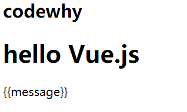
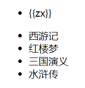
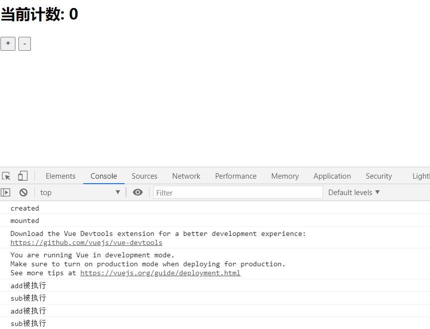

## Vue 介绍

### Vue 是一个渐进式的框架

- 渐进式意味着你可以将 Vue 作为你应用的一部分嵌入其中，带来更丰富的交互体验。
- 或者如果你希望将更多的业务逻辑使用 Vue 实现，那么 Vue 的核心库以及其生态系统。
- 比如 Core+Vue-router+Vuex，也可以满足你各种各样的需求。

### Vue 有很多特点和 Web 开发中常见的高级功能

- 解耦视图和数据

- 可复用的组件

- 前端路由技术

- 状态管理

- 虚拟 DOM

  ### Vue.js 安装

安装 Vue 的方式有很多：

#### 方式一：直接 CDN 引入

你可以选择引入开发环境版本还是生产环境版本

```html
<!-- 开发环境版本，包含了有帮助的命令行警告 -->
<script src="https://cdn.jsdelivr.net/npm/vue/dist/vue.js"></script>
<!-- 生产环境版本，优化了尺寸和速度 -->
<script src="https://cdn.jsdelivr.net/npm/vue"></script>
```

#### 方式二：下载和引入

开发环境 https://vuejs.org/js/vue.js

生产环境 https://vuejs.org/js/vue.min.js

#### 方式三：NPM 安装

通过`webpack`和`CLI`的使用.

## hello Vue.js 的实现

```html
<body>
  <div id="app">
    <h2>{{message}}</h2>
    <h1>{{name}}</h1>
  </div>

  <div>{{message}}</div>

  <script src="../js/vue.js"></script>
  <script>
    // let(变量)/const(常量)
    // 编程范式: 声明式编程
    const app = new Vue({
      el: '#app', // 用于挂载要管理的元素
      data: {
        // 定义数据
        message: 'codewhy',
        name: 'hello Vue.js',
      },
    });
  </script>
</body>
```

实现效果



元素 js 的做法(编程范式: 命令式编程)

1. 创建 div 元素,设置 id 属性

```
div#id+tab
```

2. 定义一个变量叫 message

```
{{message}};
```

3. 将 message 变量放在前面的 div 元素中显示

```
     {{message}}<div></div>
```

4. 修改 message 的数据: 今天天气不错!

```html
<div id="app">
  <h4>{{message}}</h4>
</div>
<script src="../js/vue.js">
    const app= new Vue({
      el: "#app",
      //获取id为app的div。

  //元素与元素之间逗号隔开。

  //下面的数据是数据模块
  data: {
      //给message变量赋值。
      message:"今天天气真好",
  }
    });
</script>
```

## Vue 列表展示

```html
<div id="app">
  <ul>
    <li v-for="zx in movies">{{zx}}</li>
  </ul>
</div>
<div id="app1">
  <ul>
    <li v-for="ab in books">{{ab}}</li>
  </ul>
</div>
<script src="../js/vue.js"></script>
<script>
  const app = new Vue({
    el: '#app',
    data: {
      movies: ['星际穿越', '大话西游', '少年派', '盗梦空间'],
    },
    el: '#app1',
    data: {
      books: ['西游记', '红楼梦', '三国演义', '水浒传'],
    },
  });
</script>
```

实现效果：



## Vue 实现计数器

代码：

```html
<div id="app">
  <h2>当前计数: {{counter}}</h2>
  <!--<button v-on:click="counter++">+</button>-->
  <!--<button v-on:click="counter--;">-</button>-->
  <!--+按钮添加add点击事件-->
  <button v-on:click="add">+</button>
  <!-- -按钮添加add点击事件 -->
  <button v-on:click="sub">-</button>
  <!--下面是语法糖写法-->
  <!--<button @click="sub">-</button>-->
</div>

<script src="../js/vue.js"></script>
<script>
  // 语法糖: 简写
  // proxy
  const obj = {
    counter: 0,
    message: 'abc',
  };

  new Vue();

  const app = new Vue({
    el: '#app',
    data: obj,
    methods: {
      //add 函数调用
      add: function() {
        console.log('add被执行');
        this.counter++;
      },
      //sub 函数调用
      sub: function() {
        console.log('sub被执行');
        this.counter--;
      },
    },
    beforeCreate: function() {},
    //示例create 函数
    created: function() {
      console.log('created');
    },
    //示例mounte 函数
    mounted: function() {
      console.log('mounted');
    },
  });
</script>
```

实现效果：


