## Vue 中的 MVVM

### 什么是 MVVM？

`MVVM（Model–view–viewmodel）`是一种软件架构模式。

MVVM 有助于将图形用户界面的开发与业务逻辑或后端逻辑（数据模型）的开发分离开来，这是通过置标语言或 GUI 代码实现的。MVVM 的视图模型是一个值转换器， 这意味着视图模型负责从模型中暴露（转换）数据对象，以便轻松管理和呈现对象。在这方面，视图模型比视图做得更多，并且处理大部分视图的显示逻辑。 视图模型可以实现中介者模式，组织对视图所支持的用例集的后端逻辑的访问。

MVVM 是马丁·福勒的 PM（Presentation Model）设计模式的变体。MVVM 以相同的方式抽象出视图的状态和行为，但 PM 以不依赖于特定用户界面平台的方式抽象出视图（创建了视图模型）。
MVVM 和 PM 都来自 MVC 模式。

MVVM 由微软架构师 Ken Cooper 和 Ted Peters 开发，通过利用 WPF（微软.NET 图形系统）和 Silverlight（WPF 的互联网应用派生品）的特性来简化用户界面的事件驱动程序设计。 微软的 WPF 和 Silverlight 架构师之一 John Gossman 于 2005 年在他的博客上发表了 MVVM。

MVVM 也被称为 model-view-binder，特别是在不涉及.NET 平台的实现中。ZK（Java 写的一个 Web 应用框架）和 KnockoutJS（一个 JavaScript 库）使用 model-view-binder。

### MVVM 模式的组成部分

#### 模型

模型是指代表真实状态内容的领域模型（面向对象），或指代表内容的数据访问层（以数据为中心）。

#### 视图

就像在 MVC 和 MVP 模式中一样，视图是用户在屏幕上看到的结构、布局和外观（UI）。

#### 视图模型

视图模型是暴露公共属性和命令的视图的抽象。MVVM 没有 MVC 模式的控制器，也没有 MVP 模式的 presenter，有的是一个绑定器。在视图模型中，绑定器在视图和数据绑定器之间进行通信。

#### 绑定器

声明性数据和命令绑定隐含在 MVVM 模式中。在 Microsoft 解决方案堆中，绑定器是一种名为 XAML 的标记语言。绑定器使开发人员免于被迫编写样板式逻辑来同步视图模型和视图。在微软的堆之外实现时，声明性数据绑定技术的出现是实现该模式的一个关键因素。

### Vue 的 MVVM

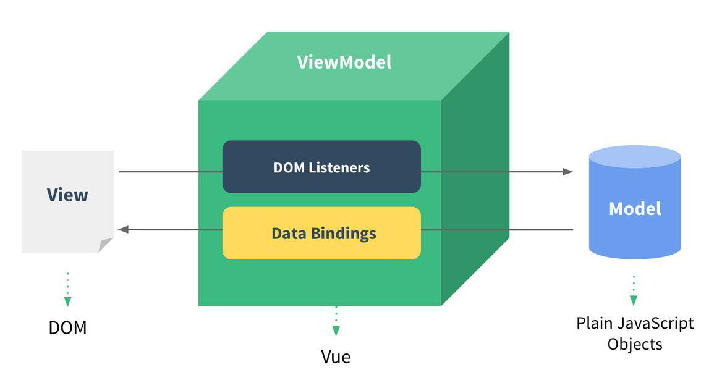

1. View 层：

- 视图层
- 在我们前端开发中，通常就是 DOM 层。
- 主要的作用是给用户展示各种信息。

2. Model 层：

- 数据层
- 数据可能是我们固定的死数据，更多的是来自我们服务器，从网络上请求下来的数据。
- 在我们计数器的案例中，就是后面抽取出来的 obj，当然，里面的数据可能没有这么简单。

3. VueModel 层：

- 视图模型层
- 视图模型层是 View 和 Model 沟通的桥梁。
- 一方面它实现了 Data Binding，也就是数据绑定，将 Model 的改变实时的反应到 View 中
- 另一方面它实现了 DOM Listener，也就是 DOM 监听，当 DOM 发生一些事件(点击、滚动、touch 等)时，可以监听到，并在需要的情况下改变对应的 Data。

## Vue 的生命周期

官方生命周期

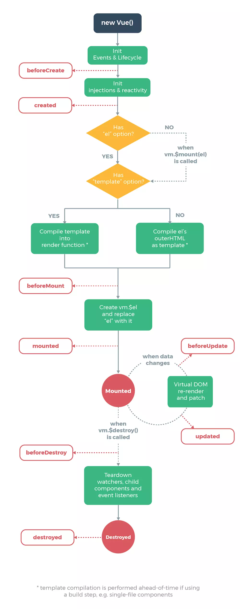

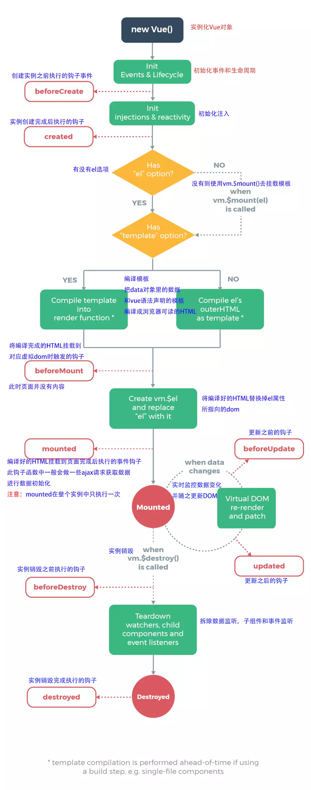

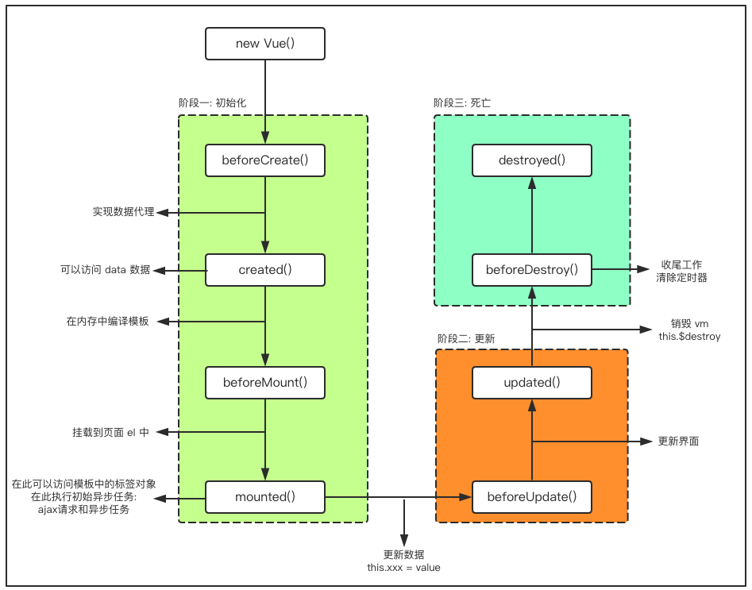

## 插值操作

### Mustache

- 可以通过 Mustache 语法(也就是双大括号)。
- Mustache: 胡子/胡须.

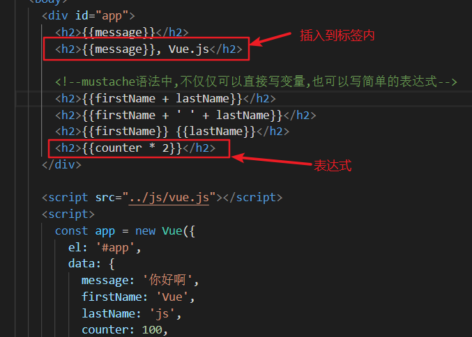

hello Vue.js 应用：

```html
<div id="app">
  <h2>{{message}}</h2>
  <h2>{{message}}, Vuejs!</h2>

  <!--mustache语法中,不仅仅可以直接写变量,也可以写简单的表达式-->
  <h2>{{firstName + lastName}}</h2>
  <h2>{{firstName + ' ' + lastName}}</h2>
  <h2>{{firstName}} {{lastName}}</h2>
  <h2>{{counter * 2}}</h2>
</div>

<script src="../js/vue.js"></script>
<script>
  const app = new Vue({
    el: '#app',
    data: {
      message: '你好啊',
      firstName: 'Vue',
      lastName: 'js',
      counter: 100,
    },
  });
</script>
```

实现效果：

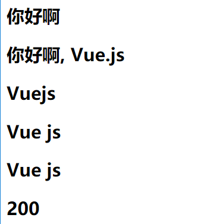

### v-once

- 该指令后面不需要跟任何表达式(比如之前的 v-for 后面是由跟表达式的)
- 该指令表示元素和组件(组件后面才会学习)只渲染一次，不会随着数据的改变而改变。

代码：

```html
<div id="app">
  <h2>{{message}}</h2>
  <h2 v-once>{{message}}</h2>
</div>

<script src="../js/vue.js"></script>
<script>
  let app = new Vue({
    el: '#app',
    data: {
      message: '你好啊',
    },
  });
</script>
```

实现：

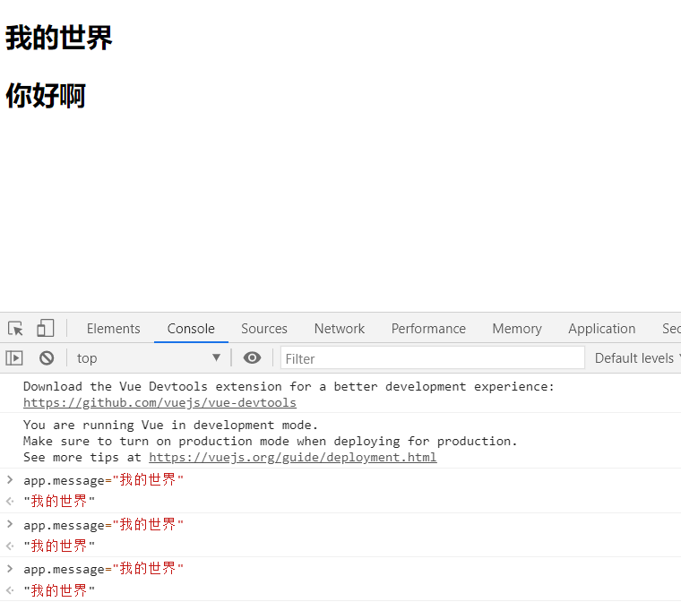

### v-html

- 如果我们直接通过{{}}来输出，会将 HTML 代码也一起输出。
- 但是我们可能希望的是按照 HTML 格式进行解析，并且显示对应的内容。

可以使用`v-html`指令

- 该指令后面往往会跟上一个 string 类型
- 会将 string 的 html 解析出来并且进行渲染

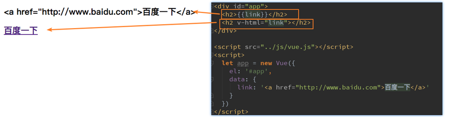

### v-text

- v-text 作用和 Mustache 比较相似：都是用于将数据显示在界面中
- v-text 通常情况下，接受一个 string 类型

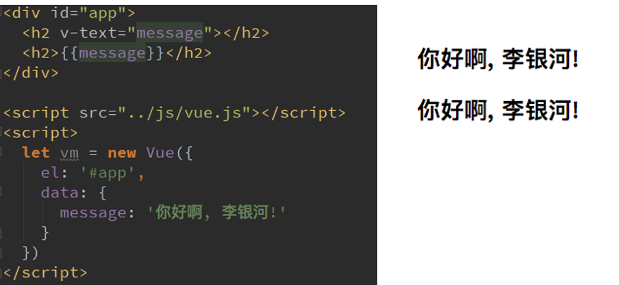

### v-pre

v-pre 用于跳过这个元素和它子元素的编译过程，用于显示原本的 Mustache 语法。

可以使用指令

第一个 h2 元素中的内容会被编译解析出来对应的内容
第二个 h2 元素中会直接显示{{message}}

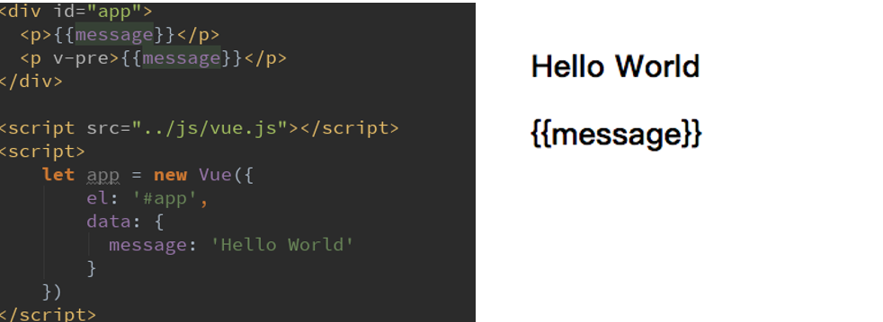

### v-cloak

在某些情况下，我们浏览器可能会直接显然出未编译的 Mustache 标签。
cloak: 斗篷

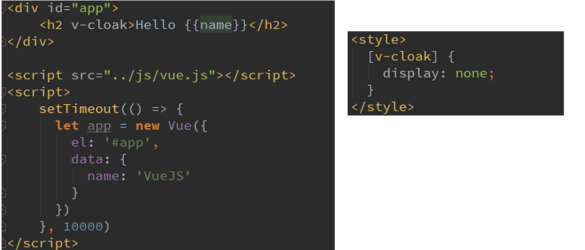

## 动态绑定属性

### v-bind

- v-bind 有一个对应的语法糖，也就是简写方式
- 在开发中，我们通常会使用`语法糖`的形式，因为这样更加简洁。

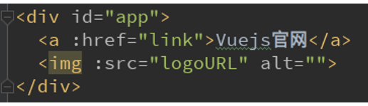

#### v-bind 绑定 class

很多时候，我们希望动态的来切换 class，比如：
当数据为某个状态时，字体显示红色。
当数据另一个状态时，字体显示黑色。

```html
<div id="app">
  <!--<h2 class="active">{{message}}</h2>-->
  <!--<h2 :class="active">{{message}}</h2>-->

  <!--<h2 v-bind:class="{key1: value1, key2: value2}">{{message}}</h2>-->
  <!--<h2 v-bind:class="{类名1: true, 类名2: boolean}">{{message}}</h2>-->
  <h2 class="title" v-bind:class="{active: isActive, line: isLine}">
    {{message}}
  </h2>
  <h2 class="title" v-bind:class="getClasses()">{{message}}</h2>
  <button v-on:click="btnClick">按钮</button>
</div>

<script src="../js/vue.js"></script>
<script>
  const app = new Vue({
    el: '#app',
    data: {
      message: '你好啊',
      isActive: true,
      isLine: true,
    },
    methods: {
      btnClick: function() {
        this.isActive = !this.isActive;
      },
      getClasses: function() {
        return { active: this.isActive, line: this.isLine };
      },
    },
  });
</script>
```

绑定 class 有两种方式：

1. 对象语法

绑定方式：对象语法
对象语法的含义是:class 后面跟的是一个对象。
对象语法有下面这些用法：

```html
<!-- 用法一：直接通过{}绑定一个类 -->
<h2 :class="{'active': isActive}">Hello World</h2>

<!-- 用法二：也可以通过判断，传入多个值 -->
<h2 :class="{'active': isActive, 'line': isLine}">Hello World</h2>

<!-- 用法三：和普通的类同时存在，并不冲突
注：如果isActive和isLine都为true，那么会有title/active/line三个类 -->
<h2 class="title" :class="{'active': isActive, 'line': isLine}">Hello World</h2>

<!-- 用法四：如果过于复杂，可以放在一个methods或者computed中
注：classes是一个计算属性 -->
<h2 class="title" :class="classes">Hello World</h2>
```

2. 数组语法

数组语法的含义是:class 后面跟的是一个数组。

```html
<!-- 用法一：直接通过{}绑定一个类 -->
<h2 :class="['active']">Hello World</h2>

<!-- 用法二：也可以传入多个值 -->
<h2 :class=“[‘active’, 'line']">Hello World</h2>

<!-- 用法三：和普通的类同时存在，并不冲突 -->
<!-- 注：会有title/active/line三个类 -->
<h2 class="title" :class=“[‘active’, 'line']">Hello World</h2>

<!-- 用法四：如果过于复杂，可以放在一个methods或者computed中 -->
<!-- 注：classes是一个计算属性 -->
<h2 class="title" :class="classes">Hello World</h2>
```

点击列表中的哪一项, 那么该项的文字变成红色

```html
<!--作业需求: 点击列表中的哪一项, 那么该项的文字变成红色-->

<div id="app">
  <ul>
    <!-- <li v-for="m in movies">{{m}}</li> -->
    <!-- active 对象|判断语句 
          IsActive===check作为一个恒表达式 成立ChangeColor为ture  -->
    <!-- v-on 语法糖@ -->
    <li
      v-for="(m,check) in movies"
      v-bind:class="{active: IsActive === check}"
      @click="changColor(check)"
    >
      {{check}}-{{m}}
    </li>
  </ul>
</div>

<script src="../js/vue.js"></script>
<script>
  const app = new Vue({
    el: '#app',
    data: {
      movies: ['海王', '海尔兄弟', '火影忍者', '进击的巨人'],
      IsActive: true,
    },
    methods: {
      changColor(check) {
        this.IsActive = check;
      },
    },
  });
</script>
```

#### v-bind 绑定 style

我们可以利用 v-bind:style 来绑定一些 CSS 内联样式。
在写 CSS 属性名的时候，比如`font-size`
我们可以使用`驼峰式 (camelCase)` fontSize
或`短横线分隔 (kebab-case`，记得用单引号括起来) ‘font-size’
绑定 class 有两种方式：

1. 对象语法

:style="{color: currentColor, fontSize: fontSize + 'px'}"
`style`后面跟的是一个对象类型

- 对象的`key`是 CSS 属性名称
- 对象的`value`是具体赋的值，值可以来自于 data 中的属性

2. 数组语法

```html
<div v-bind:style="[baseStyles, overridingStyles]"></div>
```

style 后面跟的是一个数组类型
多个值以，分割即可

## 计算属性

### 什么是计算属性？

我们知道，在模板中可以直接通过插值语法显示一些 data 中的数据。
但是在某些情况，我们可能需要对数据进行一些转化后再显示，或者需要将多个数据结合起来进行显示
比如我们有`firstName`和`lastName`两个变量，我们需要显示完整的名称。
但是如果多个地方都需要显示完整的名称，我们就需要写多个`{{firstName}}` `{{lastName}}`
我们可以将上面的代码换成计算属性：
OK，我们发现计算属性是写在实例的 computed 选项中的。

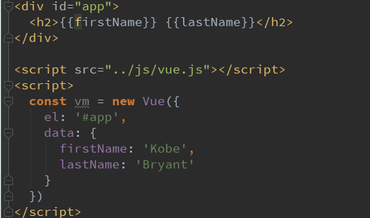

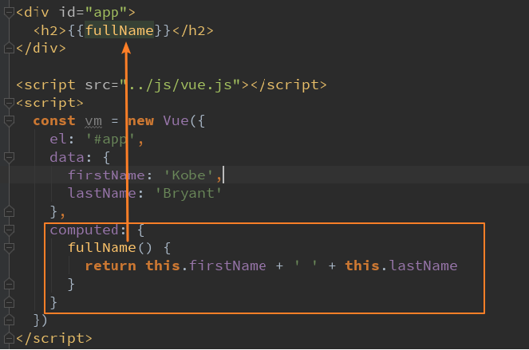

### 计算属性的复杂操作

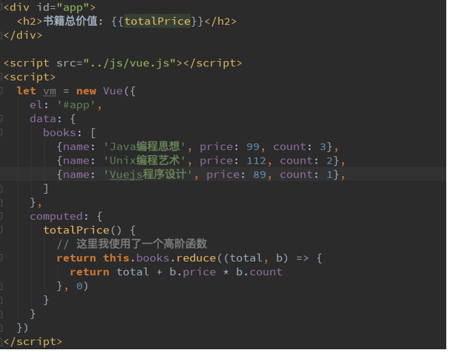

### 计算属性的缓存

我们可能会考虑这样的一个问题：
`methods`和`computed`看起来都可以实现我们的功能，
那么为什么还要多一个计算属性这个东西呢？
原因：计算属性会进行缓存，如果多次使用时，计算属性只会调用一次。

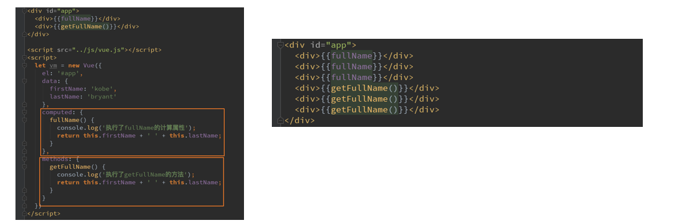

## 事件监听

在前端开发中，我们需要经常和用于交互。
这个时候，我们就必须监听用户发生的时间，比如点击、拖拽、键盘事件等等
在 Vue 中如何监听事件呢？使用 v-on 指令
`v-on`介绍
作用：绑定事件监听器
缩写(语法糖)：@
预期：`Function | Inline Statement | Object`
参数：`event`

### v-on

下面的代码中，我们使用了 v-on:click="counter++”

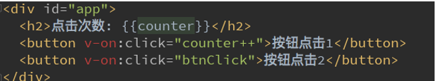另外，我们可以将事件指向一个在 methods 中定义的函数

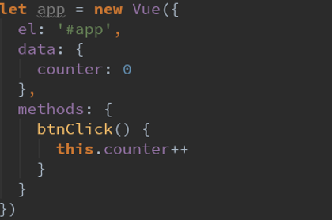

注：`v-on`也有对应的语法糖：
`v-on:click`可以写成`@click`

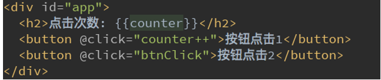

### v-on 参数

当通过`methods`中定义方法，以供`@click`调用时，需要注意参数问题：

- 情况一：如果该方法不需要额外参数，那么方法后的()可以不添加。
  但是注意：如果方法本身中有一个参数，那么会默认将原生事件`event`参数传递进去
- 情况二：如果需要同时传入某个参数，同时需要 event 时，可以通过`$event`传入事件。

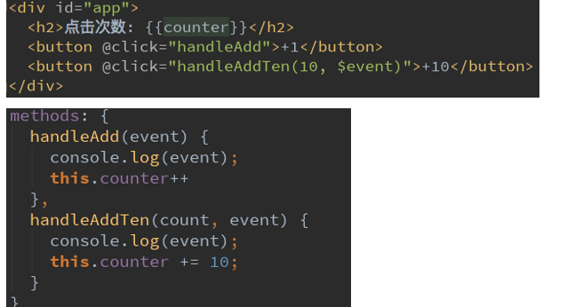

### v-on 修饰符

在某些情况下，我们拿到 event 的目的可能是进行一些事件处理。
Vue 提供了修饰符来帮助我们方便的处理一些事件：
`.stop` - 调用`event.stopPropagation()`。
`.prevent`- 调用`event.preventDefault()`。
`.{keyCode | keyAlias}` - 只当事件是从特定键触发时才触发回调。
`.native` - 监听组件根元素的原生事件。
`.once` - 只触发一次回调。

## 条件判断

### v-if、v-else-if、v-else

这三个指令与 JavaScript 的条件语句 if、else、else if 类似。
Vue 的条件指令可以根据表达式的值在 DOM 中渲染或销毁元素或组件
简单的案例演示：

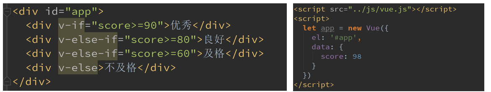

`v-if`的原理：
`v-if`后面的条件为 false 时，对应的元素以及其子元素不会渲染。
也就是根本没有不会有对应的标签出现在 DOM 中。

### 条件渲染

用户再登录时，可以切换使用用户账号登录还是邮箱地址登录。
类似如下情景：

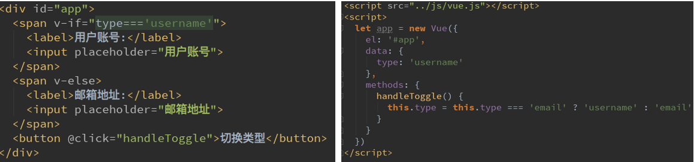

**小问题：**

如果我们在有输入内容的情况下，切换了类型，我们会发现文字依然显示之前的输入的内容。
但是按道理讲，我们应该切换到另外一个 input 元素中了。
在另一个 input 元素中，我们并没有输入内容。
为什么会出现这个问题呢？

**问题解答：**

这是因为 Vue 在进行 DOM 渲染时，出于性能考虑，会尽可能的复用已经存在的元素，而不是重新创建新的元素。
在上面的案例中，Vue 内部会发现原来的 input 元素不再使用，直接作为 else 中的 input 来使用了。

**解决方案：**

如果我们不希望 Vue 出现类似重复利用的问题，可以给对应的 input 添加 key
并且我们需要保证 key 的不同

### v-show

`v-show`的用法和`v-i`f 非常相似，也用于决定一个元素是否渲染：
`v-if`和`v-show`对比
`v-if`和`v-show`都可以决定一个元素是否渲染，那么开发中我们如何选择呢？
`v-if`当条件为 false 时，压根不会有对应的元素在 DOM 中。
`v-show`当条件为 false 时，仅仅是将元素的 display 属性设置为 none 而已。
开发中如何选择呢？
当需要在显示与隐藏之间切片很频繁时，使用`v-show`
当只有一次切换时，通过使用`v-if`

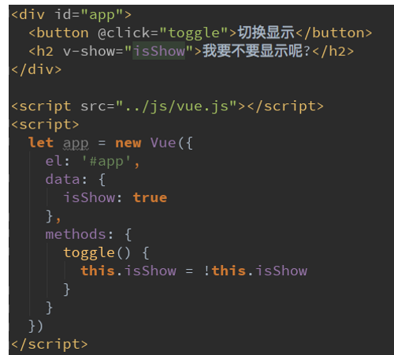

## 循环遍历

### v-for 遍历数组

当我们有一组数据需要进行渲染时，我们就可以使用`v-for`来完成。
`v-for`的语法类似于 JavaScript 中的 for 循环。
格式如下：item in items 的形式。

我们来看一个简单的案例：
如果在遍历的过程中不需要使用索引值
`v-for="movie in movies"`
依次从 movies 中取出 movie，并且在元素的内容中，我们可以使用`Mustache`语法，来使用 movie
如果在遍历的过程中，我们需要拿到元素在数组中的索引值呢？
语法格式：v-for=(item, index) in items
其中的 index 就代表了取出的 item 在原数组的索引值。

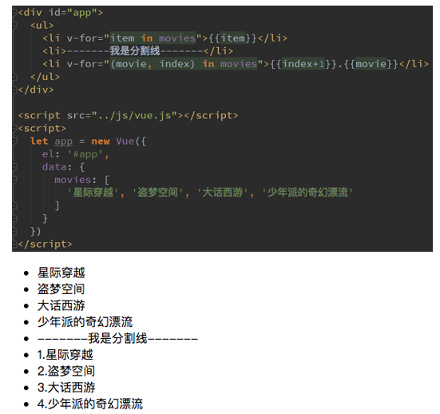

### v-for 遍历

`v-for`可以用户遍历对象：
比如某个对象中存储着你的个人信息，我们希望以列表的形式显示出来。

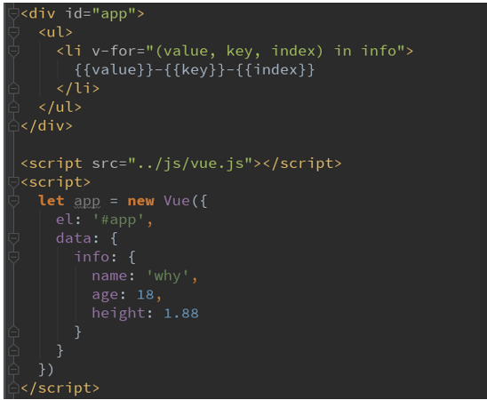

`v-for`遍历对象

比如某个对象中存储着你的个人信息，我们希望以列表的形式显示出来。

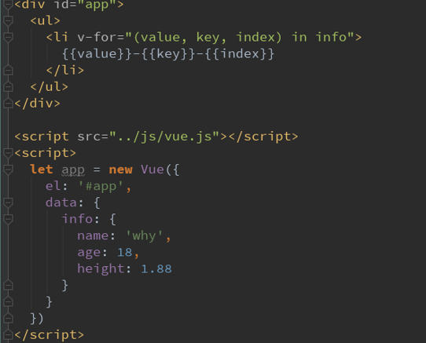

### 组件的 key 属性

官方推荐我们在使用`v-for`时，给对应的元素或组件添加上一个:key 属性。
为什么需要这个 key 属性呢（了解）？
这个其实和 Vue 的虚拟 DOM 的 Diff 算法有关系。
这里我们借用`React’s diff algorithm`中的一张图来简单说明一下：

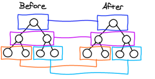

当某一层有很多相同的节点时，也就是列表节点时，我们希望插入一个新的节点
我们希望可以在 B 和 C 之间加一个 F，Diff 算法默认执行起来是这样的。
即把 C 更新成 F，D 更新成 C，E 更新成 D，最后再插入 E，是不是很没有效率？

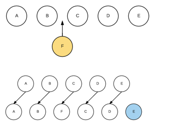

所以我们需要使用 key 来给每个节点做一个唯一标识
Diff 算法就可以正确的识别此节点
找到正确的位置区插入新的节点。
所以一句话，**key 的作用主要是为了高效的更新虚拟 DOM**。

因为 Vue 是响应式的，所以当数据发生变化时，Vue 会自动检测数据变化，视图会发生对应的更新。
Vue 中包含了一组观察数组编译的方法，使用它们改变数组也会触发视图的更新。

- `push()`
- `pop()`
- `shift()`
- `unshift()`
- `splice()`
- `sort()`
- `reverse()`

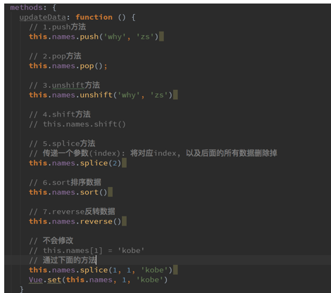

### 图书购物车

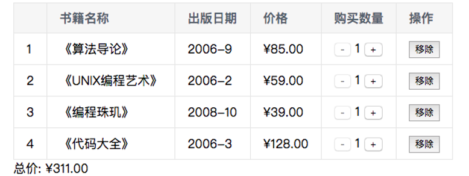

代码：

html:

```html
<!DOCTYPE html>
<html lang="en">
  <head>
    <meta charset="UTF-8" />
    <title>index</title>
    <link rel="stylesheet" href="style.css" />
  </head>
  <style>
    table {
      border: 1px solid #e9e9e9;
      border-collapse: collapse;
      border-spacing: 0;
    }

    th,
    td {
      padding: 8px 16px;
      border: 1px solid #e9e9e9;
      text-align: left;
    }

    th {
      background-color: #f7f7f7;
      color: #5c6b77;
      font-weight: 600;
    }
  </style>
  <body>
    <div id="app" v-cloak>
      <div v-if="list.length">
        <table>
          <thead>
            <tr>
              <th></th>
              <th>书籍名称</th>
              <th>出版日期</th>
              <th>价格</th>
              <th>购买数量</th>
              <th>操作</th>
            </tr>
          </thead>
          <tbody>
            <tr v-for="(item, index) in list" :key="item.id">
              <td>{{index+1}}</td>
              <td>{{item.name}}</td>
              <td>{{item.date}}</td>
              <td>{{item.price | showPrice}}</td>
              <td>
                <button @click="decrement(index)" :disabled="item.count===1">
                  -
                </button>
                {{item.count}}
                <button @click="increment(index)">+</button>
              </td>
              <td>
                <button @click="handleRemove(index)">移除</button>
              </td>
            </tr>
          </tbody>
        </table>
        <div>总价: {{totalPrice | showPrice}}</div>
      </div>
      <div v-else>购物车为空</div>
    </div>

    <script src="../js/vue.js"></script>
    <script src="index.js"></script>
  </body>
</html>
```

js

```js
const app = new Vue({
  el: '#app',
  data: {
    list: [
      {
        id: 1,
        name: '《算法导论》',
        date: '2006-9',
        price: 85.0,
        count: 1,
      },
      {
        id: 2,
        name: '《UNIX编程艺术》',
        date: '2006-2',
        price: 59.0,
        count: 1,
      },
      {
        id: 3,
        name: '《编程珠玑》',
        date: '2008-10',
        price: 39.0,
        count: 1,
      },
      {
        id: 4,
        name: '《代码大全》',
        date: '2006-3',
        price: 128.0,
        count: 1,
      },
    ],
  },
  methods: {
    decrement(index) {
      this.list[index].count--;
    },
    increment(index) {
      this.list[index].count++;
    },
    handleRemove(index) {
      this.list.splice(index, 1);
    },
  },
  filters: {
    showPrice(value) {
      return '¥' + value.toFixed(2);
    },
  },
  computed: {
    totalPrice() {
      let total = 0;
      for (let i = 0; i < this.list.length; i++) {
        let item = this.list[i];
        total += item.price * item.count;
      }
      return total;
    },
  },
});
```

## v-model

### 表单绑定 v-model

表单控件在实际开发中是非常常见的。特别是对于用户信息的提交，需要大量的表单。
Vue 中使用`v-model`指令来实现表单元素和数据的双向绑定。
案例的解析：
当我们在输入框输入内容时
因为 input 中的`v-model`绑定了 message，所以会实时将输入的内容传递给 message，message 发生改变。
当 message 发生改变时，因为上面我们使用 Mustache 语法，将 message 的值插入到 DOM 中，所以 DOM 会发生响应的改变。
所以，通过`v-model`实现了双向的绑定。

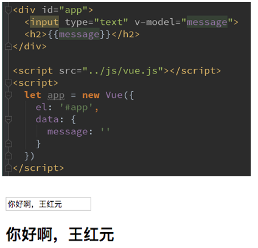

当然，我们也可以将`v-model`用于 textarea 元素

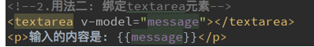

### v-model 原理

v-model 其实是一个语法糖，它的背后本质上是包含两个操作： 1.`v-bind`绑定一个 value 属性 2.`v-on`指令给当前元素绑定 input 事件

```html
<input type="text" v-model="message" />
等同于
<input
  type="text"
  v-bind:value="message"
  v-on:input="message = $event.target.value"
/>
```

### v-model:radio

当存在多个单选项框时

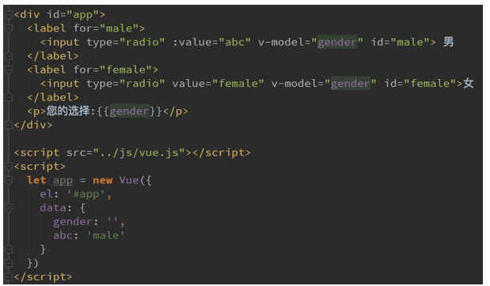

复选框分为两种情况：单个勾选框和多个勾选框
单个勾选框：

- `v-model`即为布尔值。
- 此时 input 的 value 并不影响`v-model`的值。

多个复选框：

- 当是多个复选框时，因为可以选中多个，所以对应的 data 中属性是一个数组。
- 当选中某一个时，就会将 input 的 value 添加到数组中。

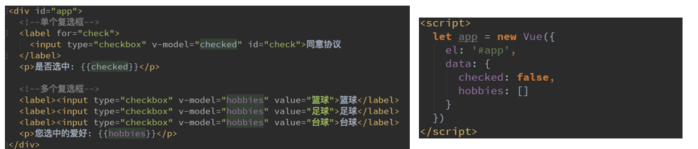

### v-model:select

和 checkbox 一样，select 也分单选和多选两种情况。
单选：只能选中一个值。

- `v-model`绑定的是一个值。

- 当我们选中 option 中的一个时，会将它对应的 value 赋值到 mySelect 中

多选：可以选中多个值。

- `v-model`绑定的是一个数组。
- 当选中多个值时，就会将选中的 option 对应的 value 添加到数组 mySelects 中

### 值绑定

初看 Vue 官方值绑定的时候，我很疑惑：what the hell is that？
但是仔细阅读之后，发现很简单，就是动态的给 value 赋值而已：

- 我们前面的 value 中的值，可以回头去看一下，都是在定义 input 的时候直接给定的。
- 但是真实开发中，这些 input 的值可能是从网络获取或定义在 data 中的。
- 所以我们可以通过 v-bind:value 动态的给 value 绑定值。
- 这不就是 v-bind 吗？

这不就是 v-bind 在 input 中的应用吗？搞的我看了很久，搞不清他想将什么。
这里不再给出对应的代码，因为会用 v-bind，就会值绑定的应用了。

## 修饰符

### lazy 修饰符：

- 默认情况下，v-model 默认是在 input 事件中同步输入框的数据的。
- 也就是说，一旦有数据发生改变对应的 data 中的数据就会自动发生改变。
- lazy 修饰符可以让数据在失去焦点或者回车时才会更新：

### number 修饰符：

- 默认情况下，在输入框中无论我们输入的是字母还是数字，都会被当做字符串类型进行处理。
- 但是如果我们希望处理的是数字类型，那么最好直接将内容当做数字处理。
- number 修饰符可以让在输入框中输入的内容自动转成数字类型：

### trim 修饰符：

- 如果输入的内容首尾有很多空格，通常我们希望将其去除
- trim 修饰符可以过滤内容左右两边的空格
