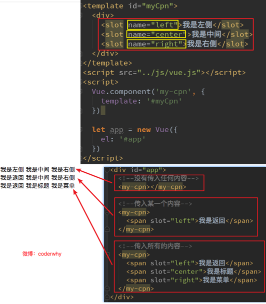

## 介绍组件

### 什么是组件化

人面对复杂问题的处理方式：

- 任何一个人处理信息的逻辑能力都是有限的
- 所以，当面对一个非常复杂的问题时，我们不太可能一次性搞定一大堆的内容。
- 但是，我们人有一种天生的能力，就是将问题进行拆解。
- 如果将一个复杂的问题，拆分成很多个可以处理的小问题，再将其放在整体当中，你会发现大的问题也会迎刃而解。

组件化也是类似的思想：

- 如果我们将一个页面中所有的处理逻辑全部放在一起，处理起来就会变得非常复杂，而且不利于后续的管理以及扩展。
- 但如果，我们讲一个页面拆分成一个个小的功能块，每个功能块完成属于自己这部分独立的功能，那么之后整个页面的管理和维护就变得非常容易了。

- 我们将一个完整的页面分成很多个组件。
- 每个组件都用于实现页面的一个功能块。
- 而每一个组件又可以进行细分。

### Vue 组件化思想

组件化是 Vue.js 中的重要思想

- 它提供了一种抽象，让我们可以开发出一个个独立可复用的小组件来构造我们的应用。
- 任何的应用都会被抽象成一颗组件树。

组件化思想的应用：

- 有了组件化的思想，我们在之后的开发中就要充分的利用它。
- 尽可能的将页面拆分成一个个小的、可复用的组件。
- 这样让我们的代码更加方便组织和管理，并且扩展性也更强。

所以，组件是 Vue 开发中，非常重要的一个篇章，要认真学习。

## 注册组件

### 注册组件的基本步骤

组件的使用分成三个步骤：

- 创建组件构造器
- 注册组件
- 使用组件。

我们来看看通过代码如何注册组件

查看运行结果：
和直接使用一个 div 看起来并没有什么区别。
但是我们可以设想，如果很多地方都要显示这样的信息，我们是不是就可以直接使用`<my-cpn></my-cpn>`来完成呢？

### 注册组件步骤解析

这里的步骤都代表什么含义呢？ 1.`Vue.extend()`：
调用`Vue.extend()`创建的是一个组件构造器。
通常在创建组件构造器时，传入 template 代表我们自定义组件的模板。
该模板就是在使用到组件的地方，要显示的 HTML 代码。
事实上，这种写法在 Vue2.x 的文档中几乎已经看不到了，它会直接使用下面我们会讲到的语法糖，但是在很多资料还是会提到这种方式，而且这种方式是学习后面方式的基础。 2.`Vue.component()`：
调用 Vue.component()是将刚才的组件构造器注册为一个组件，并且给它起一个组件的标签名称。
所以需要传递两个参数：

1、注册组件的标签名

2、组件构造器 3.组件必须挂载在某个 Vue 实例下，否则它不会生效。（见下页）
我们来看下面我使用了三次`<my-cpn></my-cpn>`
而第三次其实并没有生效：

## 组件其他补充

### 全局组件和局部组件

当我们通过调用 Vue.component()注册组件时，组件的注册是全局的
这意味着该组件可以在任意 Vue 示例下使用。
如果我们注册的组件是挂载在某个实例中, 那么就是一个局部组件

### 父组件和子组件

在前面我们看到了组件树：
组件和组件之间存在层级关系
而其中一种非常重要的关系就是父子组件的关系
我们来看通过代码如何组成的这种层级关系：

父子组件错误用法：以子标签的形式在 Vue 实例中使用
因为当子组件注册到父组件的 components 时，Vue 会编译好父组件的模块
该模板的内容已经决定了父组件将要渲染的 HTML（相当于父组件中已经有了子组件中的内容了）
`<child-cpn></child-cpn>`是只能在父组件中被识别的。
类似这种用法，`<child-cpn></child-cpn>`是会被浏览器忽略的。

### 注册组件语法糖

在上面注册组件的方式，可能会有些繁琐。

- Vue 为了简化这个过程，提供了注册的语法糖。
- 主要是省去了调用 Vue.extend()的步骤，而是可以直接使用一个对象来代替。

### 模板的分离写法

刚才，我们通过语法糖简化了 Vue 组件的注册过程，另外还有一个地方的写法比较麻烦，就是 template 模块写法。
如果我们能将其中的 HTML 分离出来写，然后挂载到对应的组件上，必然结构会变得非常清晰。
Vue 提供了两种方案来定义 HTML 模块内容：

- 使用`<script>`标签
- 使用`<template>`标签

## 组件数据的存放

### 组件可以访问 Vue 实例数据吗?

组件是一个单独功能模块的封装：

- 这个模块有属于自己的 HTML 模板，也应该有属性自己的数据 data。

组件中的数据是保存在哪里呢？顶层的 Vue 实例中吗？

- 我们先来测试一下，组件中能不能直接访问 Vue 实例中的 data

我们发现不能访问，而且即使可以访问，如果将所有的数据都放在 Vue 实例中，Vue 实例就会变的非常臃肿。
结论：Vue 组件应该有自己保存数据的地方。

### 组件数据的存放

组件自己的数据存放在哪里呢?

- 组件对象也有一个 data 属性(也可以有 methods 等属性，下面我们有用到)
- 只是这个 data 属性必须是一个函数
- 而且这个函数返回一个对象，对象内部保存着数据

### 为什么是一个函数呢?

为什么 data 在组件中必须是一个函数呢?

- 首先，如果不是一个函数，Vue 直接就会报错。
- 其次，原因是在于 Vue 让每个组件对象都返回一个新的对象，因为如果是同一个对象的，组件在多次使用后会相互影响。

## 父子组件的通信

在上一个小节中，我们提到了子组件是不能引用父组件或者 Vue 实例的数据的。
但是，在开发中，往往一些数据确实需要从上层传递到下层：

- 比如在一个页面中，我们从服务器请求到了很多的数据。
- 其中一部分数据，并非是我们整个页面的大组件来展示的，而是需要下面的子组件进行展示。
- 这个时候，并不会让子组件再次发送一个网络请求，而是直接让大组件(父组件)将数据传递给小组件(子组件)。

如何进行父子组件间的通信呢？Vue 官方提到

- 通过 props 向子组件传递数据
- 通过事件向父组件发送消息

在下面的代码中，我直接将 Vue 实例当做父组件，并且其中包含子组件来简化代码。
真实的开发中，Vue 实例和子组件的通信和父组件和子组件的通信过程是一样的。

## 父级向子级传递

### props 基本用法

在组件中，使用选项 props 来声明需要从父级接收到的数据。
`props`的值有两种方式：

- 方式一：字符串数组，数组中的字符串就是传递时的名称。
- 方式二：对象，对象可以设置传递时的类型，也可以设置默认值等。

我们先来看一个最简单的 props 传递：

### props 数据验证

在前面，我们的 props 选项是使用一个数组。
我们说过，除了数组之外，我们也可以使用对象，当需要对 props 进行类型等验证时，就需要对象写法了。
验证都支持哪些数据类型呢？
`String`
`Number`
`Boolean`
`Array`
`Object`
`Date`
`Function`
`Symbol`

当我们有自定义构造函数时，验证也支持自定义的类型

## 子级向父级传递

### 自定义事件代码

## 父子组件的访问

### 父子组件的访问方式： \$children

有时候我们需要父组件直接访问子组件，子组件直接访问父组件，或者是子组件访问跟组件。

- 父组件访问子组件：使用`$children`或`$refs`
- 子组件访问父组件：使用`$parent`

我们先来看下`$children`的访问

- this.\$children 是一个数组类型，它包含所有子组件对象。
- 我们这里通过一个遍历，取出所有子组件的 message 状态。

### 父子组件的访问方式： \$refs

`$children`的缺陷：

- 通过`$children`访问子组件时，是一个数组类型，访问其中的子组件必须通过索引值。
- 但是当子组件过多，我们需要拿到其中一个时，往往不能确定它的索引值，甚至还可能会发生变化。
- 有时候，我们想明确获取其中一个特定的组件，这个时候就可以使用\$refs

`$refs`的使用：

- `$refs`和 ref 指令通常是一起使用的。
- 首先，我们通过 ref 给某一个子组件绑定一个特定的 ID。
- 其次，通过`this.$refs.ID`就可以访问到该组件了。

### 父子组件的访问方式： \$parent

如果我们想在子组件中直接访问父组件，可以通过\$parent
注意事项：

- 尽管在 Vue 开发中，我们允许通过\$parent 来访问父组件，但是在真实开发中尽量不要这样做。
- 子组件应该尽量避免直接访问父组件的数据，因为这样耦合度太高了。
- 如果我们将子组件放在另外一个组件之内，很可能该父组件没有对应的属性，往往会引起问题。
- 另外，更不好做的是通过\$parent 直接修改父组件的状态，那么父组件中的状态将变得飘忽不定，很不利于我的调试和维护。

### 非父子组件通信

刚才我们讨论的都是父子组件间的通信，那如果是非父子关系呢?

- 非父子组件关系包括多个层级的组件，也包括兄弟组件的关系。

在 Vue1.x 的时候，可以通过`$dispatch`和`$broadcast`完成

- `$dispatch`用于向上级派发事件
- `$broadcast`用于向下级广播事件
- 但是在 Vue2.x 都被取消了

在 Vue2.x 中，有一种方案是通过中央事件总线，也就是一个中介来完成。

- 但是这种方案和直接使用 Vuex 的状态管理方案还是逊色很多。
- 并且 Vuex 提供了更多好用的功能，所以这里我们暂且不讨论这种方案，后续我们专门学习 Vuex 的状态管理。

## 插槽 slot

### 编译作用域

在真正学习插槽之前，我们需要先理解一个概念：编译作用域。
官方对于编译的作用域解析比较简单，我们自己来通过一个例子来理解这个概念：
我们来考虑下面的代码是否最终是可以渲染出来的：

- `<my-cpn v-show="isShow"></my-cpn>`中，我们使用了 isShow 属性。
- `isShow`属性包含在组件中，也包含在 Vue 实例中。

答案：最终可以渲染出来，也就是使用的是 Vue 实例的属性。
为什么呢？

- 官方给出了一条准则：父组件模板的所有东西都会在父级作用域内编译；子组件模板的所有东西都会在子级作用域内编译。
- 而我们在使用`<my-cpn v-show="isShow"></my-cpn>`的时候，整个组件的使用过程是相当于在父组件中出现的。
- 那么他的作用域就是父组件，使用的属性也是属于父组件的属性。
- 因此，`isShow`使用的是 Vue 实例中的属性，而不是子组件的属性。

### slot 基本使用

了解了为什么用 slot，我们再来谈谈如何使用 slot？
在子组件中，使用特殊的元素`<slot>`就可以为子组件开启一个插槽。
该插槽插入什么内容取决于父组件如何使用。
我们通过一个简单的例子，来给子组件定义一个插槽：
`<slot>`中的内容表示，如果没有在该组件中插入任何其他内容，就默认显示该内容
有了这个插槽后，父组件如何使用呢？

### 具名插槽 slot

当子组件的功能复杂时，子组件的插槽可能并非是一个。

- 比如我们封装一个导航栏的子组件，可能就需要三个插槽，分别代表左边、中间、右边。
- 那么，外面在给插槽插入内容时，如何区分插入的是哪一个呢？
- 这个时候，我们就需要给插槽起一个名字

如何使用具名插槽呢？

- 非常简单，只要给 slot 元素一个 name 属性即可
  `<slot name='myslot'></slot>`
  我们来给出一个案例：

这里我们先不对导航组件做非常复杂的封装，先了解具名插槽的用法。

### 作用域插槽：准备

作用域插槽是`slot`一个比较难理解的点，而且官方文档说的又有点不清晰。
这里，我们用一句话对其做一个总结，然后我们在后续的案例中来体会：
父组件替换插槽的标签，但是内容由子组件来提供。
我们先提一个需求：
子组件中包括一组数据，比如：pLanguages: ['JavaScript', 'Python', 'Swift', 'Go', 'C++']

- 需要在多个界面进行展示：
- 某些界面是以水平方向一一展示的，
- 某些界面是以列表形式展示的，
- 某些界面直接展示一个数组

内容在子组件，希望父组件告诉我们如何展示，怎么办呢？

- 利用 slot 作用域插槽就可以了

我们来看看子组件的定义：

### 作用域插槽：使用

在父组件使用我们的子组件时，从子组件中拿到数据：
我们通过`<template slot-scope="slotProps">`获取到 slotProps 属性
在通过 slotProps.data 就可以获取到刚才我们传入的 data 了

