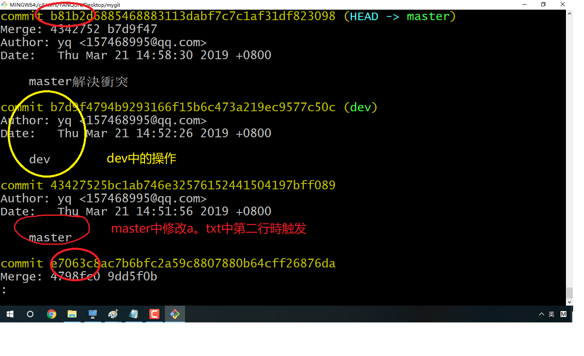
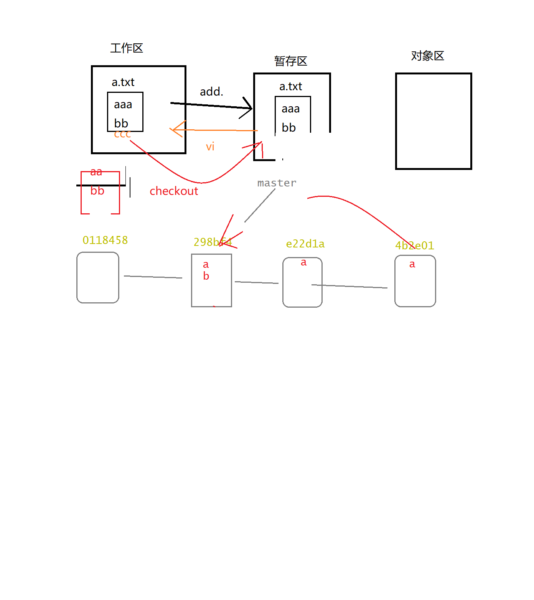
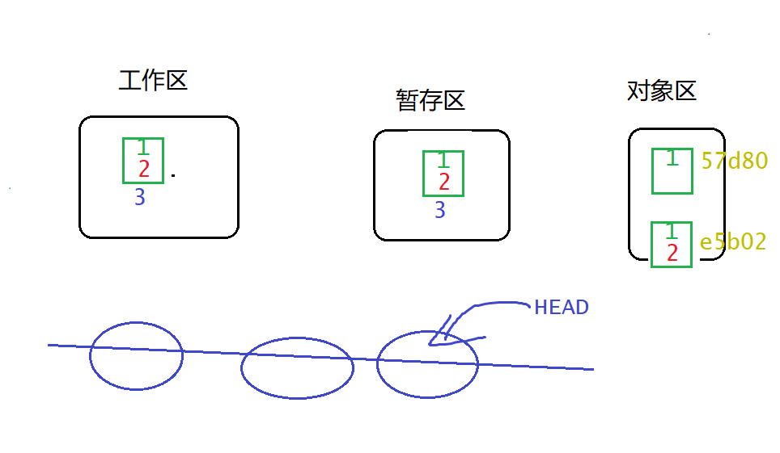
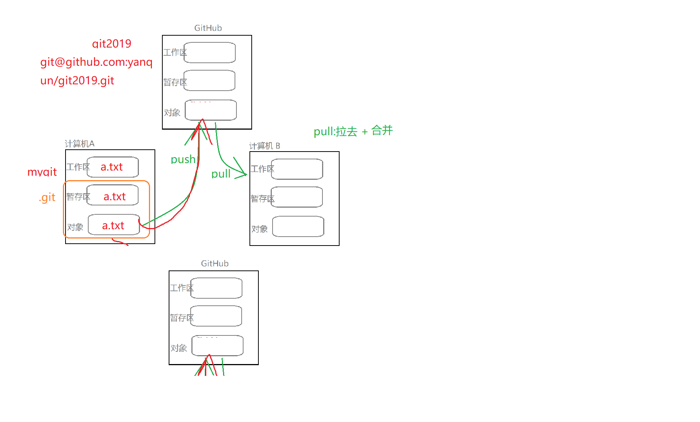

## git：分布式版本控制系统

https://git-scm.com/

git ： [g i: t]

Linux 系统 -> BitKeepper(2005 收费)

Linux 系统 ->Git

版本控制系统:集中式版本控制（cvs svn） 分布式版本控制(git)

## git 优势：

本地版本控制 重写提交说明 可以“后悔” 分支系统

svn:
a.txt "这是我的文件"
git a.txt "这是我的文件" -> a.txt "这是我的第一个文件"

svn:增量
git:全量(每一个版本都包含全部的文件,时刻保持数据的完整性)

git 三种状态（个人理解：四种）
(已管理)
已修改（modified）  
已暂存(staged)  
已提交(commited)  
将某个目录纳入 git 管理： git init （默认 master 分支）  
**.git: git 版本控制的目录**

暂存区->工作区  
`git rm --cached`

`git log`:查看提交日志

git log -最近的次数

git log --pretty=oneline
git log --pretty=format:"%h - %an ,%ar : %s"

commit eb125a18e9b9d7ffeb2e30236ce5fbe6d6d110ce

eb125a18e9b9d7ffeb2e30236ce5fbe6d6d110ce ：sha1 计算的结果  
sha1 、md5 加密算法 、随机数 ，用于区分 是哪一次的提交（并且不重复）

## 分布式 id 生成器

设置邮箱、用户名：

1. `git config --global` （基本不用，给整个计算机一次性设置）

2. `git config --system` （推荐，给当前用户一次性设置） **~.gitconfig**

3. `git config --local` （给当前项目一次性设置） **.git/config**

优先级 3>2>1  
设置用户名和邮箱  
git config --local user.name 'abc'  
git config --local user.email '123456@qq.com'

git config --local user.name 'abc'  
git config --local user.email '123456@qq.com'

给当前用户设置邮箱名字：  
/c/Users/YANQUN/.gitconfig

简单粗暴  
删除 `git config --local --unset user.name`

### 操作：

如果某个文件 已提价，并且对其进行了修改。可以放弃修改（还原到已提交状态）
： `git checkout` -- hello.txt

### 提交问题：

只对修改之后 的提交有效。修改之前的 提交 仍然使用的是之前的 配置(用户名、邮箱)双引号可省

### 删除已提交的文件：

git rm x : 1.删除 2.暂存区
删除之后 文件被放到 暂存区

彻底删除： `git commit -m` "彻底删除 b" ;
git rm 后悔：

1. 恢复到工作区 `git reset HEAD` hello.txt

2. `git checkout` -- hello.txt

### 操作系统删除 rm :1.删除 2.工作区

`git mv` 重命名

### 注释重写（重写提交说明）

正规 ：`git commit --amend -m`'修正'

**忽略文件：.gitignore(全部提交时，可以不用提交的文件)**

### 通配符 ：

\*任意字符

\*.properties

!b.properties

dir/：忽略 dir 目录中的所有文件

dir/\*.txt

dir/_/_.txt :能够忽略 dir/abc/a.txt dir/xyz/a.txt ,不能 dir/xyz/123/a.txt  
dir/\*_/_.txt :任意级别目录

空目录：默认就是忽略的

### 分支

查看分支 `git branch`  
创建分支 `git branch` 分支名  
切换分支 `git checkout` 分支名  
删除分支 `git branch -d` 分支名 (不能删除当前分支)  
其他不能删除的情况： 包含 “未合并”的内容，删除分支之前 建议先合并  
强行删除 `git branch -D` 分支名

#### 细节：

1. 如果在分支 A 中进行了写操作，但此操作局限在工作区中进行（没 add commit）。在 master 中能够看到该操作。 如果分支 A 中进行了写操作 进行了 commit（对象区），则 master 中无法观察到此文件
2. 如果在分支 A 中进行了写操作，但此操作局限在工作区中进行（没 add commit）。删除分支 A 是可以成功的。

创建新分支 并切换 ：`git checkout -b` 分支名
`git checkout -b` new_branch

合并 `git merge` new_branch

`git branch -v`

分支：一个 commit 链，一条工作记录线

分支名(master) :指向当前的提交(commit)
HEAD:指向当前分支（HEAD->分支名）

如果一个分支靠前(dev)，另一个落后(master)。则如果不冲突， master 可以通过 merge 直接追赶上 dev，称为 fast forward。  
fast forward 本质就是 分支指针的移动.注意：跳过的中间 commit，仍然会保存。
fast forward：

1. 两个分支 fast forward 归于一点 commit
2. 没有分支信息（丢失分支信息）

git 在 merge 时，默认使用 fast fast forward ；也可以禁止 : git merge --no-ff 1.两个分支 fast forward ，不会归于一点 commit （主动合并的分支 会前进一步） 2.分支信息完整（不丢失分支信息）
合并：merge more 采用 ff.

合并：如果冲突 ，需要解决冲突。
解决冲突：git add xxxx ,git commit -m "xx"
git add xxxx(告知 git,冲突已解决)

**注意：master 在 merge 时 如果遇到冲突 并解决，则解决冲突 会进行 2 次提交： 1 次是最终提交，1 次是将对方 dev 的提交信息 commit 也拿来了**

**如果一方落后，另一方 前进。则落后放可以直接通过 merge 合并到 前进方。**

git log --graph
git log --graph --pretty=oneline --abbrev-commit

合并 add 和 commit：
git commit -am '注释'

版本穿梭：在多个 commit 之间 进行穿梭。 回退、前进

回退到上二次 commit： git reset --hard HEAD^^

回退到上 n 次 commit： git reset --hard HEAD~n

跳转到任意一次 commit: 通过 sha1 值 直接回退 git reset --hard sha1 值的前几位 ，需要结合 git reflog 使用。

git reflog：查看记录，记录所有操作。可以帮助我们 实现“后悔”操作。需要借助于 良好的 注释习惯

checkout：放弃修改。放弃的是 工作区中的修改。 相对于暂存区或对象区
reset: 将之前增加到暂存区中的内容 回退到工作区

### checkout：

`git checkout` sha1 值  
版本穿梭（游离状态） 1.修改后、必须提交 2.创建分支的好时机 git branch mybranch 2735603  
git chekcout mybranch;  
git chekcout master;

### 分支重命名：

`git branch -m` master master2

### stash:保存现场

1.建议（规范） ：在功能未没有开发完毕前，不要 commit
​ 2.规定（必须） ： 在没有 commit 之前，不能 chekcout 切换分支 （不在同一个 commit 阶段）
如果还没有将某一个功能开发完毕 就要切换分支：建议

1. 保存现场（临时保存，stash）

2. 切换

### 保存现场：git stash

还原现场(默认还原最近一次)：
`git stash pop` (将原来保存的删除， 用于还原内容)  
`git stash apply`(还原内容，不删除原保存的内容),可以指定某一次现场 `git stash apply stash@{1}`

手工删除现场：`git stash drop stash@{0}`

### 查看现场：git stash list

    （了解即可） 如果不同的分支 在同一个commit阶段在，在commit之前，可以chekcout切换分支

Tag 标签 ：适用于整个项目，和具体的分支没关系
git tag xxx  
git tag -a xxx -m "xxxx"  
查看标签 `git tag`  
删除标签 `git tag -d` 标签名

### blame：责任

`git blame` a.txt 查看 a.txt 的所有提交 commit sha1 值，以及每一行的作者

差异性 diff a.txt b.txt  
@@ -4,4 +4,6 @@  
4:从第 4 行开始，6 比较 6 行 -：原文件 +：对比的文件

diff：比较的是文件本身  
git diff ：比较的 区中的文件

git diff :暂存区 和工作区的差异  
工作区 和 某个对象区的差异

git diff commit 的 sha1 值： 对象区和 工作区的差异  
git diff commit 的 sha1 值：最新 对象区和 工作区的差异

git diff --cached commit 的 sha1 值 : 对象区和 暂存区的差异

git diff --cached HEAD : 最新对象区和 暂存区的差异

push:本地->github
pull:github->本地 ， pull = fetch + merge

rm -rf \* ：当前目录中的文件、子文件目录全部删除（不会删除隐藏文件、不过回收站）  
.....rm ..... -rf / ......：不要执行，删除整个计算机中的全部文件

github 的仓库中，默认的说明文档 README.md

### 推送：

`git remote add origin` 远程仓库 http 地址  
`git remote add origin` 远程仓库 ssh 地址

git remote add ： origin -- 远程仓库地址

(master)  
git push -u origin master

### 后续修改推送时 只需要 git push

ssh 配置： 本地 私钥 ，远程 github 存放公钥

ssh-keygen 生成：私钥(本机) 公钥（github）

可以将公钥 存放在 github 中的两个地方：  
项目的 setting 中，只要当前项目可以和 本机 免秘钥登录  
账号的 settings 中， 账户的所有项目 都可以和本机免秘钥

**注意：远程增加 ssh 的公钥时 1 删除回车符 2 可写权限**

dev:开发分支，频繁改变  
test：基本开发完毕后，交给测试实施人员的分支  
master：生产阶段，，很少变化

dev -> test (merge dev) -> master (merge test ) -> ....

bugfix：临时修复 bug 分支

`git remote show`

git remote show origin

git 会在本地维护 origin/master 分支，通过该分支 感知远程 github 的内容
origin/master 一般建议 不要修改，是一个只读分支

pull/push:推送，改变指针

Fast-forward ：更新， 如果发现 更新的内容 比自己先一步（commit 的 sh1 值 在自己之前），则 会自动合并

冲突：

fetch first
git pull

pull = fetch + merge

有冲突：  
pull =fetch + merge

merge： vi 解决冲突 -> git add . ->commit

总结：
pull -> vi -> add -> commit ->push

pull =fetch + merge

图形化工具
git gui ： gitk 、gui 、github desktop

git log
查看 github 分支的日志：git log refs/remotes/origin/master

分支：就是一個指針，commit 的 sha1 值

分支：
git branch -av
本地->远程：
git push
方法一：(dev)
git push -u origin dev
方法二：
git push --set-upstream origin test

      git branch -av

远程->本地
1.pull :远程->追踪 2. 追踪->本地
方法一：
git checkout -b dev origin/dev
方法二：
git checkout -b test--track origin/test
git checkout --track origin/aaa

### 删除分支：

`git branch -d` 分支名

git push origin src:dest
删除远端分支 git push origin :test
git push origin --delete dev

git push origin src:dest
git push origin dev:dev2
git push origin HEAD:dev2

git pull origin ccc2:ccc3 ，相当于 git pull + : git checkout -b dev origin/分支名

本地没有 a 分支，但本地却感知远端的 a 分支。  
检测： git remote prune origin --dry-run

清理无效的 追踪分支（本地中感知的远程分支）
git remote prune origin

将远端分支 拉去到本地某个新分支 ：

给命令起别名：git config --global alias.ch checkout

### 标签

`git tag`

git tag v1.0 简单标签，只存储当前的 commit 的 sha1 值
git tag -a v2.0 -m "我的 v.2.0 版本" （创建一个新对象，会产生一个新的 commit/sha1）存储信息，其中包含了当前的 commit 的 sha1 值

v1.0 : 8c3512547
v2.0 : aaaa(8c3512547)

### 推送标签

git push origin v1.0 v2.0

git push origin --tags

git push origin v1.0
完整 git push origin refs/tags/v1.0:refs/tags/v1.0

### 获取远程标签

git pull :如果远端新增标签，则 pull 可以将新增的标签拉去到本地；如果远程是删除标签，则 pull 无法感知
git fetch orgin tag v4.0

### 删除远程标签

git push origin :refs/tags/v1.0

注意：如果将远程标签删除，其他用户无法直接感知

### git gc :压缩

objects、refs 中记录了很多 commit 的 sha1 值，如果执行 gc 则会将这么多 sha1 值 存放到一个 压缩文件中 packed-refs

refs ：标签、head、remote
objects：对象 ,git 每一次 version 的全量内容

### git 裸库

没有工作区的 工作仓库 ，存在于服务端

submodule ：子模块
应用场景 ：在一个仓库中 引用另一个仓库的代码。

在 github 上如果新建项目，并且 ssh 连接 则必须配置 ssh
第一次：仓库地址、分支

git remote add origin git@github.com:yanqun/A.git

git push -u origin master

--

git remote add origin git@github.com:yanqun/B.git

A 中有 B 库，但 B push 之后 A 无法直接感知 ，需要主动操作：pull 1.进入 A/B 中 pull 2.直接在 A 中 迭代 pull（将 A 中的所有 submodule 全部 pull）： git submodule foreach git pull

B：修改->push-> A（本地+远程）无法感知

本地 pull ： 本地有， A 的远程没 ： 本地 add ..commit ->push

如果 push B,则 B 本身能够感知 ；但是 A 中的 B 不能直接感知

如果 clone 的项目包含 submodule,则 clone 方法：
git clone git@github.com:yanqun/A.git --recursive

工作区
rm -rf B
暂存区
git rm --cached B

->commit . push.

**建议：submodule 单向操作**
**substree：双向、简单**

SSH
(父)指定仓库地址
git remote add origin git@github.com:yanqun/parent.git  

再指定分支
git push -u origin master    

(子)
git remote add origin git@github.com:yanqun/subtree.git  
git push -u origin master    

（父-子）
git remote add subtree-origin git@github.com:yanqun/subtree.git  
git subtree add -P subtree subtree-origin master 等价 git subtree add --prefix subtree subtree-origin master  

另一种方式
git subtree add -P subtree2 subtree-origin master --squash  

--squash：合并 commit,为了防止 子工程干扰父工程  

squash：减少 commit 的次数    

父- 子
`git log ` 
子： a,b,c,d,e 5commit subtree  
--squash ->f 合并 1 次提交， 1 次新的提交 subtree2  

加了 squash 之后：1 会产生新的提交(很容易冲突) 2 往前走两步 commit

结论： 在做 subtree
如果加 squash，以后每次都加 （git subtree 开头的命令，要么都加 要么都不加）
如果不加，都不要加
- 如果是同一个祖先，则可能不会冲突 。。
- 如果不是同一个祖先，很可能冲突
 在subtree  submodule容易冲突（有2个跟解决） -> vi add commit push

核心流程：  
子->父中子 有反应   
1.修改子工程 push  
2（本地）将github中的子工程更新到 父中子模块  
git subtree pull -P subtree subtree-origin master
3.父中子模块 的更新情况 推送到 对应的github上（父-子）    
修改 父工程中子模块->子模块  
如何将 本地修改的内容（父-子）  推送到 远程中真实的子模块中：  
git subtree push -P subtree subtree-origin master  

如果要操作 真实的子模块： git subtree pull/push -P  

冲突：修改同一文件的同一行、不是同一祖先、不规范  

cherry-pick :如果写了一半(已经提交)，发现写错分支，需要将已提交的 commit 转移 分支  
每次只能转移（复制）一个 commit ，内容会被复制，但是 sha1 会变  
思路： cherry-pick 复制到应该编写的分支上；把写错分支删除（checkout 旧节点，删除分支）；新建分支  
cherry-pick 在复制的时候，不要夸 commit 节点复制  

### rebase:变基（衍合） ：改变分支的根基

编写代码的地方
rebase会改变提交历史  
rebase之后的提交线路 是一条直线

如果 B 转到 A ；  
 cherry-pick:在 A 中操作  
rebase:在 B 中操作  
git rebase 转移的分支名  

rebase 也会冲突：  
a.解决冲突   
vi ... add . git rebase --continue  
b.忽略冲突（放弃 rebase 所在分支的修改，直接使用其他分支）  
git rebase --skip  

终止,还原成 rebase 之前的场景  
git rebase --abort  

建议：  
reabase 分支 只在本机操作，不要推送 github  
不要在 master 上直接 rebase  

git - gradle  

jar :maven  

gradle ->Maven  

下载、解压缩

gradle ->maven  
gradle 实际是在 maven 仓库中获取 jar  

pom.xml - build.gradle
配置 jdk
cmd 开发：
GRADLE_HOME：gradle 安装目录  
GRADLE_USER_HOME 本地仓库（本地存放 JAR 的目录）  
PATH：  
%GRADLE_HOME%\bin  

idea 开发 (本地仓库)  
idea:settings-gradle ：Service directory path  

web 服务器？  
​
​ gradle 或 maven 中 可以通过编码配置 产生 web 服务器环境  
​
​ gradle:gretty  
gretty ->tomcat  

appRun
appRunDebug
--结束： 按任意键

appStart
appStartDebug
--结束：appStop

自动生成的文件 1.
@WebServlet(name = "MyServlet")
改成@WebServlet(urlPatterns = "/MyServlet") 2.
metadata-complete="false">

运行：gradle appRun 、gradle appStart ->直接访问

调试： 
1 配置  
debugPort = 8888 （5005） 
debugSuspend = true  
2.gradle appRunDebug/gradle appStartDebug   
3.监听服务  
配置 Configuration - Remote : 8888
启动调试

4.访问

在 idea 中使用 git 托管项目（版本控制）  
将 idea 中默认的 cmd 更换 bash.exe 重启  

GitLab  

下载 gitlab-ce-11.9.0-ce.0.el7.x86_64.rpm  

下载地址https://packages.gitlab.com/gitlab/gitlab-ce  

搭建 centos7 、阿里云 centos7  

centos6 -> centos7  
centos7 和 centos6 在安装配置时 只有以下 3 点不一样：
1  
hostnamectl set-hostname bigdata02  
2  
网卡 ifcfg-ens33  
centos7 不需要删除 70-persistent-net.rules  
3  
systemctl start firewalld  
systemctl stop firewalld  

如果都不会搭建，上网搜资料

gitlab ->centos 7  

gitlab ee（收费）  

gitlab ce  

安装说明https://about.gitlab.com/install/ 
1. Install and configure the necessary dependencies  
2. 离线安装 
rpm -ivh gitlab-ce-11.9.0-ce.0.el7.x86_64.rpm 3.    
EXTERNAL_URL="http://centos7的IP"  
EXTERNAL_URL="http://192.168.2.129"

修改配置文件  
/opt/gitlab/embedded/service/gitlab-rails/config/gitlab.yml
host：centos7的IP

​ gitlab-ctl reconfigure
​
​ 补救 本机的 hosts 文件中 增加映射 192.168.2.129 gitlab.example.com  
​ 启动  
​ gitlab-ctl start/stop  
​
​ 关闭防火墙  
​ 访问服务的地址 192.168.2.129 root 设置密码  

gitlab-ctl restart  

后续 就可以在 gitlab 中 进行团队开发（group 项目 ） 、 自己学习 private

如果“另一个应用程序是：PackageKit”
解决：  
/etc/yum/pluginconf.d/langpacks.conf enabled = 0 ; yum update -> reboot  
