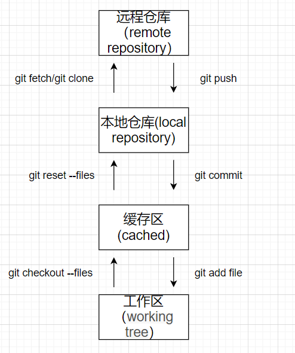

SVN 冲突：避免冲突, 及时提交、更新

## git：版本控制软件

分布式版本控制软件

### 命令：

git add:将本地文件 增加到暂存区  
git commit:将暂存区的内容 提交到 本地仓库（本地分支，默认 master 分支）  
git push：将本地仓库的内容 推送到 远程仓库（远程分支）

git pull:将远程仓库（远程分支）的内容 拉取到 本地仓库（本地分支）

### 安装 git

msysgit.github.io

安装时： Use git from git bash only..,其他默认下一步  
配置 path: E:\programs\Git\bin  
配置 git：用户名和邮箱  
右键-git bash  
git config --global user.name "abc"    
git config --global user.email "123456@qq.com"  

查看 C:\Users\YANQUN\.gitconfig  

搭建 git 服务器（远程仓库） ：统一的托管网站（https://github.com/）  

为了 在本地 和远程仓库之间进行 免密钥登录，可以配置 ssh  

### ssh:本地-远程

配置 ssh：先在本地配置，发送给远程

现在本地生成 ssh：
ssh-keygen -t rsa -C 123456@qq.com 一直回车
发送给远程：  
github - settings - SSH and ... - New SSH - title 任意、key 中输入 刚才在本地生成的 ssh：  
将本地刚才生成的 id_rsa.pub 内容复制到远程的 Key 中  

### 测试连通性：

ssh -T git@github.com

如果本地和远程成功通信，则可以在 /.ssh 目录中 发现 known_hosts 文件
如果失败：多尝试几次 、检查回车符

在本地新建 git 项目
在项目根目录 右键 - git bash - git init

### 在远程建立 git 项目

new-建立项目- 生成 https://github.com/用户/项目名.git

### 本地项目-远程项目关联

git remote add origin git@github.com:用户/项目名.git

第一次发布项目 （本地-远程）  
git add . //文件-暂存区
git commit -m "注释内容" //暂存区-本地分支（默认 master）
git push -u origin master

第一次下载项目（远程-本地）  
git clone git@github.com:用户/项目名.git

提交(本地-远程)
(在当前工作目录 右键-git bash)
git add.
git commit -m "提交到分支"
git push origin master

### 更新(远程-本地)

git pull

Egit：在 Eclipse 中操作 git
目前的 eclipse 基本都支持 git，如果不支持 则到 eclplise marktplace 搜 git 安装

### 配置：

a.team-git-configuration -邮箱 用户名  
b.general -network -ssh2 选中 生成的 ssh 目录  

第一次发布
share project
加入暂存区 add to index
提交到本地分支 commit
将项目推送到远程 右键-team -remote -push ---

提交
team-add to index  
team -commit  
team -push  

commit 时：  
commit and push 或 commit 按钮的区别：
commit 按钮：不能单独的 Push 某一个文件，只能 Push 整个项目  
commit and push：可以 单独 Push 某一个文件  

第一次下载  
import -clone -输入 https/ssh 的唯一标示符  

更新
team - remote -pull  

git 冲突的解决：  
发现冲突： 进入同步视图 右键——team - synchronized...  
解决：  
添加到本地暂存区 add to index  
提交到本地分支 commit  
更新服务端的分支内容 到本地分支 pull  
修改冲突：直接修改 或者 merge tool  
（--->已经变为了普通本地文件）
add to index  
commit push  

### git 多个人 团队协作开发

github 中 该项目 -settings  
增加合作者： Collaborators 加入 合作者：github 全名或邮箱  

发送邀请链接

合作伙伴： 打开该链接、接受邀请 :合作开发....clone 项目、修改、add \commit\push
