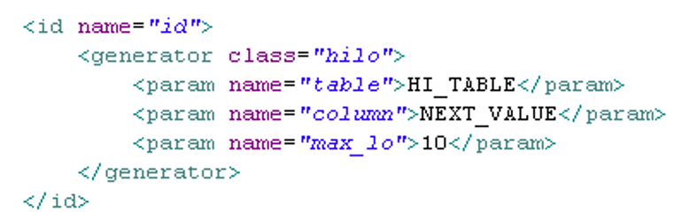
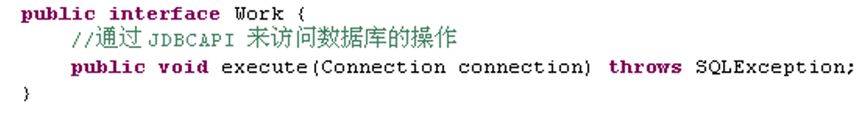
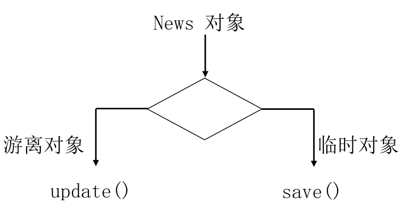

## 什么是 Hibernate

Hibernate 是一个轻量级的 JDBC 封装，也就是说，我们可以使用 Hibernate 来完成原来我们使用 JDBC 完成的操作，也就是与数据库的交互操作。它是在 Dao 层去使用的。总而言之，**Hibernate 就是一个持久层的 ORM(对象映射关系 Object Relational Mapping)框架**。

## 对象的持久化

- 狭义的理解，“持久化”仅仅指把对象永久保存到数据库中
- 广义的理解，“持久化”包括和数据库相关的各种操作：

1. 保存：把对象永久保存到数据库中。
2. 更新：更新数据库中对象(记录)的状态。
3. 删除：从数据库中删除一个对象。
4. 查询：根据特定的查询条件，把符合查询条件的一个或多个对象从数据库加载到内存中。
5. 加载：根据特定的 OID，把一个对象从数据库加载到内存中。

OID：为了在系统中能够找到所需对象，需要为每一个对象分配一个唯一的标识号。在关系数据库中称之为主键，而在对象术语中，则叫做对象标识(Object identifier-OID).

### 持久化对象的状态

1. 删除对象(Removed)
   在数据库中没有和其 OID 对应的记录
   不再处于 Session 缓存中
   一般情况下, 应用程序不该再使用被删除的对象
2. 游离对象(也叫”脱管”) （Detached）：
   **OID 不为 null
   不再处于 Session 缓存中**
   一般情况需下, 游离对象是由持久化对象转变过来的, 因此在数据库中可能还存在与它对应的记录

### 对象的状态转换图


## ORM

ORM(Object/Relation Mapping): 对象/关系映射
ORM 主要解决对象-关系的映射


ORM 的思想：将关系数据库中表中的记录映射成为对象，以对象的形式展现，==程序员可以把对数据库的操作转化为对对象的操作==。
ORM 采用`元数据`来描述对象-关系映射细节, 元数据通常采用 XML 格式, 并且存放在专门的对象-关系映射文件中.


### 流行 ORM 框架

Hibernate:

- 非常优秀、成熟的 ORM 框架。
- 完成对象的持久化操作
- Hibernate 允许开发者采用`面向对象的方式`来操作关系数据库。
- 消除那些针对特定数据库厂商的 SQL 代码

myBatis：

- 相比 Hibernate 灵活高，运行速度快
- 开发速度慢，不支持纯粹的面向对象操作，需熟悉 sql 语
  句，并且熟练使用 sql 语句优化功能

TopLink

OJB

### Hibernate 与 Jdbc 代码对比


## 1. 创建持久化 Java 类

提供一个无参的构造器:使 Hibernate 可以使用`Constructor.newInstance()`来实例化持久化类
提供一个标识属性(identifier property): 通常映射为数据库表的主键字段. 如果没有该属性，一些功能将不起作用，如：`Session.saveOrUpdate()`
为类的持久化类字段声明访问方法(get/set): Hibernate 对 JavaBeans 风格的属性实行持久化。
使用非`final`类: 在运行时生成代理是 Hibernate 的一个重要的功能. 如果持久化类没有实现任何接口, Hibnernate 使用 CGLIB 生成代理. 如果使用的是 final 类, 则无法生成 CGLIB 代理.
重写 `eqauls`和 `hashCode`方法: 如果需要把持久化类的实例放到 Set 中(当需要进行关联映射时), 则应该重写这两个方法

**Hibernate 不要求持久化类继承任何父类或实现接口，这可以保证代码不被污染。这就是 Hibernate 被称为低侵入式设计的原因**

### Java 类型, Hibernate 映射类型及 SQL 类型之间的对应关系


### Java 时间和日期类型的 Hibernate 映射

在 Java 中, 代表时间和日期的类型包括: java.util.Date 和 java.util.Calendar. 此外, 在 JDBC API 中还提供了 3 个扩展了 java.util.Date 类的子类: java.sql.Date, java.sql.Time 和 java.sql.Timestamp, 这三个类分别和标准 SQL 类型中的 DATE, TIME 和 TIMESTAMP 类型对应
在标准 SQL 中, DATE 类型表示日期, TIME 类型表示时间, TIMESTAMP 类型表示时间戳, 同时包含日期和时间信息.


### Java 大对象类型的 Hiberante 映射

在 Java 中, java.lang.String 可用于表示`长字符串(长度超过 255)`, 字节数组 byte[] 可用于存放图片或文件的`二进制数据`. 此外, 在 JDBC API 中还提供了 java.sql.Clob 和 java.sql.Blob 类型, 它们分别和标准 SQL 中的 CLOB 和 BLOB 类型对应. CLOB 表示字符串大对象(Character Large Object), BLOB 表示二进制对象(Binary Large Object)


- Mysql 不支持标准 SQL 的 CLOB 类型, 在 Mysql 中, 用 TEXT, MEDIUMTEXT 及 LONGTEXT 类型来表示长度操作 255 的长文本数据
- 在持久化类中, 二进制大对象可以声明为 byte[] 或 java.sql.Blob 类型; 字符串可以声明为 java.lang.String 或 java.sql.Clob
- 实际上在 Java 应用程序中 **处理长度超过 255 的字符串** , 使用 java.lang.String 比 java.sql.Clob 更方便

### 映射组成关系

Hibernate 把持久化类的属性分为两种:
值(value)类型: **没有 OID, 不能被单独持久化, 生命周期依赖于所属的持久化类的对象的生命周期**
实体(entity)类型: 有 OID, 可以被单独持久化, 有独立的生命周期
显然无法直接用 property 映射 pay 属性
Hibernate 使用 `<component>` 元素来映射组成关系, 该元素表名 pay 属性是 Worker 类一个组成部分, 在 Hibernate 中称之为`组件`


component

`<component>`元素来映射组成关系
`class`:设定组成关系属性的类型, 此处表明 pay 属性为 Pay 类型

`<parent>` 元素指定组件属性所属的整体类
`name`: 整体类在组件类中的属性名

## 2. 创建对象-关系映射文件

Hibernate 采用 XML 格式的文件来指定对象和关系数据之间的映射. 在运行时 Hibernate 将根据这个映射文件来生成各种 SQL 语句
映射文件的扩展名为 .hbm.xml

### POJO 类和数据库的映射文件\*.hbm.xml

POJO 类和关系数据库之间的映射可以用一个 XML 文档来定义。
通过 POJO 类的数据库映射文件，Hibernate 可以理解持久化类和数据表之间的对应关系，也可以理解持久化类属性与数据库表列之间的对应关系
在运行时 Hibernate 将根据这个映射文件来生成各种 SQL 语句
映射文件的扩展名为 .hbm.xml

### 映射文件说明

hibernate-mapping
类层次：class
主键：id
基本类型:property
**实体引用类: many-to-one | one-to-one
集合:set | list | map | array
one-to-many
many-to-many
子类:subclass | joined-subclass**
其它:component | any 等
**查询语句:query（用来放置查询语句，便于对数据库查询的统一管理和优化）**
每个 `Hibernate-mapping` 中可以同时定义多个类. 但更推荐为每个类都创建一个单独的映射文件

#### Hibernate-mapping

hibernate-mapping 是 hibernate 映射文件的根元素

- `schema`: 指定所映射的数据库 schema 的名称。若指定该属性, 则表明会自动添加该 schema 前缀
- `catalog`:指定所映射的数据库 catalog 的名称。
- `default-cascade(默认为 none)`: 设置 hibernate 默认的级联风格. 若配置 Java 属性, 集合映射时没有指定 cascade 属性, 则 Hibernate 将采用此处指定的级联风格.
- `default-access (默认为 property)`: 指定 Hibernate 的默认的属性访问策略。默认值为 property, 即使用 getter, setter 方法来访问属性. 若指定 access, 则 Hibernate 会忽略 getter/setter 方法, 而通过反射访问成员变量.
- `default-lazy(默认为 true)`: 设置 Hibernat morning 的延迟加载策略. 该属性的默认值为 true, 即启用延迟加载策略. 若配置 Java 属性映射, 集合映射时没有指定 lazy 属性, 则 Hibernate 将采用此处指定的延迟加载策略
- `auto-import (默认为 true)`: 指定是否可以在查询语言中使用非全限定的类名（仅限于本映射文件中的类）。
- `package (可选)`: 指定一个包前缀，如果在映射文档中没有指定全限定的类名， 就使用这个作为包名。

#### class

**class 元素用于指定类和表的映射**

- `name`:指定该持久化类映射的持久化类的类名
- `table`:指定该持久化类映射的表名, Hibernate 默认以持久化类的类名作为表名
- `dynamic-insert`: 若设置为 true, 表示当保存一个对象时, 会动态生成 insert 语句,
  insert 语句中仅包含所有取值不为 null 的字段. 默认值为 false
- `dynamic-update`: 若设置为 true, 表示当更新一个对象时, 会动态生成 update 语句, update 语句中仅包含所有取值需要更新的字段. 默认值为 false
- `select-before-update`:设置 Hibernate 在更新某个持久化对象之前是否需要先执行一次查询. 默认值为 false
- `batch-size`:指定根据 OID 来抓取实例时每批抓取的实例数.
- `lazy`: 指定是否使用延迟加载.
- `mutable`: 若设置为 true, 等价于所有的`<property>` 元素的 update 属性为 false, 表示整个实例不能被更新. 默认为 true.
- `discriminator-value`: 指定区分不同子类的值. 当使用 `<subclass/>`元素来定义持久化类的继承关系时需要使用该属性

### 映射对象标识符

Hibernate 使用对象标识符(OID) 来建立内存中的对象和数据库表中记录的对应关系. 对象的 OID 和数据表的主键对应. Hibernate 通过标识符生成器来为主键赋值
Hibernate 推荐在数据表中使用代理主键, 即不具备业务含义的字段. 代理主键通常为整数类型, 因为整数类型比字符串类型要节省更多的数据库空间.
在对象-关系映射文件中, `<id>`元素用来设置对象标识符. `<generator>`子元素用来设定标识符生成器.
Hibernate 提供了标识符生成器接口: `IdentifierGenerator`, 并提供了各种内置实现

#### id

**id：设定持久化类的 OID 和表的主键的映射**

- `name`: 标识持久化类 OID 的属性名  
  `column`: 设置标识属性所映射的数据表的列名(主键字段的名字).
- `unsaved-value`:若设定了该属性, Hibernate 会通过比较持久化类的 OID 值和该属性值来区分当前持久化类的对象是否为临时对象
- `type`:指定 Hibernate 映射类型. Hibernate 映射类型是 Java 类型与 SQL 类型的桥梁. 如果没有为某个属性显式设定映射类型, Hibernate 会运用反射机制先识别出持久化类的特定属性的 Java 类型, 然后自动使用与之对应的默认的 Hibernate 映射类型
- Java 的基本数据类型和包装类型对应相同的 Hibernate 映射类型. 基本数据类型无法表达 null, 所以对于持久化类的 OID 推荐使用包装类型

#### generator

**generator：设定持久化类设定标识符生成器**
`class`: 指定使用的标识符生成器全限定类名或其缩写名

## Hibernate 主键生成策略 generator


### increment 标识符生成器

increment 标识符生成器由 **Hibernate** 以递增的方式为代理主键赋值
Hibernate 会先读取 NEWS 表中的主键的最大值, 而接下来向 NEWS 表中插入记录时, 就在 max(id) 的基础上递增, 增量为 1.
适用范围:

- 由于 increment 生存标识符机制不依赖于底层数据库系统, 因此它适合所有的数据库系统
- 适用于只有单个 Hibernate **应用进程**访问同一个数据库的场合, 在集群环境下不推荐使用它
- OID 必须为 long, int 或 short 类型, 如果把 OID 定义为 byte 类型, 在运行时会抛出异常

### identity 标识符生成器

identity 标识符生成器由底层数据库来负责生成标识符, 它要求底层数据库把主键定义为自动增长字段类型
适用范围:

- 由于 identity 生成标识符的机制依赖于底层数据库系统, 因此, 要求底层数据库系统必须支持自动增长字段类型. 支持自动增长字段类型的数据库包括: DB2, Mysql, MSSQLServer, Sybase 等
- OID 必须为 long, int 或 short 类型, 如果把 OID 定义为 byte 类型, 在运行时会抛出异常

### sequence 标识符生成器

sequence 标识符生成器利用底层数据库提供的序列来生成标识符.


Hibernate 在持久化一个 News 对象时, 先从底层数据库的 news_seq 序列中获得一个唯一的标识号, 再把它作为主键值
适用范围:

- 由于 sequence 生成标识符的机制依赖于底层数据库系统的序列, 因此, 要求底层数据库系统必须支持序列. 支持序列的数据库包括: DB2, Oracle 等
- OID 必须为 long, int 或 short 类型, 如果把 OID 定义为 byte 类型, 在运行时会抛出异常

### hilo 标识符生成器

hilo 标识符生成器由 Hibernate 按照一种 high/low 算法\*生成标识符, 它从数据库的特定表的字段中获取 high 值.



Hibernate 在持久化一个 News 对象时, 由 Hibernate 负责生成主键值. **hilo 标识符生成器在生成标识符时, 需要读取并修改 HI_TABLE 表中的 NEXT_VALUE 值.**
适用范围:

- 由于 hilo 生存标识符机制不依赖于底层数据库系统, 因此它适合所有的数据库系统
- OID 必须为 long, int 或 short 类型, 如果把 OID 定义为 byte 类型, 在运行时会抛出异常

### native 标识符生成器

native 标识符生成器依据底层数据库对自动生成标识符的支持能力, 来选择使用 identity, sequence 或 hilo 标识符生成器.
适用范围:

- 由于 native 能根据底层数据库系统的类型, 自动选择合适的标识符生成器, 因此很适合于跨数据库平台开发
- OID 必须为 long, int 或 short 类型, 如果把 OID 定义为 byte 类型, 在运行时会抛出异常

### Property

**property 元素用于指定类的属性和表的字段的映射**

- `name`:指定该持久化类的属性的名字
- `column`:指定与类的属性映射的表的字段名. 如果没有设置该属性, Hibernate 将直接使用类的属性名作为字段名.
- `type`:指定 Hibernate 映射类型. Hibernate 映射类型是 Java 类型与 SQL 类型的桥梁. 如果没有为某个属性显式设定映射类型, Hibernate 会运用反射机制先识别出持久化类的特定属性的 Java 类型, 然后自动使用与之对应的默认的 Hibernate 映射类型.
- `not-null`:若该属性值为 true, 表明不允许为 null, 默认为 false
- `access`:指定 Hibernate 的默认的属性访问策略。默认值为 property, 即使用 getter, setter 方法来访问属性. 若指定 field, 则 Hibernate 会忽略 getter/setter 方法, 而通过反射访问成员变量
- `unique`: 设置是否为该属性所映射的数据列添加唯一约束.
- `index`: 指定一个字符串的索引名称. 当系统需要 Hibernate 自动建表时, 用于为该属性所映射的数据列创建索引, 从而加快该数据列的查询.
- `length`: 指定该属性所映射数据列的字段的长度
- `scale`: 指定该属性所映射数据列的小数位数, 对 double, float, decimal 等类型的数据列有效.
- `formula`：设置一个 SQL 表达式, Hibernate 将根据它来计算出派生属性的值.
  派生属性: 并不是持久化类的所有属性都直接和表的字段匹配, 持久化类的有些属性的值必须在运行时通过计算才能得出来, 这种属性称为派生属性

使用 formula 属性时

- formula=“(sql)” 的英文括号不能少
- Sql 表达式中的列名和表名都应该和数据库对应, 而不是和持久化对象的属性对应
  如果需要在 formula 属性中使用参数, 这直接使用 where cur.id=id 形式, 其中 id 就是参数, 和当前持久化对象的 id 属性对应的列的 id 值将作为参数传入.

## 3. 创建 Hibernate 配置文件

Hibernate 从其配置文件中读取和数据库连接的有关信息, 这个文件应该位于应用的 classpath 下.

hibernate.cfg.xml

```xml
<?xml version="1.0" encoding="UTF-8"?>
<!DOCTYPE hibernate-configuration PUBLIC
		"-//Hibernate/Hibernate Configuration DTD 3.0//EN"
		"http://hibernate.sourceforge.net/hibernate-configuration-3.0.dtd">
<hibernate-configuration>

    <session-factory>
    	<property name="hibernate.connection.username">root</property>
    	<property name="hibernate.connection.password">chuck</property>
    	<property name="hibernate.connection.driver_class">com.mysql.jdbc.Driver</property>
    	<property name="hibernate.connection.url">jdbc:mysql://localhost:3306/hibernate</property>

    	<property name="hibernate.dialect">org.hibernate.dialect.MySQLInnoDBDialect</property>
    	<property name="hibernate.show_sql">true</property>
    	<property name="hibernate.format_sql">true</property>
    	<property name="hibernate.hbm2ddl.auto">update</property>
    	<property name="hibernate.connection.isolation">2</property>


    	<mapping resource="com/baidu/hibernate/app/Person.hbm.xml"  />


    </session-factory>

</hibernate-configuration>
```


## Hibernate 配置文件

Hibernate 配置文件主要用于配置数据库连接和 Hibernate 运行时所需的各种属性
每个 Hibernate 配置文件对应一个 Configuration 对象
Hibernate 配置文件可以有两种格式:

- `hibernate.properties`
- `hibernate.cfg.xml`

hibernate.cfg.xml 的常用属性

JDBC 连接属性
`connection.url`：数据库 URL
`connection.username`：数据库用户名
`connection.password`：数据库用户密码
`connection.driver_class`：数据库 JDBC 驱动
==`dialect`==：配置数据库的方言，根据底层的数据库不同产生不同的 sql 语句，Hibernate 会针对数据库的特性在访问时进行优化

### hibernate.cfg.xml 的常用属性

C3P0 数据库连接池属性

- `hibernate.c3p0.max_size`: 数据库连接池的最大连接数
- `hibernate.c3p0.min_size`: 数据库连接池的最小连接数
- `hibernate.c3p0.timeout`: 数据库连接池中连接对象在多长时间没有使用过后，就应该被销毁
- `hibernate.c3p0.max_statements`: 缓存 Statement 对象的数量
- `hibernate.c3p0.idle_test_period`: 表示连接池**检测线程**多长时间检测一次池内的所有链接对象是否超时. 连接池本身不会把自己从连接池中移除，而是专门有一个线程按照一定的时间间隔来做这件事，这个线程通过比较连接对象最后一次被使用时间和当前时间的时间差来和 timeout 做对比，进而决定是否销毁这个连接对象。
- `hibernate.c3p0.acquire_increment`: 当数据库连接池中的连接耗尽时, 同一时刻获取多少个数据库连接

其他

- `show_sql`：是否将运行期生成的 SQL 输出到日志以供调试。取值 true | false
- `format_sql`：是否将 SQL 转化为格式良好的 SQL . 取值 true | false
- `hbm2ddl.auto`：在启动和停止时自动地创建，更新或删除数据库模式。取值 create | update | create-drop | validate
- `hibernate.jdbc.fetch_size`
- `hibernate.jdbc.batch_size`

#### jdbc.fetch_size 和 jdbc.batch_size

**hibernate.jdbc.fetch_size**:实质是调用`Statement.setFetchSize()` 方法**设定 JDBC 的 Statement 读取数据的时候每次从数据库中取出的记录条数。**
例如一次查询 1 万条记录，对于 Oracle 的 JDBC 驱动来说，是不会 1 次性把 1 万条取出来的，而只会取出 fetchSize 条数，当结果集遍历完了这些记录以后，再去数据库取 fetchSize 条数据。因此大大节省了无谓的内存消耗。Fetch Size 设的越大，读数据库的次数越少，速度越快；Fetch Size 越小，读数据库的次数越多，速度越慢。Oracle 数据库的 JDBC 驱动默认的 Fetch Size = 10，是一个保守的设定，根据测试，当 Fetch Size=50 时，性能会提升 1 倍之多，当 fetchSize=100，性能还能继续提升 20%，Fetch Size 继续增大，性能提升的就不显著了。并不是所有的数据库都支持 Fetch Size 特性，例如 MySQL 就不支持 。

hibernate.jdbc.batch_size:**设定对数据库进行批量删除，批量更新和批量插入的时候的批次大小，**类似于设置缓冲区大小的意思。batchSize 越大，批量操作时向数据库发送 sql 的次数越少，速度就越快。
测试结果是当 Batch Size=0 的时候，使用 Hibernate 对 Oracle 数据库删除 1 万条记录需要 25 秒，Batch Size = 50 的时候，删除仅仅需要 5 秒！Oracle 数据库 batchSize=30 的时候比较合适。

### Hibernate 配置文件的两个配置项

1. `hbm2ddl.auto`：该属性可帮助程序员实现正向工程, 即由 java 代码生成数据库脚本, 进而生成具体的表结构. 。取值 create | update | create-drop | validate

- `create` : 会根据 .hbm.xml 文件来生成数据表, 但是每次运行都会删除上一次的表 ,重新生成表, 哪怕二次没有任何改变
- `create-drop`: 会根据 .hbm.xml 文件生成表,但是 SessionFactory 一关闭, 表就自动删除
- `update`: 最常用的属性值，也会根据 .hbm.xml 文件生成表, 但若 .hbm.xml 文件和数据库中对应的数据表的表结构不同, Hiberante 将更新数据表结构，但不会删除已有的行和列
- `validate` : 会和数据库中的表进行比较, 若 .hbm.xml 文件中的列在数据表中不存在，则抛出异常

2. format_sql：是否将 SQL 转化为格式良好的 SQL . 取值 true | false

### 通过 Hibernate 调用存储过程

Work 接口: 直接通过 JDBC API 来访问数据库的操作


Session 的 doWork(Work) 方法用于执行 Work 对象指定的操作, 即调用 Work 对象的 execute() 方法. Session 会把当前使用的数据库连接传递给 execute() 方法.


### Hibernate 与触发器协同工作

Hibernate 与数据库中的触发器协同工作时, 会造成两类问题
触发器使 Session 的缓存中的持久化对象与数据库中对应的数据不一致:触发器运行在数据库中, 它执行的操作对 Session 是透明的
Session 的 `update()`方法盲目地激发触发器: 无论游离对象的属性是否发生变化, 都会执行 update 语句, 而 update 语句会激发数据库中相应的触发器
解决方案:
在执行完 Session 的相关操作后, 立即调用 Session 的 `flush() `和 `refresh()` 方法, 迫使 Session 的缓存与数据库同步(refresh() 方法重新从数据库中加载对象)


在映射文件的的 `<class>`元素中设置 select-before-update 属性: 当 Session 的 `update()` 或 `saveOrUpdate()` 方法更新一个游离对象时, 会先执行 Select 语句, 获得当前游离对象在数据库中的最新数据, 只有在不一致的情况下才会执行 update 语句

### 使用 Hibernate 内置映射类型

以下情况下必须显式指定 Hibernate 映射类型
一个 Java 类型可能对应多个 Hibernate 映射类型. 例如: 如果持久化类的属性为 java.util.Date 类型, 对应的 Hibernate 映射类型可以是 date, time 或 timestamp. 此时必须根据对应的数据表的字段的 SQL 类型, 来确定 Hibernate 映射类型. 如果字段为 DATE 类型, 那么 Hibernate 映射类型为 date; 如果字段为 TIME 类型, 那么 Hibernate 映射类型为 time; 如果字段为 TIMESTATMP 类型, 那么 Hibernate 映射类型为 timestamp.

## 4. 通过 Hibernate API 编写访问数据库的代码


### Helloworld Hibernate

使用 Hibernate 进行数据持久化操作，通常有如下步骤：

- 编写持久化类：`POJO`+ 映射文件
- 获取`Configuration` 对象
- 获取 `SessionFactory`对象
- 获取 `Session`，打开事务
- 用面向对象的方式操作数据库
- 关闭事务，关闭 Session

### Configuration 类

`Configuration` 类负责管理 Hibernate 的配置信息。包括如下内容：
Hibernate 运行的底层信息：数据库的 URL、用户名、密码、JDBC 驱动类，数据库 Dialect,数据库连接池等（对应 hibernate.cfg.xml 文件）。
持久化类与数据表的映射关系（\*.hbm.xml 文件）

创建 Configuration 的两种方式

1. 属性文件（hibernate.properties）:
   Configuration cfg = new Configuration();
2. Xml 文件（hibernate.cfg.xml）
   Configuration cfg = new Configuration().configure();

Configuration 的 configure 方法还支持带参数的访问：

- File file = new File(“simpleit.xml”);
- Configuration cfg = new Configuration().configure(file);

### SessionFactory 接口

针对单个数据库映射关系经过编译后的内存镜像，是线程安全的。
`SessionFactory`对象一旦构造完毕，即被赋予特定的配置信息
`SessionFactory`是生成 Session 的工厂
构造 `SessionFactory`很消耗资源，一般情况下一个应用中只初始化一个 `SessionFactory`对象。
Hibernate4 新增了一个 ServiceRegistry 接口，所有基于 Hibernate 的配置或者服务都必须统一向这个 ServiceRegistry 注册后才能生效
Hibernate4 中创建 SessionFactory 的步骤


### Session 接口

Session 是应用程序与数据库之间交互操作的一个单线程对象，是 Hibernate 运作的中心，所有持久化对象必须在 session 的管理下才可以进行持久化操作。此对象的生命周期很短。Session 对象有一个一级缓存，显式执行 flush 之前，所有的持久层操作的数据都缓存在 session 对象处。相当于 JDBC 中的 Connection。

#### 通过 Session 操纵对象

Session 接口是 Hibernate 向应用程序提供的操纵数据库的最主要的接口, 它**提供了基本的保存, 更新, 删除和加载 Java 对象的方法.**
**Session 具有一个缓存, 位于缓存中的对象称为持久化对象, 它和数据库中的相关记录对应.** Session 能够在某些时间点, 按照缓存中对象的变化来执行相关的 SQL 语句, 来同步更新数据库, 这一过程被称为刷新缓存(flush)
站在持久化的角度, Hibernate 把对象分为 4 种状态: ==持久化状态, 临时状态, 游离状态, 删除状态==. Session 的特定方法能使对象从一个状态转换到另一个状态.

#### Session 缓存

在 Session 接口的实现中包含一系列的 Java 集合, 这些 Java 集合构成了 Session 缓存. 只要 Session 实例没有结束生命周期, 且没有清理缓存，则存放在它缓存中的对象也不会结束生命周期
Session 缓存可减少 Hibernate 应用程序访问数据库的频率。


#### 操作 Session 缓存


#### flush 缓存

flush：Session 按照缓存中对象的属性变化来同步更新数据库
默认情况下 Session 在以下时间点刷新缓存：
显式调用`Session` 的`flush()`方法
当应用程序调用 Transaction 的 `commit（）`方法的时, 该方法先 flush ，然后在向数据库提交事务
当应用程序执行一些查询(HQL, Criteria)操作时，如果缓存中持久化对象的属性已经发生了变化，会先 flush 缓存，以保证查询结果能够反映持久化对象的最新状态
flush 缓存的例外情况: 如果对象使用 native 生成器生成 OID, 那么当调用 Session 的 `save()`方法保存对象时, 会立即执行向数据库插入该实体的 insert 语句.
`commit()` 和`flush()`方法的区别：flush 执行一系列 sql 语句，但不提交事务；`commit`方法先调用`flush()` 方法，然后提交事务. 意味着提交事务意味着对数据库操作永久保存下来。

#### 设定刷新缓存的时间点

若希望改变 flush 的默认时间点, 可以通过 Session 的 `setFlushMode()`方法显式设定 flush 的时间点


#### Session 的 save() 方法

Session 的`save()`方法使一个临时对象转变为持久化对象
Session 的 `save()`方法完成以下操作:
把 News 对象加入到 Session 缓存中, 使它进入持久化状态
选用映射文件指定的标识符生成器, 为持久化对象分配唯一的 OID. 在 使用代理主键的情况下, setId() 方法为 News 对象设置 OID 使无效的.
计划执行一条 insert 语句：在 flush 缓存的时候
Hibernate 通过持久化对象的 OID 来维持它和数据库相关记录的对应关系. 当 News 对象处于持久化状态时, ==不允许程序随意修改它的 ID==
`persist()` 和 `save()`区别：
当对一个 OID 不为 Null 的对象执行 `save()` 方法时, 会把该对象以一个新的 oid 保存到数据库中; 但执行 `persist()` 方法时会抛出一个异常.

#### Session 的 get() 和 load() 方法

都可以根据跟定的 OID 从数据库中加载一个持久化对象
区别:
当数据库中不存在与 OID 对应的记录时, load() 方法抛出 ObjectNotFoundException 异常, 而 get() 方法返回 null
两者采用不同的**延迟检索策略：load 方法支持延迟加载策略。而 get 不支持。**

#### Session 的 update() 方法

Session 的 `update()`方法使一个游离对象转变为持久化对象, 并且计划执行一条 update 语句.
若希望 Session 仅当修改了 News 对象的属性时, 才执行 `update()` 语句, 可以把映射文件中 `<class>` 元素的 select-before-update 设为 true. 该属性的默认值为 false
当 `update()`方法关联一个游离对象时, 如果在 Session 的缓存中已经存在相同 OID 的持久化对象, 会抛出异常
当 `update()`方法关联一个游离对象时, 如果在数据库中不存在相应的记录, 也会抛出异常.

#### Session 的 saveOrUpdate() 方法

Session 的 `saveOrUpdate()` 方法同时包含了`save()`与 `update()` 方法的功能



判定对象为临时对象的标准
Java 对象的 OID 为 null
映射文件中为 `<id>` 设置了 unsaved-value 属性, 并且 Java 对象的 OID 取值与这个 unsaved-value 属性值匹配

#### Session 的 merge() 方法


#### Session 的 delete() 方法

Session 的 delete() 方法既可以删除一个游离对象, 也可以删除一个持久化对象
Session 的 delete() 方法处理过程

- 计划执行一条 delete 语句
- 把对象从 Session 缓存中删除, 该对象进入删除状态.

Hibernate 的 cfg.xml 配置文件中有一个 `hibernate.use_identifier_rollback` 属性, 其默认值为 false, 若把它设为 true, 将改变 delete() 方法的运行行为: delete() 方法会把持久化对象或游离对象的 OID 设置为 null, 使它们变为临时对象

## Transaction(事务)

代表一次原子操作，它具有数据库事务的概念。所有持久层都应该在事务管理下进行，即使是只读操作。
Transaction tx = session.beginTransaction();
常用方法:

- `commit()`:提交相关联的 session 实例
- `rollback()`:撤销事务操作
- `wasCommitted()`:检查事务是否提交

### 数据库的隔离级别

对于同时运行的多个事务, 当这些事务访问数据库中相同的数据时, 如果没有采取必要的隔离机制, 就会导致各种并发问题:

- **脏读**: 对于两个事物 T1, T2, T1 读取了已经被 T2 更新但还没有被提交的字段. 之后, 若 T2 回滚, T1 读取的内容就是临时且无效的.
- **不可重复读**: 对于两个事物 T1, T2, T1 读取了一个字段, 然后 T2 更新了该字段. 之后, T1 再次读取同一个字段, 值就不同了.
- **幻读**: 对于两个事物 T1, T2, T1 从一个表中读取了一个字段, 然后 T2 在该表中插入了一些新的行. 之后, 如果 T1 再次读取同一个表, 就会多出几行.

数据库事务的隔离性: 数据库系统必须具有隔离并发运行各个事务的能力, 使它们不会相互影响, 避免各种并发问题.
一个事务与其他事务隔离的程度称为隔离级别. 数据库规定了多种事务隔离级别, 不同隔离级别对应不同的干扰程度, 隔离级别越高, 数据一致性就越好, 但并发性越弱

数据库提供的 4 种事务隔离级别:


Oracle 支持的 2 种事务隔离级别：`READ COMMITED`, `SERIALIZABLE.` Oracle 默认的事务隔离级别为:`READ COMMITED`
Mysql 支持 4 中事务隔离级别. Mysql 默认的事务隔离级别为: `REPEATABLE READ`

在 MySql 中设置隔离级别

每启动一个 mysql 程序, 就会获得一个单独的数据库连接. 每个数据库连接都有一个全局变量 @@tx_isolation, 表示当前的事务隔离级别. MySQL 默认的隔离级别为 `Repeatable Read`

```sql
#查看当前的隔离级别:
SELECT @@tx_isolation;
#设置当前 mySQL 连接的隔离级别:
set transaction isolation level read committed;
#设置数据库系统的全局的隔离级别:
 set global transaction isolation level read committed;
```

在 Hibernate 中设置隔离级别

JDBC 数据库连接使用数据库系统默认的隔离级别. 在 Hibernate 的配置文件中可以显式的设置隔离级别. 每一个隔离级别都对应一个整数:

1. `READ UNCOMMITED`
2. `READ COMMITED`
3. `REPEATABLE READ`
4. `SERIALIZEABLE`

Hibernate 通过为 Hibernate 映射文件指定 hibernate.connection.isolation 属性来设置事务的隔离级别


