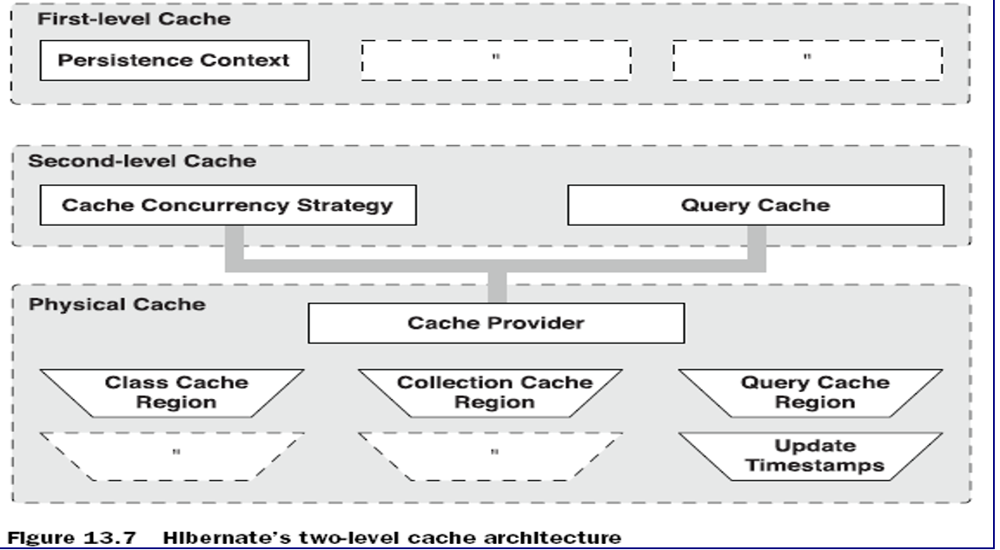
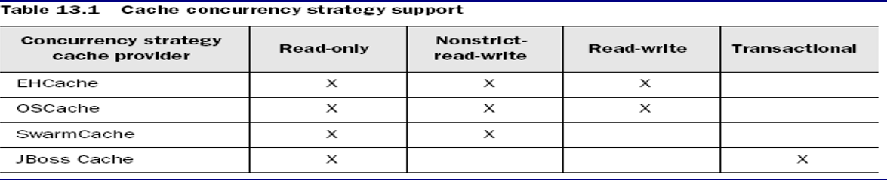

## Hibernate 缓存

缓存(Cache): 计算机领域非常通用的概念。它**介于应用程序和永久性数据存储源(如硬盘上的文件或者数据库)之间，其作用是降低应用程序直接读写永久性数据存储源的频率，从而提高应用的运行性能。缓存中的数据是数据存储源中数据的拷贝。**缓存的物理介质通常是内存
Hibernate 中提供了两个级别的缓存

- 第一级别的缓存是 Session 级别的缓存，它是属于事务范围的缓存。这一级别的缓存由 hibernate 管理的

- 第二级别的缓存是 SessionFactory 级别的缓存，它是属于进程范围的缓存

### SessionFactory 级别的缓存

SessionFactory 的缓存可以分为两类:

- 内置缓存: **Hibernate 自带的, 不可卸载.** 通常在 Hibernate 的初始化阶段, Hibernate 会把映射元数据和预定义的 SQL 语句放到 SessionFactory 的缓存中, 映射元数据是映射文件中数据（.hbm.xml 文件中的数据）的复制. 该内置缓存是只读的.
- **外置缓存(二级缓存): 一个可配置的缓存插件**. 在默认情况下, SessionFactory 不会启用这个缓存插件. 外置缓存中的数据是数据库数据的复制, 外置缓存的物理介质可以是内存或硬盘

适合放入二级缓存中的数据:

- 很少被修改
- 不是很重要的数据, 允许出现偶尔的并发问题

不适合放入二级缓存中的数据:

- 经常被修改
- 财务数据, 绝对不允许出现并发问题
- 与其他应用程序共享的数据

### Hibernate 二级缓存的架构



### 二级缓存的并发访问策略

两个并发的事务同时访问持久层的缓存的相同数据时, 也有可能出现各类并发问题.
二级缓存可以设定以下 4 种类型的并发访问策略, 每一种访问策略对应一种事务隔离级别

- 非严格读写(Nonstrict-read-write): 不保证缓存与数据库中数据的一致性. **提供 Read Uncommited 事务隔离级别,** 对于极少被修改, 而且允许脏读的数据, 可以采用这种策略
- 读写型(Read-write): **提供 Read Commited 数据隔离级别**.对于经常读但是很少被修改的数据, 可以采用这种隔离类型, 因为它可以防止脏读
- 事务型(Transactional): 仅在受管理环境下适用. **它提供了 Repeatable Read 事务隔离级别.** 对于经常读但是很少被修改的数据, 可以采用这种隔离类型, 因为它可以防止脏读和不可重复读
- 只读型(Read-Only):**提供 Serializable 数据隔离级别**, 对于从来不会被修改的数据, 可以采用这种访问策略

### 管理 Hibernate 的二级缓存

Hibernate 的二级缓存是进程或集群范围内的缓存
二级缓存是可配置的的插件, Hibernate 允许选用以下类型的缓存插件:

- EHCache: 可作为进程范围内的缓存, 存放数据的物理介质可以使内存或硬盘, 对 Hibernate 的查询缓存提供了支持
- OpenSymphony OSCache:可作为进程范围内的缓存, 存放数据的物理介质可以使内存或硬盘, 提供了丰富的缓存数据过期策略, 对 Hibernate 的查询缓存提供了支持
- SwarmCache: 可作为集群范围内的缓存, 但不支持 Hibernate 的查询缓存
- JBossCache:可作为集群范围内的缓存, 支持 Hibernate 的查询缓存

4 种缓存插件支持的并发访问策略(x 代表支持, 空白代表不支持)



### 配置进程范围内的二级缓存

配置进程范围内的二级缓存的步骤:
选择合适的缓存插件: EHCache(jar 包和 配置文件), 并编译器配置文件
在 Hibernate 的配置文件中启用二级缓存并指定和 EHCache 对应的缓存适配器
选择需要使用二级缓存的持久化类, 设置它的二级缓存的并发访问策略

- `<class>`元素的 cache 子元素表明 Hibernate 会缓存对象的简单属性, 但不会缓存集合属性, 若希望缓存集合属性中的元素, 必须在`<set>` 元素中加入 `<cache>`子元素
- 在 hibernate 配置文件中通过`<class-cache/>`节点配置使用缓存

### ehcache.xml

`<diskStore>`: 指定一个目录：当 EHCache 把数据写到硬盘上时, 将把数据写到这个目录下.
`<defaultCache>`: 设置缓存的默认数据过期策略
`<cache>` 设定具体的命名缓存的数据过期策略。每个命名缓存代表一个缓存区域
缓存区域(region)：一个具有名称的缓存块，可以给每一个缓存块设置不同的缓存策略。如果没有设置任何的缓存区域，则所有被缓存的对象，都将使用默认的缓存策略。即：`<defaultCache.../>`
Hibernate 在不同的缓存区域保存不同的类/集合。

- 对于类而言，区域的名称是类名。如:com.atguigu.domain.Customer
- 对于集合而言，区域的名称是类名加属性名。如 com.atguigu.domain.Customer.orders

cache 元素的属性

- name:设置缓存的名字,它的取值为类的全限定名或类的集合的名字
- maxInMemory:设置基于内存的缓存中可存放的对象最大数目
- eternal:设置对象是否为永久的,true 表示永不过期,此时将忽略 timeToIdleSeconds 和
- timeToLiveSeconds 属性; 默认值是 false
- timeToIdleSeconds:设置对象空闲最长时间,以秒为单位, 超过这个时间,对象过期。当对象过期时,EHCache 会把它从缓存中清除。如果此值为 0,表示对象可以无限期地处于空闲状态。
- timeToLiveSeconds:设置对象生存最长时间,超过这个时间,对象过期。 如果此值为 0,表示对象可以无限期地存在于缓存中. 该属性值必须大于或等于 timeToIdleSeconds 属性值
- overflowToDisk:设置基于内存的缓存中的对象数目达到上限后,是否把溢出的对象写到基于硬盘的缓存中

查询缓存

对于经常使用的查询语句, 如果启用了查询缓存, 当第一次执行查询语句时, Hibernate 会把查询结果存放在查询缓存中. 以后再次执行该查询语句时, 只需从缓存中获得查询结果, 从而提高查询性能
查询缓存使用于如下场合:

- 应用程序运行时经常使用查询语句
- 很少对与查询语句检索到的数据进行插入, 删除和更新操作

启用查询缓存的步骤

- 配置二级缓存, 因为查询缓存依赖于二级缓存
- 在 hibernate 配置文件中启用查询缓存
- 对于希望启用查询缓存的查询语句, 调用 Query 的`setCacheable()` 方法

### 时间戳缓存区域

时间戳缓存区域存放了对于查询结果相关的表进行插入, 更新或删除操作的时间戳. Hibernate 通过时间戳缓存区域来判断被缓存的查询结果是否过期, 其运行过程如下:

- T1 时刻执行查询操作, 把查询结果存放在 QueryCache 区域, 记录该区域的时间戳为 T1
- T2 时刻对查询结果相关的表进行更新操作, Hibernate 把 T2 时刻存放在 UpdateTimestampCache 区域.
- T3 时刻执行查询结果前, 先比较 QueryCache 区域的时间戳和 UpdateTimestampCache 区域的时间戳, 若 T2 >T1, 那么就丢弃原先存放在 QueryCache 区域的查询结果, 重新到数据库中查询数据, 再把结果存放到 QueryCache 区域; 若 T2 < T1, 直接从 QueryCache 中获得查询结果

### Query 接口的`iterate()`方法

Query 接口的 iterator() 方法
同 list() 一样也能执行查询操作
list() 方法执行的 SQL 语句包含实体类对应的数据表的所有字段
Iterator() 方法执行的 SQL 语句中**仅包含实体类对应的数据表的 ID 字段**
**当遍历访问结果集时, 该方法先到 Session 缓存及二级缓存中查看是否存在特定 OID 的对象, 如果存在, 就直接返回该对象, 如果不存在该对象就通过相应的 SQL Select 语句到数据库中加载特定的实体对象**
大多数情况下, 应考虑使用 `list()`方法执行查询操作.`iterator()`方法仅在满足以下条件的场合, 可以稍微提高查询性能:
要查询的数据表中包含大量字段
启用了二级缓存, 且二级缓存中可能已经包含了待查询的对象

### 管理 Session

Hibernate 自身提供了三种管理 Session 对象的方法

- Session 对象的生命周期与本地线程绑定
- Session 对象的生命周期与 JTA 事务绑定
- Hibernate 委托程序管理 Session 对象的生命周期

在 Hibernate 的配置文件中, hibernate.current_session_context_class 属性用于指定 Session 管理方式, 可选值包括

- thread: Session 对象的生命周期与本地线程绑定
- jta\*: Session 对象的生命周期与 JTA 事务绑定
- managed: Hibernate 委托程序来管理 Session 对象的生命周期

### Session 对象的生命周期与本地线程绑定

如果把 Hibernate 配置文件的 hibernate.current_session_context_class 属性值设为 thread, Hibernate 就会按照与本地线程绑定的方式来管理 Session
Hibernate 按一下规则把 Session 与本地线程绑定

- 当一个线程(threadA)第一次调用 SessionFactory 对象的 getCurrentSession() 方法时, 该方法会创建一个新的 Session(sessionA) 对象, 把该对象与 threadA 绑定, 并将 sessionA 返回
- 当 threadA 再次调用 SessionFactory 对象的 getCurrentSession() 方法时, 该方法将返回 sessionA 对象
- 当 threadA 提交 sessionA 对象关联的事务时, Hibernate 会自动 flush sessionA 对象的缓存, 然后提交事务, 关闭 sessionA 对象. 当 threadA 撤销 sessionA 对象关联的事务时, 也会自动关闭 sessionA 对象
- 若 threadA 再次调用 SessionFactory 对象的 getCurrentSession() 方法时, 该方法会又创建一个新的 Session(sessionB) 对象, 把该对象与 threadA 绑定, 并将 sessionB 返回

### 批量处理数据

批量处理数据是指在一个事务中处理大量数据.
在应用层进行批量操作, 主要有以下方式:

- 通过 Session
- 通过 HQL
- 通过 StatelessSession
- 通过 JDBC API

### 通过 Session 来进行批量操作

Session 的 `save()`及 `update()`方法都会把处理的对象存放在自己的缓存中. 如果通过一个 Session 对象来处理大量持久化对象, 应该**及时从缓存中清空已经处理完毕并且不会再访问**的对象. 具体的做法是**在处理完一个对象或小批量对象后, 立即调用 flush() 方法刷新缓存, 然后在调用 clear() 方法清空缓存**
通过 Session 来进行处理操作会受到以下约束

- 需要在 Hibernate 配置文件中设置 JDBC 单次批量处理的数目, 应保证每次向数据库发送的批量的 SQL 语句数目与 batch_size 属性一致
- 若对象采用 “identity” 标识符生成器, 则 Hibernate 无法在 JDBC 层进行批量插入操作
- 进行批量操作时, 建议关闭 Hibernate 的二级缓存

批量插入数据：

```sql
News new=null;
for(int i=0;i<100000;i++)
{
new =new News();
new.setTitle("--"+i);
ssession.save(news);
if((i+1)%20==0)
session.flush();
session.clear();
}

```

通过 Session 来进行批量操作

批量更新: 在进行批量更新时, 如果一下子把所有对象都加载到 Session 缓存, 然后再缓存中一一更新, 显然是不可取的
使用可滚动的结果集 org.hibernate.ScrollableResults, **该对象中实际上并不包含任何对象, 只包含用于在线定位记录的游标.** 只有当程序遍历访问 ScrollableResults 对象的特定元素时, 它才会到数据库中加载相应的对象.
org.hibernate.ScrollableResults 对象由 Query 的 scroll 方法返回

```sql
ScrollableResults sr=ssession.createQuery("FROM News").scroll();
int count=0;
while(sr.next()){
New n=(New) sr.get(0);
n.serTitle(n.getTitle()+"*****");
if(((count++)+1%100==0))
}{
session.flush();
session.clear();
}

```

通过 HQL 来进行批量操作

**注意: HQL 只支持 INSERT INTO … SELECT 形式的插入语句, 但不支持 INSERT INTO … VALUES 形式的插入语句. 所以使用 HQL 不能进行批量插入操作.**
