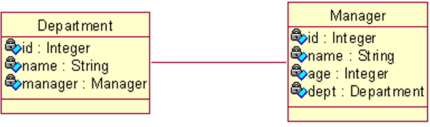
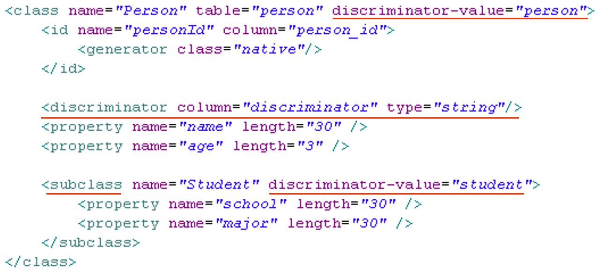

## 映射一对多关联关系

### 一对多关联关系

在领域模型中, 类与类之间最普遍的关系就是关联关系.
在 UML 中, 关联是有方向的.
以 Customer 和 Order 为例： 一个用户能发出多个订单, 而一个订单只能属于一个客户. 从 Order 到 Customer 的关联是多对一关联; 而从 Customer 到 Order 是一对多关联
单向关联

双向关联

### 单向 n-1

单向 n-1 关联只需从 n 的一端可以访问 1 的一端
域模型: 从 Order 到 Customer 的多对一单向关联需要在 Order 类中定义一个 Customer 属性, 而在 Customer 类中无需定义存放 Order 对象的集合属性

关系数据模型:ORDERS 表中的 CUSTOMER_ID 参照 CUSTOMER 表的主键

显然无法直接用 property 映射 customer 属性
Hibernate 使用 `<many-to-one>`元素来映射多对一关联关系

### many-to-one

`<many-to-one>`元素来映射组成关系

- `name`: 设定待映射的持久化类的属性的名字
- `column`: 设定和持久化类的属性对应的表的外键
- `class`：设定待映射的持久化类的属性的类型

### 双向 1-n

双向 1-n 与 双向 n-1 是完全相同的两种情形
双向 1-n 需要在 1 的一端可以访问 n 的一端, 反之依然.
域模型:从 Order 到 Customer 的多对一双向关联需要在 Order 类中定义一个 Customer 属性, 而在 Customer 类中需定义存放 Order 对象的集合属性

关系数据模型:ORDERS 表中的 CUSTOMER_ID 参照 CUSTOMER 表的主键

当 Session 从数据库中加载 Java 集合时, 创建的是 Hibernate 内置集合类的实例, 因此`在持久化类中定义集合属性时必须把属性声明为 Java 接口类型`
Hibernate 的内置集合类具有集合代理功能, **支持延迟检索策略**
事实上, Hibernate 的内置集合类封装了 JDK 中的集合类, 这使得 Hibernate 能够对缓存中的集合对象进行脏检查, 按照集合对象的状态来同步更新数据库。
在定义集合属性时, 通常把它初始化为集合实现类的一个实例. 这样可以提高程序的健壮性, 避免应用程序访问取值为 null 的集合的方法抛出 NullPointerException

Hibernate 使用`<set>`元素来映射 set 类型的属性

### set

`<set>` 元素来映射持久化类的 set 类型的属性
`name`: 设定待映射的持久化类的属性的

`<set>`元素的 inverse 属性

在 hibernate 中通过对 inverse 属性的来决定是由双向关联的哪一方来维护表和表之间的关系. inverse = false 的为主动方，inverse = true 的为被动方, 由主动方负责维护关联关系
在没有设置 inverse=true 的情况下，父子两边都维护父子

### 关系

在 1-n 关系中，将 n 方设为主控方将有助于性能改善(如果要国家元首记住全国人民的名字，不是太可能，但要让全国人民知道国家元首，就容易的多)
在 1-N 关系中，若将 1 方设为主控方

- **会额外多出 update 语句**。
- 插入数据时无法同时插入外键列，因而无法为外
- 键列添加非空约束

### 在数据库中对集合排序

`<set>` 元素有一个 `order-by` 属性, 如果设置了该属性, 当 Hibernate 通过 select 语句到数据库中检索集合对象时, 利用 order by 子句进行排序
order-by 属性中还可以加入 SQL 函数

### key

`<key>` 元素设定与所关联的持久化类对应的表的外键
`column`: 指定关联表的外键名

### one-to-many

`<one-to-many>` 元素设定集合属性中所关联的持久化类
`class`: 指定关联的持久化类的类名

### `<set>`元素的 inverse 属性

- 在 hibernate 中通过对 inverse 属性的来决定是由双向关联的哪一方来维护表和表之间的关系. inverse = false 的为主动方，inverse = true 的为被动方, 由主动方负责维护关联关系
- 在没有设置 inverse=true 的情况下，父子两边都维护父子
  关系
- 在 1-n 关系中，将 n 方设为主控方将有助于性能改善(如果要国家元首记住全国人民的名字，不是太可能，但要让全国人民知道国家元首，就容易的多)
- 在 1-N 关系中，若将 1 方设为主控方

1. 会额外多出 update 语句。
2. 插入数据时无法同时插入外键列，因而无法为外键列添加非空约束

### cascade 属性

在对象 – 关系映射文件中, 用于映射持久化类之间关联关系的元素, `<set>`, `<many-to-one>`和`<one-to-one>`都有一个 cascade 属性, 它用于指定如何操纵与当前对象关联的其他对象.

| cascade 属性      | 描述                                                                                                                                                                     |
| ----------------- | ------------------------------------------------------------------------------------------------------------------------------------------------------------------------ |
| none              | 当 Session 操作当前对象时，忽略其他关联的对象，他是 cascade 属性的默认值                                                                                                 |
| save-update       | 当通过 Session 的 save()、update()及 saveOrUpdate()方法来保存或更新当前对象时，级联保存所有关联的新建的临时对象，并且级联更新所有关联的游离对象                          |
| persist           | 当通过 Session 的 persist()方法来保存当前对象时，会级联保存所有关联的新建的临时对象                                                                                      |
| merge             | 当通过 Session 的对象 merge()方法来保存当前对象时，会级联融合所有的关联的游离对象                                                                                        |
| delete            | 当通过 Session 的 delete()方法删除当前对象时，会级联删除所有关联的对象                                                                                                   |
| lock              | 当通过 Session 得到 lock()方法把当前游离对象加入到 Session 缓存中，会把所有关联的游离对象也加入到 Sesson 缓存中.                                                         |
| replicate         | 当通过 Session 的 replicate()方法复制当前对象时，会级联复制所有关联的对象                                                                                                |
| evict             | 当通过 Session 的 evict()方法从 Session 缓存中清除当前对象,会级联清除所有关联的对象                                                                                      |
| refresh           | 当通过 Session 的 refresh()方法刷新当前对象时，会级联刷新所有关联的对象。所谓刷新是指读取数据库中相应数据，然后根据数据库中的最新数据去同步更新 Session 缓存中的相应对象 |
| all               | 包含 save-update、persist、merge、delete、lock、replicate、evict 及 refresh 的行为                                                                                       |
| delete-orphan     | 伤处所有和当前对象解除关联关系的对象                                                                                                                                     |
| all-delete-orphan | 包含 all 和 delete-orphan 的行为                                                                                                                                         |

## 映射一对一关联关系

### 1 - 1

域模型

### 关系数据模型:

- 按照外键映射:

- 按照主键映射:

### 基于外键映射的 1-1

对于基于外键的 1-1 关联，其外键可以存放在任意一边，在需要存放外键一端，增加 many-to-one 元素。为 many-to-one 元素增加 unique=“true” 属性来表示为 1-1 关联

另一端需要使用 one-to-one 元素，该元素使用 property-ref 属性指定使用被关联实体主键以外的字段作为关联字段

不使用 property-ref 属性的 sql

使用 property-ref 属性的 sql

### 两边都使用外键映射的 1-1

### 基于主键映射的 1-1

基于主键的映射策略:指一端的主键生成器使用 foreign 策略,表明根据”对方”的主键来生成自己的主键，自己并不能独立生成主键. <param> 子元素指定使用当前持久化类的哪个属性作为 “对方”

采用 foreign 主键生成器策略的一端增加 one-to-one 元素映射关联属性，其 one-to-one 属性还应增加 constrained=“true” 属性；另一端增加 one-to-one 元素映射关联属性。
`constrained(约束)`:指定为当前持久化类对应的数据库表的主键添加一个外键约束，引用被关联的对象(“对方”)所对应的数据库表主键

## 映射多对多关联关系

### 单向 n-n

域模型:

关系数据模型

- **n-n 的关联必须使用连接表**
- 与 1-n 映射类似，**必须为 set 集合元素添加 key 子元素，指定 CATEGORIES_ITEMS 表中参照 CATEGORIES 表的外键为 CATEGORIY_ID.** 与 1-n 关联映射不同的是，建立 n-n 关联时, 集合中的元素使用 `many-to-many`. many-to-many 子元素的 class 属性指定 items 集合中存放的是 Item 对象, **column 属性指定 CATEGORIES_ITEMS 表中参照 ITEMS 表的外键为 ITEM_ID**

### 双向 n-n

域模型:

关系数据模型

### 双向 n-n 关联

双向 n-n 关联需要**两端都使用集合属性**
双向 n-n 关联**必须使用连接表**
集合属性应增加 key 子元素用以映射外键列, 集合元素里还应增加 many-to-many 子元素关联实体类
**在双向 n-n 关联的两边都需指定连接表的表名及外键列的列名. 两个集合元素 set 的 table 元素的值必须指定，而且必须相同。set 元素的两个子元素：key 和 many-to-many 都必须指定 column 属性，其中，key 和 many-to-many 分别指定本持久化类和关联类在连接表中的外键列名，因此两边的 key 与 many-to-many 的 column 属性交叉相同。**也就是说，一边的 set 元素的 key 的 cloumn 值为 a,many-to-many 的 column 为 b；则另一边的 set 元素的 key 的 column 值 b,many-to-many 的 column 值为 a.  
**对于双向 n-n 关联, 必须把其中一端的 inverse 设置为 true,** 否则两端都维护关联关系可能会造成主键冲突.

### 映射继承关系

#### 继承映射

对于面向对象的程序设计语言而言，继承和多态是两个最基本的概念。**Hibernate 的继承映射可以理解持久化类之间的继承关系。** 例如：人和学生之间的关系。学生继承了人，可以认为学生是一个特殊的人，如果对人进行查询，学生的实例也将被得到。

Hibernate 支持三种继承映射策略：

- 使用 `subclass` 进行映射：将域模型中的每一个实体对象映射到一个独立的表中，也就是说不用在关系数据模型中考虑域模型中的继承关系和多态。
- 使用 `joined-subclass` 进行映射： 对于继承关系中的子类使用同一个表，这就需要在数据库表中增加额外的区分子类类型的字段。
- 使用 `union-subclass`进行映射：域模型中的每个类映射到一个表，通过关系数据模型中的外键来描述表之间的继承关系。这也就相当于按照域模型的结构来建立数据库中的表，并通过外键来建立表之间的继承关系。

采用 subclass 元素的继承映射

采用 subclass 的继承映射可以实现对于继承关系中**父类和子类使用同一张表**
因为父类和子类的实例全部保存在同一个表中，因此**需要在该表内增加一列**，使用该列来区分每行记录到低是哪个类的实例----这个列被称为辨别者列(discriminator).
在这种映射策略下，使用 subclass 来映射子类，**使用 class 或 subclass 的 discriminator-value 属性指定辨别者列的值**  
**所有子类定义的字段都不能有非空约束。** 如果为那些字段添加非空约束，那么父类的实例在那些列其实并没有值，这将引起数据库完整性冲突，导致父类的实例无法保存到数据库中

采用 joined-subclass 元素的继承映射

采用 joined-subclass 元素的继承映射可以实现**每个子类一张表**
采用这种映射策略时，父类实例保存在父类表中，**子类实例由父类表和子类表共同存储。**因为子类实例也是一个特殊的父类实例，因此必然也包含了父类实例的属性。于是将子类和父类共有的属性保存在父类表中，子类增加的属性，则保存在子类表中。
在这种映射策略下，无须使用鉴别者列，但需要为**每个子类使用 key 元素映射共有主键。**
**子类增加的属性可以添加非空约束**。因为子类的属性和父类的属性没有保存在同一个表中

采用 union-subclass 元素的继承映射

采用 union-subclass 元素可以实现**将每一个实体对象映射到一个独立的表中**。
**子类增加的属性可以有非空约束** --- 即父类实例的数据保存在父表中，而子类实例的数据保存在子类表中。
**子类实例的数据仅保存在子类表中**, 而在父类表中没有任何记录
在这种映射策略下，子类表的字段会比父类表的映射字段要多,因为子类表的字段等于父类表的字段、加子类增加属性的总和
在这种映射策略下，**既不需要使用鉴别者列，也无须使用 key 元素来映射共有主键.**
**使用 union-subclass 映射策略是不可使用 identity 的主键生成策略,** 因为同一类继承层次中所有实体类都需要使用同一个主键种子, 即多个持久化实体对应的记录的主键应该是连续的. 受此影响, 也不该使用 native 主键生成策略, 因为 native 会根据数据库来选择使用 identity 或 sequence.

三种继承映射方式的比较

|                    | union-subclass                                                         | subclass                                                                                                                      | joined-subclass                                                  |
| ------------------ | ---------------------------------------------------------------------- | ----------------------------------------------------------------------------------------------------------------------------- | ---------------------------------------------------------------- |
| 比较方面           | 每一个具体类一张表                                                     | 每个类分层结构一张表                                                                                                          | 每个子类一张表                                                   |
| 建立关系模型的原型 | 每个具体类对应，一张表，有多个具体类就需要建立多少个独立的表           | 描述一个继承关系只用一张表                                                                                                    | 每个子类使用一张表，但这些字类所对应的表都关联到基类所对应的表中 |
| 关系模型的优缺点   | 这种设计方式符合关系模型的设计原则，但有表中存在重复字段的问题         | 缺点有二：首先表中引入了区分子类的字段。其次，如果某个字类的某个属性的值不能为空，那么在数据库一级时不能设置该字段为 NOT NULL | 这种设计方式完全符合关系模型的设计原则，而且不存在亢余           |
| 可维护性           | 如果要对基类进行修改，则需要对基类以及该类的字类所对应                 | 维护起来比较方便，只需要修改一张表                                                                                            | 维护起来比较方便，对每个类的修改只需要其对应的表                 |
| 灵活性             | 映射的灵活性很大，子类可以对包括基类属性在内的每一个属性进行单独的配置 | 灵活性差，表中的亢余字段会随着子类得到增多而增加                                                                              | 灵活性很好，安全时参照对象继承的方式进行映射配置                 |
| 查询的性能         | 对于子类的查询只需要访问单独的表，但对于父类的查询则需要检索所有的表   | 在任何情况下的查询都只需要处理这一张表                                                                                        | 对于父类的查询需要使用左外连接，而对于子类的查询则需要进行内连接 |
| 维护的性能         | 对于单个对象的持久化操作只需要处理一张表                               | 对于单个对象的持久操作只需要处理一张表                                                                                        | 对于子类的持久化操作至少需要处理两行表                           |
