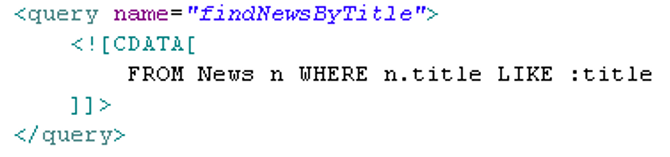
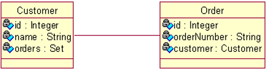
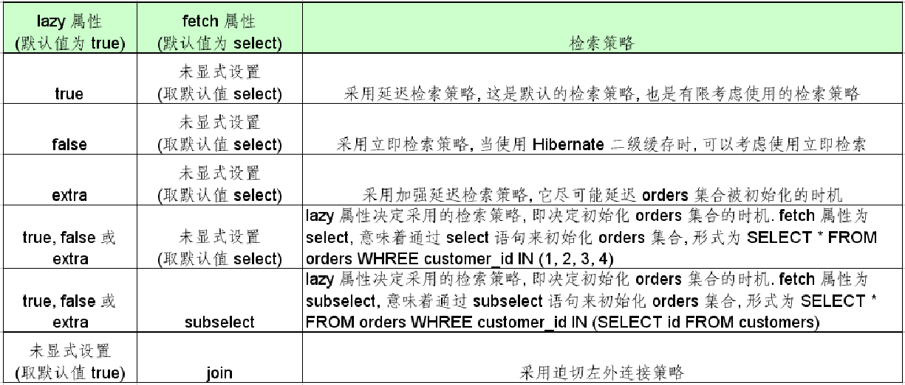

## Hibernate 检索方式

### 概述

Hibernate 提供了以下几种检索对象的方式

- 导航对象图检索方式: 根据已经加载的对象导航到其他对象
- OID 检索方式: 按照对象的 OID 来检索对象
- HQL 检索方式: 使用面向对象的 HQL 查询语言
- QBC 检索方式: 使用 QBC(Query By Criteria) API 来检索对象. 这种 API 封装了基于字符串形式的查询语句, 提供了更加面向对象的查询接口.
- 本地 SQL 检索方式: 使用本地数据库的 SQL 查询语句

### HQL 检索方式

HQL(Hibernate Query Language) 是面向对象的查询语言, 它和 SQL 查询语言有些相似. 在 Hibernate 提供的各种检索方式中, HQL 是使用最广的一种检索方式. 它有如下功能:

- 在查询语句中设定各种查询条件
- 支持投影查询, 即仅检索出对象的部分属性
- 支持分页查询
- 支持连接查询
- 支持分组查询, 允许使用 HAVING 和 GROUP BY 关键字
- 提供内置聚集函数, 如 sum(), min() 和 max()
- 支持子查询
- 支持动态绑定参数
- 能够调用 用户定义的 SQL 函数或标准的 SQL 函数

HQL 检索方式包括以下步骤:
通过 Session 的 `createQuery()`方法创建一个 Query 对象, 它包括一个 HQL 查询语句. HQL 查询语句中可以包含命名参数
动态绑定参数
调用 Query 相关方法执行查询语句.
**Qurey 接口支持方法链编程风格**, 它的 setXxx() 方法返回自身实例, 而不是 void 类型
HQL vs SQL:
HQL 查询语句是面向对象的, Hibernate 负责解析 HQL 查询语句, 然后根据对象-关系映射文件中的映射信息, 把 HQL 查询语句翻译成相应的 SQL 语句. HQL 查询语句中的主体是**域模型中的类及类的属性**
SQL 查询语句是与关系数据库绑定在一起的. SQL 查询语句中的主体是数据库表及表的字段.

绑定参数:
Hibernate 的参数绑定机制依赖于 JDBC API 中的 PreparedStatement 的预定义 SQL 语句功能.
HQL 的参数绑定由两种形式:

- 按`参数名字绑定`: 在 HQL 查询语句中定义命名参数, 命名参数以 “:” 开头.
- 按`参数位置绑定`: 在 HQL 查询语句中用 “?” 来定义参数位置

相关方法:
`setEntity()`: 把参数与一个持久化类绑定
`setParameter()`: 绑定任意类型的参数. 该方法的第三个参数显式指定 Hibernate 映射类型
HQL 采用 `ORDER BY`关键字对查询结果排序

分页查询:

- `setFirstResult(int firstResult)`: 设定从哪一个对象开始检索, 参数 firstResult 表示这个对象在查询结果中的索引位置, 索引位置的起始值为 0. 默认情况下, Query 从查询结果中的第一个对象开始检索
- `setMaxResults(int maxResults)`: 设定一次最多检索出的对象的数目. 在默认情况下, Query 和 Criteria 接口检索出查询结果中所有的对象

在映射文件中定义命名查询语句
Hibernate 允许在映射文件中定义字符串形式的查询语句.
`<query>`元素用于定义一个 HQL 查询语句, 它和 `<class>`元素并列.

在程序中通过 Session 的 `getNamedQuery()` 方法获取查询语句对应的 Query 对象.

### 投影查询

投影查询: **查询结果仅包含实体的部分属性**. 通过 SELECT 关键字实现.
**Query 的 `list()` 方法返回的集合中包含的是数组类型的元素, 每个对象数组代表查询结果的一条记录**
**可以在持久化类中定义一个对象的构造器来包装投影查询返回的记录**, 使程序代码能完全运用面向对象的语义来访问查询结果集.
可以通过 DISTINCT 关键字来保证查询结果不会返回重复元素

### 报表查询

报表查询用于对数据分组和统计, 与 SQL 一样, HQL 利用 **GROUP BY** 关键字对数据分组, 用 **HAVING** 关键字对分组数据设定约束条件.
在 HQL 查询语句中可以调用以下聚集函数

- count()
- min()
- max()
- sum()
- avg()

### HQL (迫切)左外连接

- 迫切左外连接:
  **LEFT JOIN FETCH** 关键字表示迫切左外连接检索策略.
  list() 方法**返回的集合中存放实体对象的引用**, 每个 Department 对象关联的 Employee 集合都被初始化, 存放所有关联的 Employee 的实体对象.
  查询结果中可能会包含重复元素, 可以通过一个 HashSet 来过滤重复元素
- 左外连接:
  LEFT JOIN 关键字表示左外连接查询.
  `list()`方法返回的集合中存放的是对象数组类型
  根据配置文件来决定 Employee 集合的检索策略.
  如果希望`list()`方法返回的集合中仅包含 Department 对象, 可以在 HQL 查询语句中使用 SELECT 关键字

### HQL (迫切)内连接

- 迫切内连接:
  INNER JOIN FETCH 关键字表示迫切内连接, 也可以省略 INNER 关键字
  `list()` 方法返回的集合中存放 Department 对象的引用, 每个 Department 对象的 Employee 集合都被初始化, 存放所有关联的 Employee 对象
- 内连接:
  INNER JOIN 关键字表示内连接, 也可以省略 INNER 关键字
  `list()` 方法的集合中存放的每个元素对应查询结果的一条记录, 每个元素都是对象数组类型
  如果希望 `list()` 方法的返回的集合仅包含 Department 对象, 可以在 HQL 查询语句中使用 SELECT 关键字

### 关联级别运行时的检索策略

如果在 HQL 中没有显式指定检索策略, 将使用映射文件配置的检索策略.
HQL 会忽略映射文件中设置的迫切左外连接检索策略, **如果希望 HQL 采用迫切左外连接策略, 就必须在 HQL 查询语句中显式的指定它**
若在 HQL 代码中显式指定了检索策略, 就会覆盖映射文件中配置的检索策略

### QBC 检索和本地 SQL 检索

QBC 查询就是通过使用 Hibernate 提供的 Query By Criteria API 来查询对象，这种 API 封装了 SQL 语句的动态拼装，对查询提供了更加面向对象的功能接口
本地 SQL 查询来完善 HQL 不能涵盖所有的查询特性

## Hibernate 检索策略

### 概述

检索数据时的 2 个问题：
不浪费内存：当 Hibernate 从数据库中加载 Customer 对象时, 如果同时加载所有关联的 Order 对象, 而程序实际上仅仅需要访问 Customer 对象, 那么这些关联的 Order 对象就白白浪费了许多内存.
更高的查询效率：发送尽可能少的 SQL 语句

### 类级别的检索策略

类级别可选的检索策略包括立即检索和延迟检索, 默认为延迟检索

- 立即检索: 立即加载检索方法指定的对象

- 延迟检索: 延迟加载检索方法指定的对象。在使用具体的属性时，再进行加载

类级别的检索策略可以通过`<class>`元素的 lazy 属性进行设置

如果程序加载一个对象的目的是为了访问它的属性, 可以采取立即检索.
如果程序加载一个持久化对象的目的是仅仅为了获得它的引用, 可以采用延迟检索。注意出现懒加载异常！

无论`<class>` 元素的 lazy 属性是 true 还是 false, Session 的 `get()`方法及 Query 的 `list()` 方法在类级别总是使用立即检索策略
若 `<class>`元素的 lazy 属性为 true 或取默认值, Session 的 `load()`方法不会执行查询数据表的 SELECT 语句, 仅返回代理类对象的实例, 该代理类实例有如下特征:
由 Hibernate 在运行时采用 CGLIB 工具动态生成
Hibernate 创建代理类实例时, **仅初始化其 OID 属性**
在应用程序第一次访问代理类实例的非 OID 属性时, Hibernate 会初始化代理类实例

## 一对多和多对多的检索策略

在映射文件中, 用 `<set>`元素来配置一对多关联及多对多关联关系. `<set>` 元素有 lazy 和 fetch 属性

- lazy: 主要决定 orders 集合被初始化的时机. 即到底是在加载 Customer 对象时就被初始化, 还是在程序访问 orders 集合时被初始化
- fetch: 取值为 “select” 或 “subselect” 时, 决定初始化 orders 的查询语句的形式; 若取值为”join”, 则决定 orders 集合被初始化的时机
- 若把 fetch 设置为 “join”, lazy 属性将被忽略
  `<set>`元素的 batch-size 属性：用来为延迟检索策略或立即检索策略设定批量检索的数量. 批量检索能减少 SELECT 语句的数目, 提高延迟检索或立即检索的运行性能.

### `<set>`元素的 lazy 和 fetch 属性

### 延迟检索和增强延迟检索

在延迟检索(lazy 属性值为 true) 集合属性时, Hibernate 在以下情况下初始化集合代理类实例
应用程序第一次访问集合属性: `iterator()`, `size()`, `isEmpty()`, `contains()`等方法
通过 `Hibernate.initialize()`静态方法显式初始化
增强延迟检索(lazy 属性为 extra): 与 lazy=“true” 类似. 主要区别是**增强延迟检索策略能进一步延迟 Customer 对象的 orders 集合代理实例的初始化时机：**
当程序第一次访问 orders 属性的 `iterator()` 方法时, 会导致 orders 集合代理类实例的初始化
当程序第一次访问 order 属性的`size()`,`contains()`和`isEmpty()`方法时, Hibernate 不会初始化 orders 集合类的实例, 仅通过特定的 select 语句查询必要的信息, 不会检索所有的 Order 对象

### `<set>`元素的 batch-size 属性

`<set>`元素有一个 batch-size 属性, 用来为延迟检索策略或立即检索策略设定批量检索的数量. 批量检索能减少 SELECT 语句的数目, 提高延迟检索或立即检索的运行性能.

### 一对多和多对多的检索策略

在映射文件中, 用 `<set>`元素来配置一对多关联及多对多关联关系. `<set>`元素有 lazy 和 fetch 属性

- lazy: 主要决定 orders 集合被初始化的时机. 即到底是在加载 Customer 对象时就被初始化, 还是在程序访问 orders 集合时被初始化
- fetch: 取值为 “select” 或 “subselect” 时, 决定初始化 orders 的查询语句的形式; 若取值为”join”, 则决定 orders 集合被初始化的时机
- 若把 fetch 设置为 “join”, lazy 属性将被忽略

用带子查询的 select 语句整批量初始化 orders 集合(fetch 属性为 “subselect”)

`<set>`元素的 fetch 属性: ==取值为 “select” 或 “subselect” 时, 决定初始化 orders 的查询语句的形式;== 若取值为”join”, 则决定 orders 集合被初始化的时机.默认值为 select
当 fetch 属性为 “subselect” 时
假定 Session 缓存中有 n 个 orders 集合代理类实例没有被初始化, Hibernate 能够通过带子查询的 select 语句, 来批量初始化 n 个 orders 集合代理类实例
==batch-size 属性将被忽略==
子查询中的 select 语句为查询 CUSTOMERS 表 OID 的 SELECT 语句

迫切左外连接检索(fetch 属性值设为 “join”)

`<set>` 元素的 fetch 属性: 取值为 “select” 或 “subselect” 时, 决定初始化 orders 的查询语句的形式; 若取值为”join”, 则决定 orders 集合被初始化的时机.默认值为 select

当 fetch 属性为 “join” 时:

- 检索 Customer 对象时, 会采用迫切左外连接(通过左外连接加载与检索指定的对象关联的对象)策略来检索所有关联的 Order 对象

- lazy 属性将被忽略

- Query 的 list() 方法会忽略映射文件中配置的迫切左外连接检索策略, 而依旧采用延迟加载策略

### 多对一和一对一关联的检索策略

和`<set>`一样, `<many-to-one>`元素也有一个 lazy 属性和 fetch 属性.

| lazy 属性(默认为 proxy)    | fetch 属性(默认值为 select) | 检索 Order 对象时对关联的 Customer 对象使用的检索策略 |
| -------------------------- | --------------------------- | ----------------------------------------------------- |
| proxy                      | 未显式设置(取默认值 select) | 采用延迟检索                                          |
| no-proxy                   | 未显式设置(取默认值 select) | 无代理延迟检索                                        |
| FALSE                      | 未显示设置(取默认 select)   | 立即检索                                              |
| 未显式设置(取默认值 proxy) | join                        | 迫切左外连接策略                                      |

**若 fetch 属性设为 join, 那么 lazy 属性被忽略**

- 迫切左外连接检索策略的优点在于比立即检索策略使用的 SELECT 语句更少.
- 无代理延迟检索需要增强持久化类的字节码才能实现

## 检索策略小结

### 类级别和关联级别可选的检索策略及默认的检索策略

| 检索策略的作用域 | 可选的检索策略                     | 默认的检索策略 | 运行时行为受影响的检索方法                                                                                                         |
| ---------------- | ---------------------------------- | -------------- | ---------------------------------------------------------------------------------------------------------------------------------- |
| 类级别           | 立即检索 延迟检索                  | 延迟检索       | 仅影响 Session 的 load()方法                                                                                                       |
| 关联级别         | 立即检索 延迟检索 迫切左外连接检索 | 延迟检索       | 影响 Session 的 load()和 get()方法;以及 Query API 和 Criteria API；例外情况时 Query API 会忽略映射文件中的设定迫切左外连接检索策略 |

### 3 种检索策略的运行机制

| 检索策略的类型   | 类级别                     | 关联级别                                                     |
| ---------------- | -------------------------- | ------------------------------------------------------------ |
| 立即检索         | 立即加载检索方法指定的对象 | 立即加载与检索方法指定的对象的关联对象，可以设定批量检索数量 |
| 延迟检索         | 延迟加载检索方法指定的对象 | 延迟加载与检索方法指定的对象的关联对象，可以设定批量检索数量 |
| 迫切左外连接检索 | 不适用                     | 通过左外连接加载与检索方法指定的对象的关联对象               |

### 映射文件中用于设定检索策略的几个属性

| 属性  | 类级别                                                                                                              | 一对多关联级别                                                                                                                                                            | 多对多关联级别                                                                                                                                      |
| ----- | ------------------------------------------------------------------------------------------------------------------- | ------------------------------------------------------------------------------------------------------------------------------------------------------------------------- | --------------------------------------------------------------------------------------------------------------------------------------------------- |
| lazy  | 1.`<class>`元素中 lazy 属性的可选值为：true(延迟检索)和 false(立即检索)2. `<class>` 元素的 lazy 属性的默认值为 true | 1.`<set>`元素中 lazy 属性的可选值为 true（延迟检索）、extra（增强延迟检索）和 false（立即检索）2.`<set>`元素的 lazy 属性的默认值为 true                                   | 1.`<many-to-one>` 元素中 lazy 属性的可选值为:proxy(延迟策略)、no-proxy(无代理检索)和 false(立即检索)2. `<many-to-one>`元素的 lazy 属性的默认值 true |
| fetch | 没有此属性                                                                                                          | 1.`<set>`元素中 fetch 属性的可选值为：select(select 查询语句)、subselect(带字查询的 select 查询语句)和 join(迫切左外连接索引);2.`<set>`元素的 fetch 属性的默认值为 select | 1.`<many-to-one>`元素中 fetch 属性的可选值为：select(select 查询语句)和 join(迫切左外连接检索)2.`<many-to-one >`元素的 fetch 属性的默认值 select    |

batch-size 设定批量检索的数量，可选为一个正整数，默认值为 1，如果设定此项。合理的取值在 3-10 之间。仅仅适用于关联几倍的立即检索和延迟检索.在`<class>`和`<set>`元素中包含此属性。

比较 Hibernate 的三个检索

| 检索策略         | 优点                                                                                                                                           | 缺点                                                                                            | 优先考虑使用的场合                                                                   |
| ---------------- | ---------------------------------------------------------------------------------------------------------------------------------------------- | ----------------------------------------------------------------------------------------------- | ------------------------------------------------------------------------------------ |
| 立即检索         | 对应用程序完全透明，不管对象处于持久化状态，还是游离状态，应用程序都可以方便地从一个对象导航到与它关联地对象                                   | 1. select 语句数目多 2.可能会加载应用程序不需要访问的对象，白白浪费许多内存空间                 | 1.类级别 2.应用程序要立即访问的对象 3.使用了第二季缓存                               |
| 延迟策略         | 由应用程序决定需要加载哪些对象，可以避免执行多余的 select 语句，以及避免加载引用程序不需要访问的对象，因此能提高检索性能，并且节省内在空间     | 应用程序中如果希望访问游离状态的代理类示例，必须保证它在持久化状态时已经被初始化                | 1.一对多或者多对多关联 2.应用程序不需要立即访问或根本不会访问的对象                  |
| 迫切左外连接检索 | 1.对应用程序完全透明，不管对象处于持久化状态，还是游离状态，应用程序都可以方便地从一个对象导航到与它关联地对象 2.使用外连接，select 语句数目少 | 1.可能会加载应用程序不需要访问地对象，白白浪费许多内存空间 2.复杂地数据库表连接也会影响检索性能 | 1.多对一或者多对多关联 2.应用程序需要立即访问地对象 3.数据库系统具有良好地表连接性能 |
