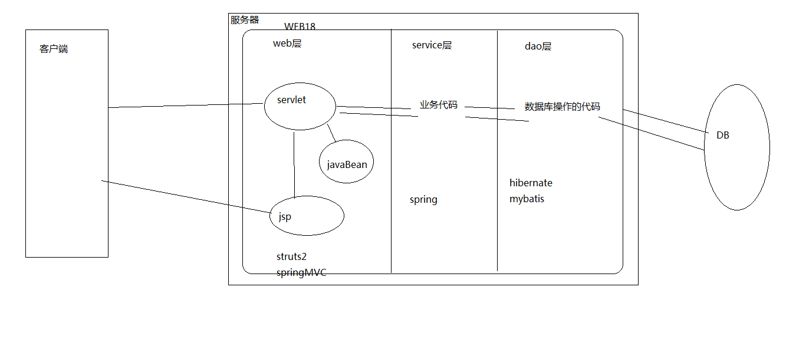

## MVC 模式

### Model1

说到设计模式，不得不提一下之前的的 Model1。据说早期对于 java 企业项目的开发，用的是 Jsp+JavaBean 的模式。由于 jsp 在编译后实际就是 Servlet，当时的开发人员就省去编写 Servlet，将所有的业务逻辑都放在 jsp 中。在业务逻辑简单的时候，这种方式还算高效，可是到了现代业务逻辑复杂，还用这种模式开发将会导致一个问题：jsp 中的代码过于繁琐，一段是 html 的代码，中间又嵌入了 java 代码。java 代码又过于庞大：既有对业务的逻辑的实现，又有对业务的展示，还有对数据库的操作。因此会导致代码的维护性、可读性较差：如果想增加或修改一个代码，就需要把整个 jsp 代码都看完，理解了相关的逻辑后才行，否则很可能出现雪崩（一处修改，多处错误）。而这个过程又比较漫长，因此在现代开发中已经被抛弃。

### Model2（MVC)

为了解决上述问题，我们引入 Model2——MVC 模式。也就是说 MVC 能够将展示层（html）与业务逻辑分开，一方面能够让每个部分的代码尽量少，一方面又能将开发的思路清晰（相当于给了一个模板，之后往里面填实现代码）。

那么具体 MVC 是代表什么呢？

- M：Model，模型，代表业务逻辑代码与数据库代码（对用户请求处理）
- V：View，视图，代表展示给用户的界面（对数据展示 j）
- C：Controller，控制，代表对业务信息的传递（告诉模型要处理什么，告诉视图要展示什么）

1. 提交需求。用户打开浏览器，输入网址，访问到 jsp 页面，点击页面上的内容（input），传递一个请求
2. 获取需求。该请求就传递到控制器 Servlet（Control）中，Servlet 分析出用户需要的数据，告知 Model
3. 获取数据。Model 通过相应的方法，在数据库（DataBase）中算出相应的数据，发回给 Servlet（Control）
4. 展示数据。Servlet（Control）得到数据后，再转发数据到 jsp（View）中，展示给用户

## 三层架构

三层架构是 javaee 规范中的推荐架构，传统意义上的是分为表示层（UI）、业务逻辑层（BLL）、数据访问层（DAL）。在 javaee 的开发中，三层架构具体分为表示层（web 层）、业务逻辑层（service 层）、数据访问层（dao 层）。

但是现在很少用 SSH 架构一般都是 SSM

- web 层：与客户端交互，包括获取用户请求，传递数据，封装数据，展示数据。
- service 层：复杂的业务处理，包括各种实际的逻辑运算。
- dao 层：与数据库进行交互，与数据库相关的代码在此处实现。

1. 提交需求。客户端点击 jsp 相应的内容，传递一个请求。
2. 获取需求。Servlet 获取需求、分析需求，将需求传递到 service 层。
3. 处理需求。service 层中是对业务逻辑进行处理，这里是对业务具体的处理，调用各种方法运算（不涉及数据库）。
4. 提取数据。需要提取数据库中的信息时，service 将需求传递给 dao 层，由该层与数据库交互。
5. 返回需求。由后向前传递处理好的结果，封装为一个 javaBean 对象，Servlet 将封装好的对象返回给 jsp 展示给用户。

## 两者之间的区别与联系

两者本为不同领域下的设计模式，并无直接关联。

三层架构是典型的架构模式（Architecture Pattern），将产品的开发细分为三层，这么做的好处是能够让每个人都能发挥自己的专长。比如前端工程师能专注页面的设计，如何吸引用户，而不用在乎业务逻辑的实现。数据库工程师，又可以专注数据库的处理，使其变得高效，而不必关注如何展示。

MVC 是表现模式（Presentation Pattern），是为了让 HTML 代码和业务逻辑分开，使代码清晰（el 表达式的引入也是为了这个原因），但在某种意义上，也是将功能进行分化。

如果说可能的联系，那么在 javaee 的三层架构中的 ui 层（web 层）中继续细分下去，又刚好符合一个 mvc 的设计模式。也就是说，mvc 是把第一层 web 层细继续分为控制器 Servlet、视图 jsp、实体模型 javabean。其中 Servlet 不仅负责 mvc 中的信息控制，还负责三层架构中的信息调用返回。
