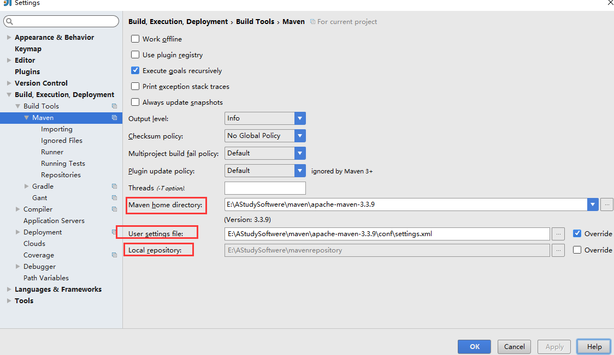
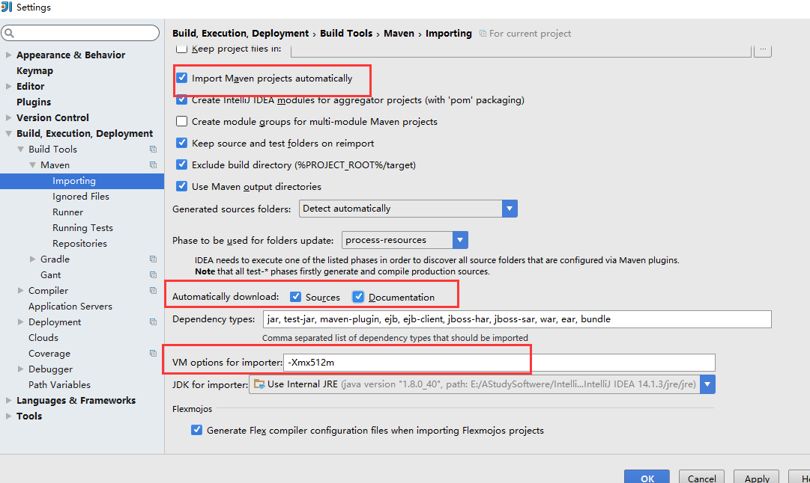

## 一、配置 Maven

在 File->Settings->Build,Execution,Deployment->Build Tools->Maven 下对 Maven 进行配置

我个人的配置是：

参数分析：

user settings file:指定 Maven 的 settings.xml 位置
　　　　　　 local repository: 指定 Maven 的本地仓库位置，是读取 settings.xml 自动配置的
　　　　　　 maven home directory:指定本地 Maven 的安装目录所在，因为我已经配置了 MAVEN_HOME 系统参数，所以直接这样配置 IntelliJ IDEA 是可以找到的，但是假如你没有配置的话，这里可以选择你的 Maven 安装目录

参数分析：

VM options for importer:可以设置导入的 VM 参数，一般这个都不需要主动改，除非项目真的导入太慢了我们再增大此参数
　　　　　　 Import Maven projects automatically:表示 IntelliJ IDEA 会实时监控项目的 pom.xml 文件进行项目变动设置，建议进行勾选
　　　　　　 Sources 和 Documentation:表示在 Maven 导入依赖包的时候是否自动下载源码和文档，默认是没有勾选的也不建议勾选，原因是这样可以加快项目从外网导入依赖包的速度，

如果我们需要源码和文档的时候我们到时候再针对某个依赖包进行联网下载即可，IntelliJ IDEA 支持直接从公网下载源码和文档的。

**IDEA2019.1 + maven3.5 版**

**一定要注意！！！idea2019 版不兼容 maven3.6.2 版本**
