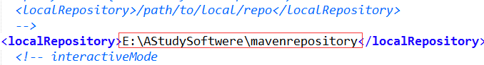

## 一、Maven 概述

## 1.1、Maven 介绍

Maven 可以翻译为“知识的积累”、“专家”、“内行”。作为 Apache 组织中的一个颇为成功的开源项目，Maven 主要服务于基于 Java 平台的项目构建、依赖管理、和项目信息管理。Maven 在各类项目中都可以大显身手。

1） **Maven 是优秀的构建工具**
　　　　除了编写源代码，我们每天有相当一部分时间花在了编译，运行单元测试，生成文档，打包，部署等繁琐且不起眼的工作上，这就是构建。Maven 就是一个异常强大的构建工具，能够帮我们自动化构建过程，从清理，编译，测试，到生成报告，再到打包和部署。

我们不需要一遍一遍的输入命令，　一次又一次点击鼠标，Maven 帮我们很方便的搞定。**Maven 是跨平台的**。

2） **Maven 还是依赖管理工具和项目信息管理工具**
　　　　 Maven 通过一组坐标能够找到任何一个 Java 类库（如 jar），Maven 给这个类库世界引入了经纬，让它们变得有秩序，于是我们可以借助它来有序地管理依赖，轻松地解决那些繁杂的依赖问题。

Maven 还能帮助我们管理原本分散在项目中各个角落的项目信息，包括项目描述，开发者列表，版本控制系统地址，许可证，缺陷管理系统地址等。除了直接的项目信息，通过 Maven 自动生成的站点，

以及一些已有的插件，我们还能轻松地获得项目文档、测试报告、静态分析报告、源码版本日志报告等非常具有价值的项目信息。

3） **仓库**
　　　　 Maven 为全世界的 Java 开发者提供了一个免费的中央仓库，在其中几乎可以找到任何流行开源类库。通过 Maven 的一些衍生工具（如 Nexus）,我们还能对其进行快速地搜索。只要定位了坐标，Maven 就能够帮我们自动下载，省去了手工劳动。

## 1.2、理解 Maven

如果没明白 maven 是什么，那个人觉得，Maven 的核心功能便是合理叙述项目间的依赖关系，通俗点讲，就是通过 pom.xml 文件的配置获取 jar 包，而不用手动去添加 jar 包，而这里 pom.xml 文件对于学了一点 maven 的人来说，就有些熟悉了。

怎么通过 pom.xml 的配置就可以获取到 jar 包呢？pom.xml 配置文件从何而来？等等类似问题我们需要搞清楚，如果需要使用 pom.xml 来获取 jar 包，那么首先该项目就必须为 maven 项目，

maven 项目可以这样去想，就是**在 java 项目和 web 项目的上面包裹了一层 maven，本质上 java 项目还是 java 项目，web 项目还是 web 项目，但是包裹了 maven 之后，就可以使用 maven 提供的一些功能了(通过 pom.xml 添加 jar 包)**。

所以，根据上一段的描述，我们最终的目的就是学会如何在 pom.xml 中配置获取到我们想要的 jar 包，在此之前我们就必须了解如何创建 maven 项目，maven 项目的结构是怎样，与普通 java,web 项目的区别在哪里，还有如何配置 pom.xml 获取到对应的 jar 包等等。

### Maven 功能

Maven 能够帮助开发者完成以下工作：

- 构建
- 文档生成
- 报告
- 依赖
- SCMs
- 发布
- 分发
- 邮件列表

### Maven 特点

- 项目设置遵循统一的规则。
- 任意工程中共享。
- 依赖管理包括自动更新。
- 一个庞大且不断增长的库。
- 可扩展，能够轻松编写 Java 或脚本语言的插件。
- 只需很少或不需要额外配置即可即时访问新功能。
- **基于模型的构建** − Maven 能够将任意数量的项目构建到预定义的输出类型中，如 JAR，WAR 或基于项目元数据的分发，而不需要在大多数情况下执行任何脚本。
- **项目信息的一致性站点** − 使用与构建过程相同的元数据，Maven 能够生成一个网站或 PDF，包括您要添加的任何文档，并添加到关于项目开发状态的标准报告中。
- **发布管理和发布单独的输出** − Maven 将不需要额外的配置，就可以与源代码管理系统（如 Subversion 或 Git）集成，并可以基于某个标签管理项目的发布。它也可以将其发布到分发位置供其他项目使用。Maven 能够发布单独的输出，如 JAR，包含其他依赖和文档的归档，或者作为源代码发布。
- **向后兼容性** − 您可以很轻松的从旧版本 Maven 的多个模块移植到 Maven 3 中。
- 子项目使用父项目依赖时，正常情况子项目应该继承父项目依赖，无需使用版本号，
- **并行构建** − 编译的速度能普遍提高 20 - 50 %。
- **更好的错误报告** − Maven 改进了错误报告，它为您提供了 Maven wiki 页面的链接，您可以点击链接查看错误的完整描述。

### **Maven 的 Snapshot 版本与 Release 版本**

1、Snapshot 版本代表不稳定、尚处于开发中的版本。

2、Release 版本则代表稳定的版本。

3、什么情况下该用 SNAPSHOT?

协同开发时，如果 A 依赖构件 B，由于 B 会更新，B 应该使用 SNAPSHOT 来标识自己。这种做法的必要性可以反证如下：

- a. 如果 B 不用 SNAPSHOT，而是每次更新后都使用一个稳定的版本，那版本号就会升得太快，每天一升甚至每个小时一升，这就是对版本号的滥用。
- b.如果 B 不用 SNAPSHOT, 但一直使用一个单一的 Release 版本号，那当 B 更新后，A 可能并不会接受到更新。因为 A 所使用的 repository 一般不会频繁更新 release 版本的缓存（即本地 repository)，所以 B 以不换版本号的方式更新后，A 在拿 B 时发现本地已有这个版本，就不会去远程 Repository 下载最新的 B

4、 不用 Release 版本，在所有地方都用 SNAPSHOT 版本行不行？

不行。正式环境中不得使用 snapshot 版本的库。 比如说，今天你依赖某个 snapshot 版本的第三方库成功构建了自己的应用，明天再构建时可能就会失败，因为今晚第三方可能已经更新了它的 snapshot 库。你再次构建时，Maven 会去远程 repository 下载 snapshot 的最新版本，你构建时用的库就是新的 jar 文件了，这时正确性就很难保证了。

## 1.3、项目的构建与依赖管理

项目构建过程包括【清理项目】→【编译项目】→【测试项目】→【生成测试报告】→【打包项目】→【部署项目】这几个步骤，这六个步骤就是一个项目的完整构建过程。

依赖指的是 jar 包之间的相互依赖，比如我们搭建一个 Struts2 的开发框架时，光光有 struts2-core-2.3.16.3.jar 这个 jar 包是不行的，struts2-core-2.3.16.3.jar 还依赖其它的 jar 包，

依赖管理指的就是使用 Maven 来管理项目中使用到的 jar 包，Maven 管理的方式就是“自动下载项目所需要的 jar 包，统一管理 jar 包之间的依赖关系”。

## 1.4、Maven 的优点

1）Maven 中使用约定，约定 java 源代码代码必须放在哪个目录下，编译好的 java 代码又必须放到哪个目录下，这些目录都有明确的约定。

2）Maven 的每一个动作都拥有一个生命周期，例如执行 mvn install 就可以自动执行编译，测试，打包等构建过程。

3）只需要定义一个 pom.xml,然后把源码放到默认的目录，Maven 帮我们处理其他事情

4）使用 Maven 可以进行项目高度自动化构建，依赖管理(这是使用 Maven 最大的好处)，仓库管理。

## 二、Maven 的安装

### 2.1、Maven 的下载

下载地址是：http://maven.apache.org/download.cgi

下载完成后，得到一个压缩包解压，可以看到 maven 的组成目录

目录介绍：

bin：含有 mvn 运行的脚本

boot：含有 plexus-classworlds 类加载器框架

conf：含有 settings.xml 配置文件

lib：含有 Maven 运行时所需要的 java 类库

LICENSE.txt, NOTICE.txt, README.txt 针对 Maven 版本，第三方软件等简要介绍

### 2.2、Maven 的安装

1）首先你要确保你的电脑已经安装了 jdk1.6 版本以上的，并配置好了 JDK 的环境变量。

### 系统要求

| 项目     | 要求                                                                                                                                    |
| :------- | :-------------------------------------------------------------------------------------------------------------------------------------- |
| JDK      | Maven 3.3 要求 JDK 1.7 或以上 Maven 3.2 要求 JDK 1.6 或以上 Maven 3.0/3.1 要求 JDK 1.5 或以上                                           |
| 内存     | 没有最低要求                                                                                                                            |
| 磁盘     | Maven 自身安装需要大约 10 MB 空间。除此之外，额外的磁盘空间将用于你的本地 Maven 仓库。你本地仓库的大小取决于使用情况，但预期至少 500 MB |
| 操作系统 | 没有最低                                                                                                                                |

### 检查 Java 安装

| 操作系统 | 任务           | 命令                 |
| :------- | :------------- | :------------------- |
| Windows  | 打开命令控制台 | `c:\> java -version` |
| Linux    | 打开命令终端   | `# java -version`    |
| Mac      | 打开终端       | `$ java -version`    |

2）对 apache-maven-3.3.9-bin.zip 进行解压缩，例如解压到如下目录**(解压目录最好不要有中文)**

3）第三步：配置环境变量

4）设置环境变量 path，将%M2_HOME%\bin 加入到 path 中，一定要注意使用分号；隔开。

5）验证是否配置成功：打开 cmd 命令——>输入:`mvn-v`

## 三、Maven 仓库

通过 pom.xml 中的配置，就能够获取到想要的 jar 包(还没讲解如何配置先需要了解一下仓库的概念)，但是这些 jar 是在哪里呢？就是我们从哪里获取到的这些 jar 包？答案就是仓库（用来统一存储所有 Maven 共享构建的位置）。

仓库分为：本地仓库、第三方仓库(私服)、中央仓库

### 3.1、本地仓库

Maven 会将工程中依赖的构件(Jar 包)从远程下载到本机一个目录下管理，每个电脑默认的仓库是在 \$user.home/.m2/repository 下

我的就是在：C:\Users\Shinelon\.m2\repository

一般我们会修改本地仓库位置，自己创建一个文件夹，在从网上下载一个拥有相对完整的所有 jar 包的结合，都丢到本地仓库中，然后每次写项目，直接从本地仓库里拿就行了

这里面的 jar 包相对的完整，很多都是我们需要的。

修改本地库位置：在\$MAVEN_HOME/conf/setting.xml 文件中修改

E:\AStudySoftwere\mavenrepository：就是我们自己创建的本地仓库，将网上下载的所有 jar 包，jar 包默认的下载存储位置，我们就可以直接通过 maven 的 pom.xml 文件直接拿。

把 jar 包下载到本地的好处就是，当编译时，会优先从本地的 jar 包去找，如果本地存在，就直接拿来用，如果不存在，就从 Maven 的中心仓库去下载。

### 3.2、第三方仓库(私服)

第三方仓库，又称为内部中心仓库，也称为私服（一种特殊的远程仓库，它是架设在局域网内的仓库）。

私服：一般是由公司自己设立的，只为本公司内部共享使用。它既可以作为公司内部构件协作和存档，也可作为公用类库镜像缓存，减少在外部访问和下载的频率。（使用私服为了减少对中央仓库的访问

私服可以使用的是局域网，中央仓库必须使用外网（一般公司都会创建这种第三方仓库，保证项目开发时，项目所需用的 jar 都从该仓库中拿，每个人的版本就都一样。）

注意：连接私服，需要单独配置。如果没有配置私服，默认不使用

## 3.3、中央仓库

Maven 内置了远程公用仓库：http://repo1.maven.org/maven2

这个公共仓库是由 Maven 自己维护，里面有大量的常用类库，并包含了世界上大部分流行的开源项目构件。目前是以 java 为主

工程依赖的 jar 包如果本地仓库没有，默认从中央仓库下载

### 3.4、Maven 获取 jar 的过程

## 四、手动创建 Maven 项目

### 4.1、Maven 的目录结构

MavenProjectRoot(项目根目录)
　　　　 |----src
　　　　 | |----main
　　　　| | |----java ——存放项目的.java 文件
　　　　 | | |----resources ——存放项目资源文件，如 spring, hibernate 配置文件
　　　　 | |----test
　　　　 | | |----java ——存放所有测试.java 文件，如 JUnit 测试类
　　　　 | | |----resources ——存放项目资源文件，如 spring, hibernate 配置文件
　　　　 |----target ——项目输出位置
　　　　|----pom.xml ----用于标识该项目是一个 Maven 项目

图中有一个 target 目录，是因为将该 java 项目进行了编译，src/main/java 下的源代码就会编译成.class 文件放入 target 目录中，target 就是输出目录。

### 约定配置

Maven 提倡使用一个共同的标准目录结构，Maven 使用约定优于配置的原则，大家尽可能的遵守这样的目录结构。如下所示：

| 目录                                | 目的                                                                       |
| :---------------------------------- | :------------------------------------------------------------------------- |
| \${basedir}                         | 存放 pom.xml 和所有的子目录                                                |
| \${basedir}/src/main/java           | 项目的 java 源代码                                                         |
| \${basedir}/src/main/resources      | 项目的资源，比如说 property 文件，springmvc.xml                            |
| \${basedir}/src/test/java           | 项目的测试类，比如说 Junit 代码                                            |
| \${basedir}/src/test/resources      | 测试用的资源                                                               |
| \${basedir}/src/main/webapp/WEB-INF | web 应用文件目录，web 项目的信息，比如存放 web.xml、本地图片、jsp 视图页面 |
| \${basedir}/target                  | 打包输出目录                                                               |
| \${basedir}/target/classes          | 编译输出目录                                                               |
| \${basedir}/target/test-classes     | 测试编译输出目录                                                           |
| Test.java                           | Maven 只会自动运行符合该命名规则的测试类                                   |
| ~/.m2/repository                    | Maven 默认的本地仓库目录位置                                               |

### 4.2、手动创建一个 Maven 项目

1）创建项目的根文件夹：FirstMaven

2）创建一个 pom.xml 文件

 pom.xml

3）编写 Java 类文件，Maven 项目规定，所有的\*.java 文件必须放在 src 目录下的 main 目录下的 java 目录中，在 FirstMaven 项目根目录中创建一个 src 目录，然后在 src 目录中创建 main 目录，在 main 目录中再创建 java 文件夹。

4）使用 Maven 编译 Hello.java，首先进入到项目根目录，然后使用命令”**mvn compile**”进行编译

使用 Maven 编译完成之后，在项目的根目录会产生一个 target 文件夹。打开 target 文件夹，可以看到里面有一个 classes 文件夹，classes 文件夹存放的就是编译成功后生成的.class 文件。

5）使用"**mvn clean**"命令清除编译结果，也就是把编译生成的 target 文件夹删掉

